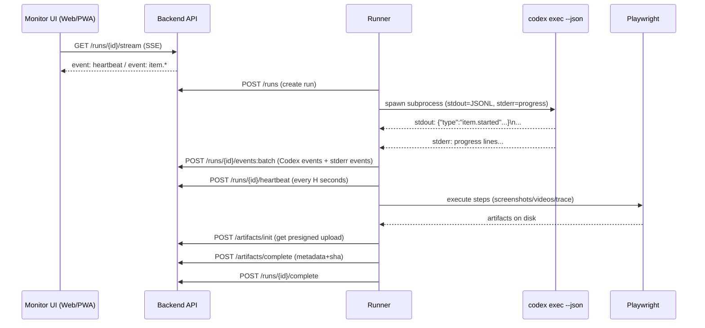

# AI 停止后仍可记录执行并实时监控 CLI 工作状态的系统设计研究

## 执行摘要

本报告聚焦两个工程难题：其一，**AI（以 Codex CLI 为代表）停止输出后，系统如何继续“记录干活”**——也就是对后续自动化（如 Playwright 执行、截图/录像/trace、上传、重试与收尾）的完整可追溯记录；其二，**监控端如何实时判断 CLI 是否仍在工作**（不仅是“进程在不在”，还要能看到“在忙/在等/卡住/已完成”等状态）。为满足这两点，关键在于把“AI 输出”从“工作执行与记录”中解耦：用一个**Runner 监督进程 + 事件流（NDJSON/JSONL）+ 心跳**作为系统事实来源。  

推荐方案是：  
- Runner 以子进程方式运行 `codex exec --json`，将 **stdout 作为 JSONL 事件流**解析并落盘/上报；同时捕获 `stderr`（Codex 在非交互时会把进度流到 `stderr`，最终消息在非 JSON 模式才到 `stdout`），避免监控误判“没输出=没干活”。citeturn1view1  
- Runner 独立发送 **心跳与状态上报**（即使 AI 已停止，Runner 仍持续上报自动化步骤、媒体产物与收尾进度），保证“AI 停止后仍记录干活”。  
- 监控端采用 **SSE（Server-Sent Events）实时推送**为主：浏览器以 `EventSource` 持久在线连接接收事件，移动端/桌面端都容易落地；如需双向交互（远程取消/暂停/下发命令），再引入 WebSocket。citeturn2search10turn3search0turn3search1  
- 自动化证据链以 Playwright 为核心：关键节点截图（`full_page=True`）、失败录像（`record_video_dir`，视频在 context close 时写入）、trace（`context.tracing` + Trace Viewer）。citeturn4search2turn0search2turn4search3turn4search5turn4search1  
- DataClaw 作为“可选离线补采/导出器”：用于把历史会话统一导入或做额外脱敏/归档，但需强调其自动脱敏“并非万无一失，发布前必须人工复核”。citeturn7view0  

未指定约束（平台/预算/规模/合规等级）按“无特定约束”处理：默认设计覆盖 macOS/Linux/CI，且注意 Codex CLI 在 Windows 上为实验性支持（官方建议在 WSL 中使用）。citeturn1view0  

---

## 关键问题定义

本问题可拆为三个“必须严格定义”的概念集合，否则系统实现会在边界条件上失真。

**AI 停止后再记录“干活”是什么意思**  
这里的“AI 停止”应区分三种情况：  
- **AI 子进程结束**：`codex exec` 进程退出（有退出码），但 Runner 仍在执行后续步骤（Playwright、上传、清理、汇总）。这是最常见的“AI 停止但仍需记录干活”的场景，因为 `codex exec` 在脚本/CI 中就是一个阶段性组件。citeturn1view1turn9view2  
- **AI 输出静默**：进程仍在运行，但一段时间没有 stdout/stderr（可能是长时间思考、网络等待、工具执行中）。若监控仅盯 stdout，会误判为“停了”。Codex 明确说明：非交互模式下执行期间会把进度流到 `stderr`，而非持续写 `stdout`。citeturn1view1  
- **AI 被外部中止**：Runner 或用户关闭/kill 了 CLI；此时仍需“把已有证据与执行结果”完整封存，并对未完成的步骤标记为 aborted/unknown（审计要可解释）。  

**监控端实时看到 CLI 是否在工作是什么意思**  
“在工作”不能只等价于“进程存活”。监控应至少输出：  
- **活性**：Runner 是否在线（心跳）。  
- **进度**：最近是否有事件（Codex JSONL `item.started/item.completed`、Playwright step started/completed、上传完成等）。citeturn1view1turn4search2turn0search2  
- **健康度**：是否处于 stall（长时间无进度、无输出、无 step 变化）。  
- **阶段**：AI 阶段/自动化阶段/收尾阶段。  

**实现约束与官方行为依赖点**  
- Codex CLI 可用于脚本与 CI：`codex exec` 在运行时向 `stderr` 流式输出进度，向 `stdout` 输出最终消息；当启用 `--json` 时，`stdout` 变成 JSONL 事件流，可捕获“每个事件”。citeturn1view1turn9view1  
- `codex exec` 默认在只读沙箱，自动化时应以最小权限提升：`--full-auto` 或必要时 `--sandbox danger-full-access`，且官方强调后者仅用于隔离环境。citeturn1view1turn9view0  
- `codex exec` 在 CI 常用 `CODEX_API_KEY` 环境变量提供凭证，并说明仅在 `codex exec` 支持该变量。citeturn1view1  
- Codex 在自动化中默认要求 Git 仓库环境（安全护栏）；如需绕过需显式 `--skip-git-repo-check` 并确保环境安全。citeturn1view1  

---

## 可选设计方案对比

下面给出至少三种可落地设计，并用表格比较优缺点。对比维度围绕你关心的两点：**停止后记录**与**实时监控**。

| 方案 | 核心思路 | 优点 | 缺点与风险 | 适用性结论 |
|---|---|---|---|---|
| 方案 A：纯日志尾随与文件补采 | 不改 Runner，只在外部 tail Codex/终端日志与产物目录；任务结束后再汇总入库 | 改动小；可快速验证 UI | 监控实时性差；无法可靠区分“静默但在忙”与“卡死”；AI 停止后若自动化仍在跑，记录链容易断；对 stdout/stderr 行为变化敏感 | 仅适合 PoC，不建议作为主系统 |
| 方案 B：Runner 监督子进程 + 事件流 + 心跳 | Runner 作为事实源：捕获 `codex exec --json` stdout(JSONL) + stderr；Runner 独立上报心跳与步骤事件；监控端订阅事件流 | 最能满足“AI 停止后仍记录干活”；实时可视化强；可做幂等/重试/审计闭环；与官方 `--json`/`--output-last-message`/安全建议一致citeturn1view1turn9view0turn9view1 | 需要实现事件 schema、心跳检测与后端流式推送；需处理 CLI 边缘 bug（例如 stdout pipe 关闭导致 broken pipe 崩溃风险）citeturn0search16 | **推荐**（默认） |
| 方案 C：绕开 CLI，改用 OpenAI API 流式输出 | AI 部分不跑 CLI，直接用 API 流式返回结构化计划/工具调用；Runner 执行并记录 | schema 与版本可控；更易在服务端集中治理 | 需要自建与 CLI 等价的权限沙箱/审批机制；与 Codex CLI 的实践/生态脱钩；对本地工具链复用较少 | 适合产品深度集成，但本题“监控 CLI 是否工作”指向性偏弱 |
| 方案 D：Codex SDK 或更深集成 + 统一事件总线 | 用 SDK/MCP 管理 thread/run，事件进入总线（SSE/WS/Kafka/OTel） | 可编程性强；多工具统一 | 复杂度最高；团队需具备协议/事件总线经验；落地较慢 | 适合大型组织/多团队平台化 |

结论：若你的目标是“监控 CLI 工作状态”与“停止后仍记录执行”，**方案 B**的因果闭环最完整：CLI 只是一个被监督的子步骤，真正的“工作记录系统”由 Runner 驱动。citeturn1view1turn9view1turn3search2  

---

## 推荐方案与理由

推荐采用 **方案 B：Runner 监督子进程 + 事件流 + 心跳**，并将整体设计落到一个清晰的状态机与数据流上。

**推荐理由聚焦你提出的两点**  
- “AI 停止后仍记录干活”：让 Runner（而不是 AI）负责记录与上报。AI 输出停止≠系统停止；只要 Runner 仍在线，后续 Playwright、上传、trace 打包都能持续产生日志与审计事件。  
- “实时看到 CLI 是否在工作”：监控端不直接“猜测”CLI，而是订阅 Runner 的心跳与事件流；同时 Runner 捕获 Codex 的 `stderr` 进度与 `--json` 事件，能解释“为什么看起来没输出但其实在跑”。citeturn1view1turn2search10turn3search2  

**总体流程图（Mermaid）**



**Codex 事件流的官方依赖点**  
- `codex exec --json` 会把 `stdout` 变成 JSONL 事件流，包含 `thread.started/turn.started/turn.completed/turn.failed/item.*` 等事件类型；事件中包括 agent message、command execution、文件变更等“轨迹”。citeturn1view1turn9view1  
- CLI 参考建议在 CI 中“`--json` + `--output-last-message` 搭配”，既拿到机器可读进度，也拿到最终自然语言总结落盘。citeturn9view0turn9view1  

---

## 详细实现步骤与关键算法

本节给出端到端落地步骤，并重点回答：心跳/状态检测算法、AI 停止/空闲/完成判定逻辑、以及“停止后触发记录”的 Playwright 策略。

### 端到端实现步骤

**阶段一：Run 初始化与运行环境准备**  
1. 后端创建 `run_id`，返回 SSE/WS 订阅地址与设备级鉴权信息（device token）。  
2. Runner 设置运行目录（Git repo 根目录）；如不在 Git repo 且确认安全，才使用 `--skip-git-repo-check`。citeturn1view1  
3. Runner 选择最小权限：默认 read-only；需要写入/执行才启用 `--full-auto` 或提高 sandbox，且 `danger-full-access` 仅用于隔离运行器。citeturn1view1turn9view0  

**阶段二：启动 Codex CLI 并解析 JSONL**  
4. Runner 以子进程启动 `codex exec --json`（必要时 `--output-schema` 与 `-o` 落最终结果文件）。`--json` 使 stdout 为 JSONL。citeturn1view1turn9view1  
5. Runner 同时读取 stdout（逐行 JSON）与 stderr（进度文本），立即落本地 spool（append-only JSONL），并分批上报后端（幂等）。  

**阶段三：执行自动化并在 AI 停止后继续记录**  
6. Runner 将“自动化执行”视为独立 step pipeline（即使 Codex 子进程退出也不终止 pipeline）：  
   - 若 Codex 输出的是结构化计划（`--output-schema`），Runner 按计划执行 Playwright 步骤；  
   - 若 Codex 同时产生了 command_execution 类 item，Runner 仍以“外部事实”记录 Playwright 与上传事件，实现跨源关联。citeturn1view1turn4search2turn0search2  
7. Playwright 侧在关键点截图与按策略录制视频/trace；所有媒体先落盘后上传对象存储，再上报 `artifact.created` 事件。截图与录像/trace 的关键 API 行为见官方文档：  
   - `page.screenshot(..., full_page=True)` 生成全页截图；citeturn4search2  
   - `record_video_dir=...` 录制视频，视频在 browser context close 时写入；citeturn0search2  
   - `context.tracing` 可收集 trace，并用 Trace Viewer 打开；`trace.playwright.dev` 在浏览器内加载 trace 并声明不向外传数据。citeturn4search3turn4search5turn4search1  

**阶段四：收尾与封存**  
8. Runner 等待所有子任务完成（含上传确认），写入 `run.completed` 或 `run.failed`，并将最后一次心跳更新为 finished。  
9. 可选：若要补采历史对话/统一格式，可触发 DataClaw `export --no-push` 并导入；但要遵循其“先本地导出复核 PII，再决定是否发布”的流程提示。citeturn7view0  

### 心跳与状态上报参数建议

| 参数 | 建议值 | 用途 | 解释 |
|---|---:|---|---|
| 心跳间隔 H | 5s | Runner→后端活性 | 5s 在移动网络/公网也较稳；配合 jitter 减少同频抖动 |
| 心跳超时 T_dead | 20s | 判定 Runner 离线 | 通常取 3–4 个心跳窗口（H×4）+ 网络抖动余量 |
| 输出静默阈值 T_idle | 30–90s | 判定“静默但可能在忙” | Codex 可能在长耗时工具/等待；静默≠失败，应与“进程存活+心跳”联合判断citeturn1view1 |
| 卡顿阈值 T_stall | 5–15min | 判定“疑似卡死” | 结合：无事件进展 + 无 step 变化 + 可选 CPU≈0；触发告警但不自动判死（防误杀） |
| SSE keepalive | 15–30s | 防代理断流 | 服务器发送注释行或空事件保持连接（实现层面）citeturn2search10 |

### 心跳检测算法与状态机

**状态上报最小字段（建议）**  
- `runner_online`: bool（心跳是否按期到达）  
- `cli_alive`: bool（子进程 poll 是否退出）  
- `last_stdout_ts` / `last_stderr_ts`（最近输出时间）  
- `last_event_ts`（最近成功入库事件时间）  
- `phase`: `ai_running | automation_running | finalizing | finished`  
- `progress_counters`: `events_sent`, `artifacts_uploaded`, `steps_done/total`  
- 可选：`pid`, `cpu_pct`, `rss_mb`（若引入 psutil）  

**监控端判定逻辑（建议实现为后端派生字段，前端直接展示）**  
- `RUNNER_OFFLINE`：`now - last_heartbeat_at > T_dead`  
- `CLI_RUNNING`：`cli_alive == true`  
- `CLI_STOPPED`：`cli_alive == false`（根据退出码进一步分 `completed/failed/aborted`）  
- `AI_IDLE`：`cli_alive==true` 且 `now - max(last_stdout_ts,last_stderr_ts) > T_idle`，但 `runner_online==true`（解释为“仍在跑但暂无可见输出”）  
- `STALL_SUSPECTED`：`runner_online==true` 且 `now - last_event_ts > T_stall` 且 `steps_done` 无变化（触发告警+提供“最近输出片段/trace”入口）  

**为什么要区分“AI 停止”与“Run 完成”**  
因为本系统目标是“停止后仍记录干活”：即使 Codex 子进程结束，Run 仍可能处于 automation/finalizing 阶段（截图、录像、上传、汇总）。因此 run 的完成判定必须以 Runner 的 pipeline 完成事件为准，而不以 AI 子进程退出为准。citeturn1view1turn0search2turn4search3  

---

## 接口、数据格式示例与核心代码片段

本节给出 NDJSON/JSON 事件示例、API 端点表，以及你要求的 Runner 示例代码（stdout/stderr/JSONL 处理 + 心跳）。

### Codex JSONL 与系统事件的统一格式

**Codex CLI JSONL（来自 `codex exec --json` 的原始风格）**  
官方说明 `--json` 会输出“每个事件一行 JSON”，并给出典型事件包含 `thread.started/turn.started/item.started/item.completed/turn.completed` 等类型。citeturn1view1turn9view1  

示例（NDJSON，每行一个 JSON 对象；以下为示意结构，字段以实际输出为准）：

```json
{"type":"thread.started","thread_id":"0199..."}
{"type":"turn.started","turn_id":"turn_1"}
{"type":"item.started","item":{"id":"item_1","type":"command_execution","status":"in_progress","command":"bash -lc ls"}}
{"type":"item.completed","item":{"id":"item_2","type":"agent_message","status":"success","text":"已完成目录扫描。"}}
{"type":"turn.completed","usage":{"input_tokens":1234,"output_tokens":56}}
```

**系统统一事件 Envelope（建议）**  
为了把 Codex/Playwright/上传/心跳都统一进审计链，建议用 envelope 包裹：

```json
{
  "schema_version": "1.0",
  "event_id": "01J...ULID",
  "ts": "2026-03-01T10:15:30.123Z",
  "run_id": "b3a6...uuid",
  "source": "codex_cli|runner|playwright|uploader",
  "event_type": "cli.jsonl|cli.stderr|heartbeat|step.started|artifact.created|run.completed",
  "idempotency_key": "run:b3a6...:seq:000123",
  "payload": { "...": "..." }
}
```

### 监控与写入 API 端点表

| 端点 | 方法 | 用途 | 请求/响应要点 | 实时性 |
|---|---:|---|---|---|
| `/v1/runs` | POST | 创建 run | 返回 `run_id`、SSE 地址 | 启动 |
| `/v1/runs/{run_id}/events:batch` | POST | 批量写入事件 | `events[]`；幂等键去重 | 准实时 |
| `/v1/runs/{run_id}/heartbeat` | POST | 心跳上报 | `cli_alive/phase/last_output_ts/...` | 高频 |
| `/v1/runs/{run_id}` | GET | run 概览 | 返回派生状态（running/idle/stall） | 查询 |
| `/v1/runs/{run_id}/stream` | GET | SSE 订阅 | `text/event-stream` 推送事件 | 实时citeturn2search10 |
| `/v1/runs/{run_id}/ws` | GET | WebSocket 订阅/控制 | 双向消息（可选） | 实时citeturn3search0turn3search1 |
| `/v1/artifacts/init` | POST | 申请上传 | 返回预签名 URL、object_key | 准实时 |
| `/v1/artifacts/complete` | POST | 上传完成确认 | 上报 sha256/size/step_id | 准实时 |

### SSE、WebSocket、轮询对比与推荐

| 机制 | 优点 | 缺点 | 推荐结论 |
|---|---|---|---|
| SSE | 基于 HTTP；浏览器 `EventSource` 简单；服务端单向推送很适合“日志/事件流”；跨移动/桌面易落地citeturn2search10 | 主要是单向（如需客户端主动控制需另开请求）；部分网络设备可能断流需 keepalive | **默认推荐**：用于实时日志/状态 |
| WebSocket | 真正双向；无需轮询即可交互式通信citeturn3search0turn3search1 | 基础设施、鉴权与负载均衡更复杂；需要处理连接管理 | 仅当需要“远程控制 Runner/CLI”时引入 |
| 轮询 | 实现最简单；无长连接要求 | 延迟高或成本高（频繁请求）；体验差 | 仅作为降级方案 |

### Runner 关键代码片段

下面示例展示：  
- 使用 `subprocess` 启动 `codex exec --json`；  
- 并发读取 stdout(JSONL) 与 stderr(progress)；  
- 解析 JSONL、构建统一事件、批量上报；  
- 定时心跳（即使 CLI 无输出也会持续上报）。  

`subprocess` 模块可生成子进程并连接 stdout/stderr 管道、获取返回码，是该实现的基础。citeturn3search2  
`codex exec --json` 的 stdout 为 JSONL，stderr 用于进度流输出，这是读取策略的依据。citeturn1view1turn9view1  

```python
import json
import os
import queue
import subprocess
import threading
import time
from dataclasses import dataclass
from typing import Any, Dict, Optional

@dataclass
class Event:
    schema_version: str
    event_id: str
    ts: float
    run_id: str
    source: str
    event_type: str
    idempotency_key: str
    payload: Dict[str, Any]

def now_ts() -> float:
    return time.time()

def ulid_like() -> str:
    # 示例：生产环境请用 ULID/UUID 库
    return f"evt_{int(time.time()*1000)}_{os.getpid()}"

class EventSpool:
    """最小示例：先入队，再由 sender 批量发送；实际可同时 append 到本地 JSONL 文件做断点续传。"""
    def __init__(self) -> None:
        self.q: queue.Queue[Event] = queue.Queue()

    def emit(self, evt: Event) -> None:
        self.q.put(evt)

def read_lines(name: str, stream, run_id: str, spool: EventSpool, last_seen: Dict[str, float]) -> None:
    for line in iter(stream.readline, ""):
        ts = now_ts()
        last_seen[name] = ts
        line = line.rstrip("\n")
        if not line:
            continue

        if name == "stdout":
            # codex --json: 每行一个 JSON 对象
            try:
                obj = json.loads(line)
                spool.emit(Event(
                    schema_version="1.0",
                    event_id=ulid_like(),
                    ts=ts,
                    run_id=run_id,
                    source="codex_cli",
                    event_type="cli.jsonl",
                    idempotency_key=f"{run_id}:cli.jsonl:{int(ts*1000)}",
                    payload=obj,
                ))
            except json.JSONDecodeError:
                # 防御：如果遇到非 JSON 行，也记录下来便于排障
                spool.emit(Event(
                    schema_version="1.0",
                    event_id=ulid_like(),
                    ts=ts,
                    run_id=run_id,
                    source="runner",
                    event_type="cli.stdout.non_json",
                    idempotency_key=f"{run_id}:cli.stdout.non_json:{int(ts*1000)}",
                    payload={"line": line[:4000]},
                ))
        else:
            # stderr: 进度文本（重要：exec 期间进度在 stderr）
            spool.emit(Event(
                schema_version="1.0",
                event_id=ulid_like(),
                ts=ts,
                run_id=run_id,
                source="codex_cli",
                event_type="cli.stderr",
                idempotency_key=f"{run_id}:cli.stderr:{int(ts*1000)}",
                payload={"line": line[:4000]},
            ))

def heartbeat_loop(run_id: str, proc: subprocess.Popen, last_seen: Dict[str, float], spool: EventSpool, interval_s: float = 5.0) -> None:
    while True:
        ts = now_ts()
        alive = (proc.poll() is None)

        payload = {
            "cli_alive": alive,
            "pid": proc.pid,
            "last_stdout_ts": last_seen.get("stdout"),
            "last_stderr_ts": last_seen.get("stderr"),
        }
        spool.emit(Event(
            schema_version="1.0",
            event_id=ulid_like(),
            ts=ts,
            run_id=run_id,
            source="runner",
            event_type="heartbeat",
            idempotency_key=f"{run_id}:heartbeat:{int(ts)}",
            payload=payload,
        ))

        if not alive:
            # 进程退出后再发一次退出事件并结束心跳
            rc = proc.returncode
            spool.emit(Event(
                schema_version="1.0",
                event_id=ulid_like(),
                ts=now_ts(),
                run_id=run_id,
                source="runner",
                event_type="cli.exited",
                idempotency_key=f"{run_id}:cli.exited:{proc.pid}:{rc}",
                payload={"returncode": rc},
            ))
            break

        time.sleep(interval_s)

def run_codex_exec(run_id: str, prompt: str, workdir: str) -> int:
    # CI 中可用 CODEX_API_KEY 提供凭证（仅 codex exec 支持）
    # 生产环境建议用密钥管理系统注入环境变量
    cmd = [
        "codex", "exec",
        "--json",
        "--full-auto",
        prompt,
    ]

    proc = subprocess.Popen(
        cmd,
        cwd=workdir,
        stdout=subprocess.PIPE,
        stderr=subprocess.PIPE,
        text=True,
        bufsize=1,   # 行缓冲
    )

    spool = EventSpool()
    last_seen: Dict[str, float] = {}

    t_out = threading.Thread(target=read_lines, args=("stdout", proc.stdout, run_id, spool, last_seen), daemon=True)
    t_err = threading.Thread(target=read_lines, args=("stderr", proc.stderr, run_id, spool, last_seen), daemon=True)
    t_hb = threading.Thread(target=heartbeat_loop, args=(run_id, proc, last_seen, spool, 5.0), daemon=True)

    t_out.start()
    t_err.start()
    t_hb.start()

    # TODO: sender 线程：从 spool.q 批量取出 events，POST 到 /events:batch 与 /heartbeat
    # TODO: 断网时落本地 JSONL，恢复后补传（幂等键保证不会重复入库）

    rc = proc.wait()
    return rc
```

关于 `CODEX_API_KEY` 用于 CI 的说明来自官方非交互文档；同时官方强调执行期间进度在 `stderr`，启用 `--json` 时 stdout 为 JSONL 事件流。citeturn1view1turn9view1  

---

## 停止后触发记录的 Playwright 策略、审计与运维估算

本节集中回答剩余必答项：Playwright 在停止后触发记录、事件与审计日志格式、幂等重试、异常恢复、性能安全与部署建议、以及工期人力估算。

### Playwright 在停止后触发记录的策略

**核心原则：把证据链的“落盘时刻”绑定到可控的生命周期点**  
- 录像：官方明确“视频在 browser context 关闭时保存”，因此必须确保 `context.close()` 在任何异常路径都执行（例如 `try/finally`）。citeturn0search2  
- trace：用 `context.tracing` 收集与保存，并在失败/重试时保留；Trace Viewer 可打开保存的 `trace.zip`，且 `trace.playwright.dev` 表示在浏览器内加载 trace 不外传数据（对敏感场景很关键）。citeturn4search3turn4search5turn4search1  
- 截图：关键节点与失败点都截图；全页截图使用 `full_page=True`。citeturn4search2  

**建议触发点**  
- step 开始：`step.started`（记录目标 URL、测试用例名、环境）  
- 页面到达关键状态：截图（例如登录成功、提交前、提交后）  
- 异常捕获：失败截图 + 保存 trace + 标记 step.failed  
- step 结束：关闭 context 触发视频落盘；上传 artifact；发 `artifact.created` 与 `step.completed`  
- run 收尾：若 Codex 已停止但自动化仍在做上传/清理，持续记录该阶段；最终发 `run.completed`  

### 示例 Playwright 代码要点

```python
import asyncio
from playwright.async_api import async_playwright

async def run_flow(artifact_root: str):
    async with async_playwright() as p:
        browser = await p.chromium.launch(headless=True)
        context = await browser.new_context(record_video_dir=f"{artifact_root}/videos")

        # trace：生产中建议按“失败/重试”策略启用
        await context.tracing.start(screenshots=True, snapshots=True, sources=True)

        page = await context.new_page()
        try:
            await page.goto("https://example.com")
            await page.screenshot(path=f"{artifact_root}/screenshots/step_001.png", full_page=True)
            # ...更多自动化步骤...
        except Exception:
            await page.screenshot(path=f"{artifact_root}/screenshots/error.png", full_page=True)
            raise
        finally:
            # 关键：先 stop tracing 再 close context
            await context.tracing.stop(path=f"{artifact_root}/traces/trace.zip")
            await context.close()   # 触发视频写入
            await browser.close()
```

上述截图、录像、trace 的关键语义均由 Playwright 官方文档定义（全页截图、录像在 close 时保存、Tracing/Trace Viewer）。citeturn4search2turn0search2turn4search3turn4search5  

### 事件与审计日志格式、幂等与重试策略

**审计事件最小集合（建议）**  
- `heartbeat`：每 H 秒  
- `cli.jsonl` / `cli.stderr`：Codex 轨迹与解释性进度  
- `step.started/step.completed/step.failed`：自动化步骤状态  
- `artifact.created`：截图/视频/trace 上传确认（包含 hash/size）  
- `run.completed/run.failed/run.aborted`：终态  

**幂等策略（必须）**  
- 所有写入端点支持 `idempotency_key`；后端以唯一索引去重。  
- 事件上报采用“先本地 append-only JSONL，再批量提交”的双写策略：上报失败不丢事件；恢复后重放。  
- 媒体上传采用“两阶段提交”：先拿预签名 URL 上传对象存储，再 `artifacts/complete` 入库；避免 DB 指向不存在对象。  

**重试策略（建议）**  
- 事件批量上报：指数退避（例如 1s, 2s, 4s…上限 30s），超阈值进入本地 DLQ 文件。  
- SSE 断流：前端自动重连（EventSource 内建重连机制常见；实现时需支持 resume cursor）。citeturn2search10  
- WebSocket 断流：客户端重连 + 服务器端会话恢复（更复杂）。citeturn3search0turn3search1  

### 异常场景与恢复流程

**Codex 输出管道异常**  
- 已有开源 issue 报告：当 `codex exec --json` 被 pipe，且 stdout 消费端提前关闭时，可能触发 broken pipe 崩溃（例如 Rust panic）。因此 Runner 应尽量“自己消费 stdout”，不要依赖外部管道；必要时将 JSONL 落文件并由 Runner 读取。citeturn0search16  

**Runner 掉线**  
- 监控端依据 `T_dead` 将 run 标为 `runner_offline`；若 Runner 恢复并携带 spool 游标补传，则 run 可回到 running/finalizing。  

**Playwright 卡住**  
- 超时策略：对每个 step 设置 deadline；失败时保存截图+trace，确保 context.close 触发视频落盘；并记录 `step.failed`，由队列重试或人工介入。citeturn0search2turn4search3turn4search5  

**隐私与数据外泄风险**  
- DataClaw 明确指出自动脱敏并不“万无一失”，尤其是特殊格式的标识符、第三方 PII、非典型 secret；因此即便只做内部记录，也建议对日志与媒体进行脱敏策略（例如截图 mask、日志字段黑名单、最小化工具输出）。citeturn7view0  

### 性能与安全考虑与部署建议

**安全与权限最小化**  
- Codex 自动化权限遵循最小权限：默认只读；需要编辑用 `--full-auto`；需要更大范围才考虑 `--sandbox danger-full-access`，且官方强调只能在隔离环境使用。citeturn1view1turn9view0  
- CI 场景使用 `CODEX_API_KEY` 注入凭证，注意提示与工具输出可能包含敏感信息。citeturn1view1  

**部署形态建议（无特定约束下的默认路线）**  
- Runner：部署在 CI runner 或专用执行机；对高权限 sandbox 单独隔离（容器/VM/专用网络）。citeturn1view1  
- 后端：提供事件摄取（batch）、心跳端点、SSE 推送；前端接入 SSE。citeturn2search10  
- 平台差异：Codex CLI 在 Windows 上为实验性支持，官方建议 WSL；因此如需覆盖 Windows 执行端，优先用 WSL 作为 Runner 运行环境。citeturn1view0  

### 开发时间与人力估算

在“平台/预算/并发规模/合规等级”未指定条件下，按经验给出可执行估算（以 2026-03-01 为基准）。

**MVP（可用：实时监控 + 停止后仍记录）**  
- 2–3 人，约 3–5 周  
  - 1 平台/自动化工程：Runner、Codex exec 集成、心跳、Playwright 证据链  
  - 1 后端：事件摄取、SSE、幂等、基础存储与鉴权  
  - 0.5 前端：run 列表/详情、时间线、心跳状态、媒体浏览（响应式）  

**生产级（可运营：告警、恢复、审计、规模化）**  
- 4–6 人，约 8–12 周  
  - 增加：断点续传与 DLQ、权限分级、审计报表、异常恢复自动化、存储生命周期、更多平台兼容与压测  
  - 若需要 WebSocket 双向控制与复杂 RBAC/SSO，会进一步拉长周期（通常 +2–4 周）citeturn3search0turn3search1