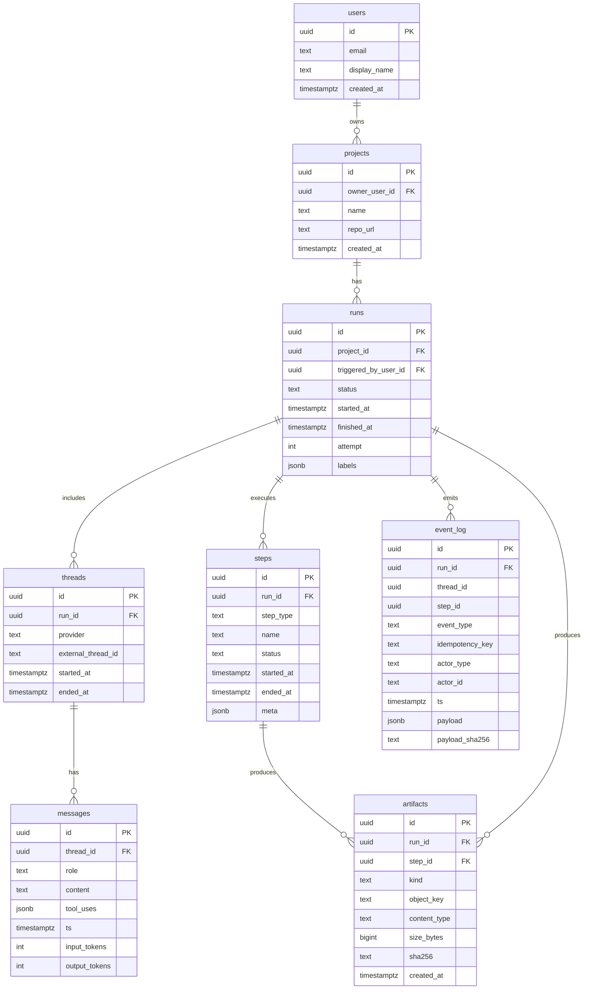

# Codex CLI 与自动化流程集成的对话与操作记录系统研究报告

## 执行摘要

本报告研究了如何将 Codex CLI 融入自动化流程（以 Python + Playwright 为主），并构建一个“可在手机与电脑上查看的对话与操作记录系统”，覆盖对话（人机交互、LLM 输出、工具调用）与执行（浏览器操作、命令执行、截图与录像、产物上传、错误与重试）的端到端证据链。核心结论是：**采用“事件流（JSONL/NDJSON）为中心 + 对象存储承载媒体 + 关系型数据库承载索引与审计”的可观测性架构**，能在最小化供应商锁定的同时，兼顾可靠性、检索体验与合规扩展。该路线与 Codex CLI 的非交互模式与日志/历史落盘机制天然契合：`codex exec` 适合在脚本/CI 中运行，并可将最终输出与机器可读事件流导出；同时 Codex CLI 支持多层配置文件与最小权限沙箱策略，利于在自动化场景做“权限分级”。citeturn12view0turn6view0turn9view0turn3view0

建议的“默认实现路线”如下：

- **交互与工具调用采集**：优先使用 `codex exec` 的 JSONL/NDJSON 输出能力（如 `--experimental-json`）采集逐事件输出；对既有会话或跨平台终端日志，使用 DataClaw 作为“统一导出/脱敏/结构化”管道的补充。citeturn6view0turn12view0turn5view0  
- **自动化执行采集**：Playwright 作为浏览器自动化核心，按“关键节点截图 + 失败/重试录像 + 可选 trace”策略留存证据；视频在 context 关闭后落盘并上传；trace 便于在失败后进行时间旅行式调试。citeturn1search2turn1search3turn1search4turn1search13  
- **存储**：结构化事件与索引写入 PostgreSQL；媒体（png/webm/zip/jsonl）写入 S3 兼容对象存储并使用预签名 URL 上传/下载；必要时引入全文检索（Postgres GIN/tsvector 起步，规模上来再上 OpenSearch/Elasticsearch）。  
- **多端查看**：Web 前端优先采用响应式 + PWA（可安装、离线、后台能力），以最低成本覆盖 iOS/Android/桌面浏览器；原生/跨端 App 仅在需要深度系统集成（后台上传、系统级分享、企业 MDM/证书）时再投入。PWA 的跨平台与可安装性、离线/后台能力在官方文档中被明确强调。citeturn13search0turn13search12  
- **鉴权与审计**：前端采用 OAuth 2.0 登录（企业可接入 OIDC/SSO），后端对 Runner 设备使用“设备令牌 + 最小权限”并对事件入库做不可抵赖审计字段；JWT 作为会话令牌方案可用于 API 访问控制与声明传递。citeturn13search1turn13search2  

在“无特定约束（预算/平台未指定）”前提下，本报告给出一套可落地的参考架构、数据模型、端点清单、实现步骤与风险控制清单，并提供工期与人力估算：**MVP（可用）约 4–6 周、2–3 人；生产级（含权限/审计/告警/高可用与治理）约 10–16 周、4–6 人**（具体取决于是否需要企业 SSO、全文检索、跨网络同步、移动端录屏与设备代理等）。  

---

## 任务清单与里程碑

下表按“优先级（P0/P1/P2）+ 里程碑（MVP/Beta/Prod）”给出任务清单。考虑到你明确要求覆盖多组件与严谨审计，本清单把“证据链与可追溯”作为主线。

| 任务域 | 关键交付物 | 优先级 | 里程碑 | 说明 |
|---|---|---:|---|---|
| 事件模型与字段标准化 | 统一 JSON 事件规范（run_id、correlation_id、payload schema、版本号）+ NDJSON/JSONL 约定 | P0 | MVP | 贯穿对话/操作/媒体/错误/审计，先定“最小可用字段集”，后续可演进版本。 |
| Runner（本地/CI） | Python Runner：执行任务、收集 codex exec 事件、生成 Playwright 证据、断点续传 | P0 | MVP | `codex exec` 适合脚本/CI；其输出分 stderr（进度）与 stdout（最终消息），便于流水线。citeturn12view0 |
| Codex CLI 集成 | 非交互模式封装、沙箱/审批策略、JSON 事件输出、会话关联 | P0 | MVP | `codex exec` 支持最小权限沙箱，必要时 `--full-auto` 或更高权限；危险模式需隔离环境。citeturn12view0turn8view0 |
| DataClaw 导入 | `dataclaw export --no-push` 导出 JSONL + 脱敏检查 + 导入器 | P1 | Beta | DataClaw 明确支持将多种终端 Agent 会话转结构化数据并脱敏，但强调“非万无一失”。citeturn5view0 |
| 存储与检索 | PostgreSQL 表结构 + 对象存储路径规范 + 预签名上传 | P0 | MVP | 媒体与大文件走对象存储；结构化索引走 DB。 |
| Web 前端 | Run 列表/详情页、时间线、对话查看器、截图/视频播放器、过滤与搜索 | P0 | MVP | 手机端以响应式优先；PWA 在 Beta 引入。citeturn13search0 |
| 调度与队列 | cron/队列（RabbitMQ/Celery 等）+ 任务重试策略 + 幂等 | P0 | Beta | 先 cron + 单机队列起步；规模上来再分布式。 |
| 日志与审计 | 统一日志格式、审计表、导出与保留策略 | P0 | Beta | DataClaw、Codex、Runner、后端都要“同一关联键”。 |
| 安全与权限治理 | OAuth2 登录、RBAC、设备令牌、密钥管理、网络隔离 | P1 | Prod | OAuth2 为行业标准授权协议。citeturn13search1 |
| 运维与可观测 | 指标/Tracing（OpenTelemetry/OTLP）、告警、备份恢复、容量规划 | P1 | Prod | OTLP 定义了遥测数据编码与传输机制，利于统一接入。citeturn13search3 |

---

## 架构与数据流设计

### 目标架构概览

**核心设计原则**：  
1) **事件优先**（所有东西可还原为事件流）；2) **媒体外置**（截图/视频/trace 走对象存储）；3) **多端一致**（同一 run 在手机/桌面一致呈现）；4) **最小权限**（Codex/自动化脚本/存储凭证分权）；5) **可审计**（不可抵赖字段 + 关联键）。  

Codex CLI 适合作为本地/CI 的“编码与操作 Agent”，其 CLI 文档明确指出可在终端运行、读取/修改/运行代码，并且首次运行会提示使用 ChatGPT 账号或 API Key 认证；同时对 Windows 的支持仍属实验性（推荐 WSL）。citeturn3view0  
在自动化流水线里，`codex exec` 的“stderr 输出进度、stdout 输出最终消息”设计使其天然适合被脚本捕获与管道化。citeturn12view0  

### 参考架构图（Mermaid）

```mermaid
flowchart LR
  subgraph ClientSide[本地/CI 执行侧]
    Scheduler[cron/队列调度器]
    Runner[Python Runner\n(任务编排+采集+重试)]
    Codex[Codex CLI / Codex SDK]
    PW[Playwright 自动化脚本]
    DClaw[DataClaw 导出器]
    LocalSpool[本地 Spool\n(JSONL+媒体临时目录)]
  end

  subgraph ServerSide[服务端]
    API[后端 API\n(FastAPI/Node)]
    DB[(PostgreSQL\n索引+审计)]
    Obj[(对象存储\nS3/MinIO)]
    WS[实时通道\nSSE/WebSocket]
  end

  subgraph WebUI[Web 前端]
    FE[响应式 Web / PWA]
  end

  Scheduler --> Runner
  Runner --> Codex
  Runner --> PW
  Codex --> LocalSpool
  PW --> LocalSpool
  DClaw --> LocalSpool

  Runner -->|事件批量上传| API
  Runner -->|预签名上传媒体| Obj
  API --> DB
  API --> Obj
  API --> WS
  WS --> FE
  API --> FE
```

### 数据流分段说明与同步频率建议

**对话/Agent 事件流（Codex CLI）**  
- 建议以 `codex exec` 的 **NDJSON 事件**作为“准实时对话与工具调用轨迹”，并在 Runner 侧追加统一字段（run_id、project_id、device_id）。Codex CLI 参考文档列出了 `--json, --experimental-json`，用于输出换行分隔的 JSON 事件，适合自动化消费。citeturn6view0  
- 同步频率：  
  - 在线：每 1–3 秒或每 50 条事件 flush 一次（批量发送）  
  - 离线：落本地 spool，任务结束后补传（断点续传）。  

**自动化执行（Playwright）**  
- 事件粒度：页面导航、关键点击、表单提交、关键断言、异常堆栈、截图/录像生成、trace 路径等。  
- Playwright 截图与录像：Python 文档展示 `page.screenshot(...)` 与 `browser.new_context(record_video_dir=...)`，并提示**视频在 browser context 关闭时保存**。citeturn1search2turn1search3  

**DataClaw 批量导出**  
- DataClaw 的 README 明确说明：它可以把 Claude Code、Codex、Gemini CLI 等终端会话转为结构化数据（JSONL），并执行“秘密与 PII 脱敏”，同时强调“自动脱敏并不保证万无一失、发布前必须人工复核”。citeturn5view0  
- 同步频率：  
  - MVP：每个 run 结束后导出一次（只在需要整合旧会话/跨 Agent 时启用）  
  - Beta：夜间增量导出（按 project） + 变更检测（mtime/游标）。  

**配置与权限（Codex CLI）**  
- Codex 配置文件支持“用户级 + 项目级 + profile”的层叠与优先级：用户默认位于 `~/.codex/config.toml`，项目覆盖可置于 `.codex/config.toml`（仅在信任项目时加载）；并有明确的优先级顺序。citeturn9view0  
- 历史与日志落盘：高级配置中描述默认会在 `CODEX_HOME` 下保存会话历史（例如 `~/.codex/history.jsonl`），并允许禁用或限制大小；同时 AGENTS.md 指南提到可检查 `~/.codex/log/codex-tui.log` 或会话 JSONL 以审计加载的指令文件。citeturn12view1turn12view2  

---

## 关键组件集成与实现步骤

本节按“组件—接口—数据格式—鉴权—实现要点”展开，给出一条可实现的端到端路径，并补充可选增强（Codex SDK、MCP、移动端代理与录屏）。

### 组件接口总表（摘要）

| 组件 | 主要职责 | 关键接口/输入输出 | 数据格式 | 鉴权方式 | 推荐同步策略 |
|---|---|---|---|---|---|
| Codex CLI | 生成/修改/运行代码；输出对话与工具轨迹 | `codex exec ... --experimental-json`；配置来自 `~/.codex/config.toml` | NDJSON/JSONL + 文本 stdout/stderr | ChatGPT OAuth/设备认证/或 API key（CLI 提示支持）citeturn3view0turn8view0 | 实时事件 + 本地 spool |
| OpenAI API | 替代/补充：直接调用模型生成结构化动作计划 | `POST /responses`（Responses API） | JSON + 流式事件 | API Key（环境变量方式）citeturn3view3turn0search17 | 流式 + 批量落库 |
| Python Runner | 编排任务、抓取事件、重试、上传媒体 | 自定义 REST：/runs、/events、/artifacts | JSON（批量）+ 本地 JSONL | 设备令牌/JWT | 批量+幂等 |
| Playwright | 浏览器自动化、截图录像、trace | `page.screenshot`、`record_video_dir`、`context.tracing` | png/webm/zip + JSON 元数据 | 目标系统登录凭证（密钥管理） | 节点截图 + 失败录像 |
| DataClaw | 会话导出、脱敏、统一 schema | `dataclaw export --no-push --output ...` | conversations.jsonl | HF token（发布时）；本系统导入不必发布citeturn5view0 | run 结束批量导出 |
| 后端存储 | 保存索引/审计与媒体 | PostgreSQL + 对象存储 | SQL/对象键 | DB 凭证；对象存储 AK/SK 或 STS | 事件先入库、媒体并行上传 |
| Web 前端 | 手机/桌面查看、检索、导出 | REST + SSE/WS | JSON | OAuth2 登录 + JWT 会话 | 订阅实时更新 |
| 调度器 | 定时或队列驱动任务 | cron / RabbitMQ / Celery | N/A | OS 权限/队列凭证 | 任务级重试 + DLQ |

### Codex CLI 集成要点

**非交互执行与输出捕获**  
- `codex exec` 是官方推荐用于脚本/CI 的非交互入口；其运行时进度输出到 `stderr`，最终消息输出到 `stdout`，便于在 shell 中重定向或 `tee` 保存产物。citeturn12view0  
- 事件输出：CLI 参考中给出 `--json, --experimental-json` 可输出换行分隔 JSON 事件，适合作为系统的“对话/工具调用事件源”。citeturn6view0  
- 会话关联：Codex 会保存本地 transcript，`codex resume`/`codex exec resume` 可继续历史会话，并指出会话 ID 可从 `~/.codex/sessions/` 下文件等处获取，这对“跨 run 追踪同一线程”很关键。citeturn11search3  

**权限与安全**  
- 非交互场景默认在只读沙箱下运行，并建议按需提升：允许编辑可用 `--full-auto`；更高权限的 `danger-full-access` 仅应在隔离环境使用。citeturn12view0  
- CLI 参考也包含 “绕过审批与沙箱（yolo）” 的危险旗标，并明确提示只应在外部加固环境中使用。citeturn8view0  

**配置分层与可复制性**  
- Codex 配置既可用户级（`~/.codex/config.toml`）也可项目级（`.codex/config.toml`，需信任项目），并有明确优先级顺序；这为“同一项目在 CI/本地一致执行”提供了基础。citeturn9view0  
- 建议在 CI/Runner 中使用独立 `CODEX_HOME`（例如放到工作目录的 `.codex/`），以实现“任务级隔离 + 可随 run 打包归档”。AGENTS.md 指南给出设置 `CODEX_HOME` 的示例。citeturn12view2  

### OpenAI API 作为替代/补充的集成方式

当你希望绕开 CLI、在服务端直接控制模型输出结构化计划与动作时，可使用 OpenAI API。官方文档已将 **Responses API** 描述为主要接口，并提供 Python/JS 示例。citeturn0search11turn3view3turn0search17  

**示例：Python 调用 Responses API（最小示例）**

```python
import os
from openai import OpenAI

client = OpenAI(api_key=os.environ["OPENAI_API_KEY"])

resp = client.responses.create(
    model="gpt-5.2",
    input="请输出一个用于E2E自动化的JSON计划，包含步骤、断言与截图点。"
)
print(resp.output_text)
```

上述用法与官方 Quickstart 的 Python 示例一致（安装 SDK、读取环境变量、调用 `client.responses.create`）。citeturn3view3turn0search12  

**结构化输出与工具调用（用于生成可执行计划）**  
- 若你希望模型严格输出某个 JSON Schema（例如 `{"steps":[...],"artifacts":[...]}`），官方提供 Structured Outputs 以保证输出符合 schema，降低“日志/计划解析失败”的工程风险。citeturn0search29  
- 若你希望模型以“工具调用”方式触发 Runner 执行（例如 `run_playwright_step`、`upload_artifact`），官方 Function calling 指南描述了 function tools 与 custom tools 的机制。citeturn3view4turn11search8  

### Playwright：截图、录像、trace 与媒体上传

**截图策略（建议）**  
- P0：每个关键业务节点截图（登录后、提交前、提交后、最终结果页）  
- P1：每次失败自动截图（异常捕获处）  
- P2：对关键组件（按钮/表格）做元素级截图（便于定位 UI 漂移）  

Playwright Python 文档给出最直接的截图示例 `page.screenshot(path="screenshot.png")`。citeturn1search2  

**录像策略（建议）**  
- 失败/重试才保留视频（节省存储与带宽）  
- 或者对“高风险流程”（支付/发布/权限变更）全量录像  
- 关键点：视频文件在 browser context 关闭时写入磁盘；因此必须确保 `context.close()` 被调用。citeturn1search3turn1search9  

**可选：Trace（强烈建议在 CI 失败时启用）**  
- Trace Viewer 是官方提供的可视化调试工具，用于回放自动化过程、查看每一步发生了什么。citeturn1search4turn1search7  
- Tracing API 允许收集与保存 trace。citeturn1search13  

**示例：Playwright（异步）+ 截图 + 录像 + 上传前路径约定**

```python
import asyncio
import pathlib
from playwright.async_api import async_playwright

RUN_ID = "run_20260301_abcd"  # 由后端创建返回

def artifact_dir(run_id: str) -> pathlib.Path:
    base = pathlib.Path("./spool") / run_id
    (base / "screenshots").mkdir(parents=True, exist_ok=True)
    (base / "videos").mkdir(parents=True, exist_ok=True)
    (base / "traces").mkdir(parents=True, exist_ok=True)
    return base

async def main():
    out = artifact_dir(RUN_ID)
    async with async_playwright() as p:
        browser = await p.chromium.launch(headless=True)

        # 录像目录：视频在 context close 时生成
        context = await browser.new_context(record_video_dir=str(out / "videos"))
        page = await context.new_page()

        try:
            await page.goto("https://example.com", wait_until="domcontentloaded")
            await page.screenshot(path=str(out / "screenshots" / "step_001_home.png"), full_page=True)

            # ...执行更多步骤...
            # await page.click(...)
            # await page.fill(...)

        except Exception:
            # 失败截图：证据链的一部分
            await page.screenshot(path=str(out / "screenshots" / "error.png"), full_page=True)
            raise
        finally:
            await context.close()  # 触发视频落盘
            await browser.close()

asyncio.run(main())
```

截图 API 与录像 `record_video_dir` 的机制来自 Playwright Python 官方文档。citeturn1search2turn1search3  

**媒体上传建议（对象存储 + 预签名 URL）**  
- Runner 向后端请求 `upload_url`（单次有效、短 TTL），直接 PUT 上传到对象存储（绕过后端带宽瓶颈）。  
- 上传完成后，Runner 调用 `artifacts/complete` 报告 `sha256/size/content_type/step_id`，后端写库并发出事件。  
- 存储路径约定（示例）：  
  - `artifacts/{org_id}/{project_id}/{run_id}/screenshots/{step_id}_{ts}.png`  
  - `artifacts/{org_id}/{project_id}/{run_id}/videos/{context_id}.webm`  
  - `artifacts/{org_id}/{project_id}/{run_id}/traces/{attempt}.zip`  

### DataClaw：导出与导入（并作为“等效导出工具”基线）

DataClaw 的 README 给出了相当明确的导出流程与数据 schema：  
- 支持多来源（含 Codex）、可配置 source scope、列出项目/排除目录、先 `--no-push` 导出、复核与确认（含“全名扫描/跳过证明”）、最后才允许发布。citeturn5view0  
- schema：每行一个 session，含 `session_id`、`project`、`model`、`git_branch`、`start_time/end_time`、`messages[]`、`stats`，并可包含 `tool_uses`（含 tool 输入输出与状态）。citeturn5view0  
- 隐私与脱敏：路径匿名化、用户名哈希、秘密检测、熵分析、邮件脱敏、可配置自定义脱敏；但作者强调**并非万无一失**，发布前必须人工审阅。citeturn5view0  
- 许可证为 MIT。citeturn5view2  

**系统集成建议**：  
- 将 DataClaw 的 `conversations.jsonl` 视为一种“离线批量导入格式”，适合补齐你在 CLI 执行过程中未能实时捕获的历史会话；也适合把多种终端 Agent 的日志统一到同一后端。  
- 在生产系统中默认关闭“发布到 Hugging Face”，仅使用 `--no-push` 与本地输出，然后导入你的数据库（避免数据外流与合规风险）。  

### 可选增强：Codex SDK 与 MCP（更强可编程性）

若希望更深度地把 Codex 嵌入你的系统（例如由服务端或本地程序启动线程、连续 run、恢复 thread），可使用 Codex SDK。官方文档给出 TypeScript SDK 的安装与基本用法（`startThread()`、`run()`、`resumeThread()`）。citeturn12view3  

若希望把外部工具与上下文以标准协议暴露给 Codex，可使用 MCP：官方文档描述 MCP 支持 STDIO 与 HTTP Server，并支持 Bearer Token 与 OAuth 等认证方式；MCP 配置同样位于 `config.toml` 的配置层。citeturn12view4turn9view0  

### 可选移动端代理/录屏工具（Android/iOS）

在“移动端主要用于查看记录”的前提下，移动端无需参与执行。但若你希望把“手机上的操作”也纳入证据链，可采用以下手段：

- Android：  
  - `adb` 是官方提供的设备通信命令行工具。citeturn21search0  
  - 可用 `adb shell screenrecord ...` 录屏（保存为 mp4），再通过 Runner 上传到对象存储并关联到 run。citeturn21search12  
  - `scrcpy` 可在桌面镜像与控制 Android，并支持录制；其开源许可证为 Apache 2.0。citeturn21search5turn21search1  
- iOS（模拟器）：  
  - Apple 文档给出 `xcrun simctl io booted recordVideo <filename>` 录制模拟器视频，Ctrl+C 结束；文件默认生成到当前目录。citeturn21search3  
- 跨平台移动自动化：  
  - Appium 是开源移动自动化框架，文档明确其为 Apache 2.0 许可。citeturn21search10turn21search2  

---

## 数据库与 API 设计

本节给出可落地的数据库表结构、ER 图（Mermaid）与示例 SQL，并提供前端页面原型要素清单与 API 端点列表。

### 数据库设计原则

1) **Append-only 事件表（审计与可重放）**：所有输入事件先写入 `event_log`（带幂等键与哈希），保证“可追溯与可重放”。  
2) **面向查询的读模型**：为 Run 列表、时间线、对话检索建立 `runs/messages/steps/artifacts` 等表；必要时异步从 `event_log` 派生。  
3) **媒体与大文本外置**：视频/trace/大 JSONL 存对象存储，DB 只保存 key、hash、size、content_type。  
4) **关联键（最重要）**：`run_id`（一次执行）、`thread_id`（对话线程）、`step_id`（自动化步骤）、`correlation_id`（跨系统关联），贯穿所有表与日志。  

### ER 图（Mermaid）



### 示例 SQL（PostgreSQL）

```sql
-- 建议：使用 pgcrypto/gen_random_uuid()
create extension if not exists pgcrypto;

create table users (
  id uuid primary key default gen_random_uuid(),
  email text unique not null,
  display_name text,
  created_at timestamptz not null default now()
);

create table projects (
  id uuid primary key default gen_random_uuid(),
  owner_user_id uuid not null references users(id),
  name text not null,
  repo_url text,
  created_at timestamptz not null default now()
);

create table runs (
  id uuid primary key default gen_random_uuid(),
  project_id uuid not null references projects(id),
  triggered_by_user_id uuid references users(id),
  status text not null,
  started_at timestamptz not null default now(),
  finished_at timestamptz,
  attempt int not null default 1,
  labels jsonb not null default '{}'::jsonb
);

create table threads (
  id uuid primary key default gen_random_uuid(),
  run_id uuid not null references runs(id),
  provider text not null,              -- "codex_cli" | "openai_api" | "dataclaw_import"
  external_thread_id text,             -- Codex thread/session id, OpenAI thread id, etc.
  started_at timestamptz not null default now(),
  ended_at timestamptz
);

create table messages (
  id uuid primary key default gen_random_uuid(),
  thread_id uuid not null references threads(id),
  role text not null,                  -- "user" | "assistant" | "system" | "tool"
  content text,
  tool_uses jsonb not null default '[]'::jsonb,
  ts timestamptz not null default now(),
  input_tokens int,
  output_tokens int
);

create index idx_messages_thread_ts on messages(thread_id, ts);

create table steps (
  id uuid primary key default gen_random_uuid(),
  run_id uuid not null references runs(id),
  step_type text not null,             -- "playwright" | "shell" | "upload" | ...
  name text not null,
  status text not null,                -- "running" | "success" | "failed" | "skipped"
  started_at timestamptz not null default now(),
  ended_at timestamptz,
  meta jsonb not null default '{}'::jsonb
);

create index idx_steps_run_started on steps(run_id, started_at);

create table artifacts (
  id uuid primary key default gen_random_uuid(),
  run_id uuid not null references runs(id),
  step_id uuid references steps(id),
  kind text not null,                  -- "screenshot" | "video" | "trace" | "jsonl" | ...
  object_key text not null,
  content_type text,
  size_bytes bigint,
  sha256 text,
  created_at timestamptz not null default now()
);

create index idx_artifacts_run on artifacts(run_id);

create table event_log (
  id uuid primary key default gen_random_uuid(),
  run_id uuid not null references runs(id),
  thread_id uuid,
  step_id uuid,
  event_type text not null,            -- e.g. "message.created", "step.started", "artifact.created"
  idempotency_key text not null,
  actor_type text not null,            -- "runner" | "user" | "system"
  actor_id text not null,              -- device_id/user_id
  ts timestamptz not null default now(),
  payload jsonb not null,
  payload_sha256 text
);

create unique index uq_event_idempotency on event_log(idempotency_key);
create index idx_event_run_ts on event_log(run_id, ts);
```

### 日志格式、审计字段与关联方式（示例 JSON 事件）

建议采用“统一事件 envelope”，并允许 payload 按 `event_type` 演进版本：

```json
{
  "schema_version": "1.0",
  "event_id": "01J...ULID",
  "event_type": "artifact.created",
  "ts": "2026-03-01T10:15:30.123Z",
  "run_id": "b3a6...uuid",
  "thread_id": "c8d1...uuid",
  "step_id": "e2f0...uuid",
  "correlation_id": "run:b3a6.../step:e2f0...",
  "actor": { "type": "runner", "id": "device_tokyo_ci_01" },
  "idempotency_key": "artifact.created:b3a6...:e2f0...:video:attempt1",
  "payload": {
    "kind": "video",
    "object_key": "artifacts/org1/proj1/b3a6/videos/context_001.webm",
    "content_type": "video/webm",
    "size_bytes": 42819320,
    "sha256": "..."
  }
}
```

**关联机制说明**：  
- `run_id`：把一次执行的对话、步骤、媒体全串起来。  
- `thread_id`：把同一个 Codex/OpenAI thread 的多条消息串起来（支持跨 run）。Codex SDK 支持 `resumeThread(threadId)`，适合把 thread_id 映射到 external_thread_id。citeturn12view3  
- `step_id`：把自动化步骤与其截图/视频/trace 串起来。  
- `correlation_id`：允许将 “Codex JSON 事件（工具调用）” 与 “Playwright 实际动作” 做一对一或一对多关联（例如 model 决策一个步骤 -> 真实执行多个 Playwright action）。  

### 前端页面原型要素清单

**Run 列表页（移动优先布局）**  
- 顶部：项目选择、时间范围、状态筛选、全文搜索框  
- 列表项：run 状态（颜色/图标）、触发人/设备、开始/耗时、失败原因摘要、关键标签（branch、env、scenario）  
- 快捷操作：打开详情、导出摘要（JSON/Markdown）、复制 run 链接（手机分享）

**Run 详情页（时间线/对话双栏，手机为上下布局）**  
- 概览卡片：状态、开始结束、attempt、运行环境、版本信息（Codex CLI 版本/Playwright 版本）  
- 时间线：按 ts 展示（message/step/artifact/error/retry）  
- 对话区：支持折叠 tool_uses、代码块高亮、跳转到对应 step  
- 媒体区：截图画廊、视频播放器、trace 下载/打开提示  
- 失败诊断区：异常堆栈、重试次数、最后 N 条日志  
- 审计区：谁看过/导出过/删除过（仅管理员可见）

### 必要 API 端点列表（表格）

| 端点 | 方法 | 用途 | 请求体/响应体（简述） | 鉴权 | 备注 |
|---|---:|---|---|---|---|
| `/v1/auth/login` | GET/POST | OAuth2 登录启动/回调 | 重定向/Code 换 Token | OAuth2 | OAuth2 是行业标准授权框架。citeturn13search1 |
| `/v1/projects` | GET | 项目列表 | resp: projects[] | JWT | |
| `/v1/runs` | POST | 创建 run（Runner 调用） | req: project_id, labels；resp: run_id | 设备令牌 | |
| `/v1/runs/{run_id}` | GET | run 概览 | status、耗时、counts | JWT | |
| `/v1/runs/{run_id}/events:batch` | POST | 批量写入事件 | req: events[]；resp: accepted/rejected | 设备令牌 | 必须幂等（idempotency_key）。 |
| `/v1/runs/{run_id}/events` | GET | 拉取事件流（分页） | cursor + events[] | JWT | |
| `/v1/runs/{run_id}/stream` | GET | 实时订阅（SSE/WS） | 流式 events | JWT | 手机端可用 SSE 简化。 |
| `/v1/artifacts/init` | POST | 申请上传（预签名 URL） | req: run_id, kind, content_type；resp: upload_url, object_key | 设备令牌 | |
| `/v1/artifacts/complete` | POST | 上传完成回调 | req: object_key, sha256, size, step_id | 设备令牌 | 写 artifacts 表并发事件。 |
| `/v1/artifacts/{id}` | GET | 获取下载地址/代理 | resp: download_url | JWT | 可短 TTL 预签名。 |
| `/v1/search` | GET | 全文/结构化检索 | q、filters；resp: hits | JWT | MVP 可先用 Postgres tsvector。 |
| `/v1/audit` | GET | 审计查询 | filters；resp: audit events | 管理员 | |

### 手机端查看方案对比（响应式 / PWA / 原生）

| 方案 | 优点 | 缺点 | 适用场景 |
|---|---|---|---|
| 响应式 Web | 成本最低；发布快；无需安装 | 离线能力弱；推送/后台受限 | MVP 首选 |
| PWA | 可安装、离线/后台能力更强、跨平台一套代码；接近原生体验 | iOS/企业策略差异；部分系统能力受限 | Beta/Prod 推荐主路线。PWA 定义与能力见 MDN 与 web.dev。citeturn13search0turn13search12 |
| 原生（iOS/Android） | 最强系统集成（后台上传、分享、通知、证书/MDM） | 成本高；双端维护；发布流程复杂 | 当你明确需要深度系统能力或企业强管控时 |

---

## 运维、安全与工期估算

### 替代方案与优缺点比较（至少三种）

| 方案 | 核心思路 | 优点 | 缺点/风险 | 推荐度 |
|---|---|---|---|---|
| 方案 A：Codex CLI（exec + NDJSON）为主 + Playwright + 自建后端 | Runner 触发 `codex exec`，用 `--experimental-json` 收事件；Playwright 产物上对象存储；Web/PWA 展示 | 与官方 CLI/CI 用法一致；事件来源贴近真实执行；权限与沙箱可配置、可最小化。citeturn12view0turn6view0turn9view0 | 需要处理 CLI 版本演进与事件 schema 兼容；Windows 仍实验性。citeturn3view0 | ⭐⭐⭐⭐⭐（默认） |
| 方案 B：OpenAI API（Responses + Structured Outputs）为主 + Python Runner + Playwright | 不依赖 CLI；模型输出结构化计划/工具调用，由 Runner 执行并记录 | 更可控的 schema 与版本；可把推理放服务端；Structured Outputs 降解析失败。citeturn0search29turn0search17turn3view3 | 你需自己实现“安全沙箱/命令审批”等机制；与 Codex CLI 的内建工作流脱钩 | ⭐⭐⭐⭐ |
| 方案 C：Codex SDK + MCP + 统一事件总线 | 用 SDK 控 thread/run；用 MCP 标准化外部工具；事件进入总线（OTLP/Kafka） | 可编程能力强；跨工具一致；MCP 支持 OAuth/Bearer auth。citeturn12view3turn12view4 | 架构复杂度高；Node 依赖；需要团队对事件总线/协议有经验 | ⭐⭐⭐ |
| 方案 D：接入现成 LLM Observability（如 Langfuse/Helicone）+ 自建媒体与 UI | 用第三方追踪 LLM 调用；你只做自动化与媒体归档/展示 | 快速获得追踪/成本分析；减少自研 | 供应商锁定；对 Codex CLI/终端会话支持不一；数据合规需评估 | ⭐⭐–⭐⭐⭐ |

### 错误处理与重试策略（工程要点）

**事件上传（Runner → 后端）**  
- **幂等键**：`idempotency_key = <event_type>:<run_id>:<step_id>:<seq>`，后端建唯一索引拒绝重复（避免重试导致重复）。  
- **批量提交**：每批 100–500 条事件；失败后指数退避重试；超过阈值写本地 dead-letter 文件。  
- **断点续传**：Runner spool 采用“append-only JSONL”，每条附带递增序号；成功写入后记录 server ack cursor。  

**媒体上传（Runner → 对象存储）**  
- 先上传后确认：避免 DB 指向不存在对象。  
- 失败重试：分片/断点（大视频可选 multipart upload）；失败时保留本地文件并标记待上传。  
- 完整性校验：sha256 与 size 入库；可在下载时校验。  

**Playwright 失败诊断**  
- 失败时强制截图，必要时保存 trace；Trace Viewer 用于回放失败过程。citeturn1search4turn1search13  
- 视频仅保留失败/重试，以控制存储（Playwright Test 也提供 retain-on-failure 等策略可借鉴）。citeturn1search0  

### 日志与审计（建议落地标准）

**统一日志格式（JSON Log）字段建议**  
- `ts`、`level`、`service`（runner/api/web）、`env`、`run_id`、`thread_id`、`step_id`、`correlation_id`  
- `msg`、`error.type`、`error.stack`  
- `actor.type/actor.id`（user/device）  
- `http.method/path/status/latency_ms`（服务端）  
- `artifact.object_key/sha256`（媒体）  

**为什么要单独审计表（event_log）**  
- DataClaw 明确指出其脱敏不是万能，发布前需人工复核；你的系统也应当支持“谁在何时导出/分享/删除”这类行为审计，以便合规追责。citeturn5view0  
- 对企业环境，建议将审计事件写入不可变存储（WORM bucket/日志归档）并设置保留策略。  

### 性能与安全考虑

**鉴权与会话**  
- Web 端：建议 OAuth 2.0（或 OIDC）登录，后端签发短期 JWT；OAuth2 与 JWT 的标准定义见 RFC。citeturn13search1turn13search2  
- Runner 端：设备令牌（可轮换）+ 最小权限（只允许写入本项目 run/events/artifacts）。  

**密钥与敏感信息**  
- Codex CLI 与 Runner 都可能接触 API key、目标系统账号、内部 URL。DataClaw 提供了秘密检测/脱敏机制，但仍强调不保证全覆盖；因此建议你在 Runner 侧再加一层：对事件 payload 做“关键字段黑名单/正则扫描”，对疑似 secret 进行阻断或脱敏。citeturn5view0turn12view1  
- 对象存储使用短 TTL 预签名 URL，避免长期暴露下载链接。  

**资源与成本控制（在预算未知前提下的通用建议）**  
- 视频与 trace 是主要成本项：默认仅失败保留；对高价值 run 允许手动“提升保留级别”。  
- DB 存储：消息全文可放 `messages.content`，但建议对长内容做压缩/分表，或放对象存储仅保留摘要与检索字段。  

**可观测性与统一接入**  
- 若你希望未来把本系统与组织内监控体系对齐，可用 OpenTelemetry/OTLP 汇聚 logs/metrics/traces；OTLP 规范说明其用于遥测数据编码与传输。citeturn13search3turn13search11  

### 部署与运维建议（从轻到重）

**MVP（单机/小团队）**  
- 后端：单实例 API + PostgreSQL（同机或托管）+ 对象存储（S3/MinIO）  
- Runner：在开发机或 CI runner 上部署（cron 调度）  
- 前端：静态站点（同域）+ API 反代  
- 备份：每日 PG 备份 + 对象存储生命周期策略  

**生产级（团队/组织）**  
- API 多副本 + 负载均衡；DB 主从/托管高可用；对象存储单独账号与桶策略隔离  
- 引入队列（RabbitMQ 等）解耦“事件处理/派生索引/通知推送”  
- 引入集中日志与告警、审计归档（WORM/冷存储）  
- 对 Codex 危险权限（例如 `danger-full-access` 或类似 yolo）只允许在隔离执行器（容器/专用 runner）使用，并将执行器网络策略设为默认拒绝。citeturn12view0turn8view0  

### 所需第三方服务与开源库（含许可证表）

下表按“最小实现集合（MVP+）”列出关键依赖。许可证以官方 LICENSE/声明为准。

| 名称 | 类型 | 作用 | 许可证/条款 | 依据 |
|---|---|---|---|---|
| entity["company","OpenAI","ai company"] OpenAI Python SDK | 开源库 | 调用 Responses API | Apache 2.0 | citeturn16view0 |
| Playwright | 开源库 | 自动化、截图、录像、trace | Apache 2.0 | citeturn16view4 |
| DataClaw | 开源库 | 会话导出/脱敏/JSONL schema | MIT | citeturn5view2turn5view0 |
| FastAPI | 开源库 | 后端 API（建议栈） | MIT | citeturn16view1 |
| SQLAlchemy | 开源库 | ORM/DB 访问 | MIT | citeturn17view0 |
| Alembic | 开源库 | 数据库迁移 | MIT | citeturn17view1 |
| PostgreSQL | 开源软件/服务 | 结构化存储与检索 | PostgreSQL License | citeturn18search0 |
| RabbitMQ | 开源软件/服务 | 队列/解耦/重试 | MPL 2.0（核心插件同） | citeturn19view0turn19view1 |
| MinIO（可选） | 开源软件/服务 | S3 兼容对象存储自建 | AGPLv3（另有商业许可） | citeturn19view2turn18search2 |
| Prometheus（可选） | 开源软件 | 指标采集 | Apache 2.0 | citeturn20view0 |
| Grafana（可选） | 开源软件 | 仪表盘 | AGPLv3（核心项目） | citeturn20view1turn14search3 |
| React（可选） | 开源库 | 前端 UI | MIT | citeturn16view2 |
| Next.js（可选） | 开源库 | 前端框架（SSR/PWA） | MIT | citeturn16view3 |
| entity["company","Apple","consumer electronics company"] simctl（可选） | 平台工具 | iOS 模拟器录屏 | 平台工具条款 | citeturn21search3 |
| Android adb（可选） | 平台工具 | Android 设备通信 | 平台工具条款 | citeturn21search0 |
| scrcpy（可选） | 开源工具 | Android 镜像/控制/可录制 | Apache 2.0 | citeturn21search1turn21search5 |
| Appium（可选） | 开源工具 | 移动端自动化 | Apache 2.0 | citeturn21search10turn21search2 |

### 开发时间与人力估算（按阶段）

在“目标平台/预算/规模”未指定的情况下，以下估算假设：  
- 初期并发：≤ 20 个并发 run；  
- 单 run 平均 1–5 分钟；  
- 主要浏览器自动化在 CI/专用 runner 执行；  
- 媒体策略为“失败保留为主”；  
- 需要基本权限与审计，但不含复杂企业合规（例如 SOX/GxP）。  

**MVP（4–6 周，2–3 人）**  
- 1 后端（API+DB+对象存储+预签名上传）  
- 1 自动化/平台工程（Runner+Codex exec 集成+Playwright 证据链）  
- 0.5 前端（响应式页面：run 列表+详情+媒体查看）  

交付：  
- 能从 Runner 创建 run、上传事件与截图/视频、Web 查看与检索（基础过滤）、失败定位（截图+关键日志）。  

**Beta（6–10 周，3–5 人）**  
新增：  
- DataClaw 导入器与脱敏复核流程（把历史会话纳入系统）citeturn5view0  
- PWA（安装/离线缓存/后台同步）citeturn13search0  
- 权限分级（RBAC）、审计查询、导出  
- trace 采集与下载（CI 失败自动保留）citeturn1search4turn1search13  

**生产级（10–16 周，4–6 人）**  
新增：  
- 分布式队列与任务执行池（隔离高权限执行器）  
- 统一可观测（OTLP/集中日志/告警）citeturn13search3  
- 数据保留/归档、WORM/冷存储策略、合规评审  
- 移动端代理/录屏（若必须）与设备管理（若必须）  

---

**附：与本系统高度相关的官方/权威参考重点（按组件）**  
- Codex CLI：安装/运行/平台支持与认证提示。citeturn3view0  
- Codex 非交互模式：`codex exec` 在脚本/CI 中使用方式、stderr/stdout 行为、`--ephemeral`。citeturn12view0  
- Codex CLI 参考：JSON/NDJSON 输出、危险旗标、沙箱/审批策略与 profile。citeturn6view0turn8view0  
- Codex 配置：`~/.codex/config.toml` 与 `.codex/config.toml`、优先级与信任机制。citeturn9view0  
- Codex 历史/日志落盘：`CODEX_HOME`、`history.jsonl`、`codex-tui.log` 与审计建议。citeturn12view1turn12view2  
- OpenAI API：Quickstart、Responses API、Structured Outputs、Function calling。citeturn3view3turn0search17turn0search29turn3view4  
- Playwright：截图、录像（context close 才写入）、Trace Viewer/Tracing。citeturn1search2turn1search3turn1search4turn1search13  
- DataClaw：导出流程、schema、脱敏机制与局限、MIT 许可。citeturn5view0turn5view2