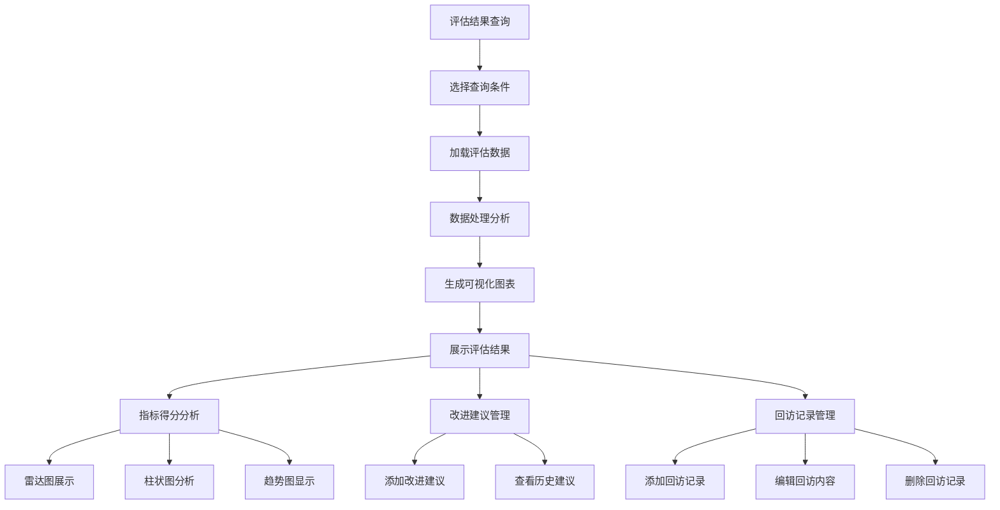
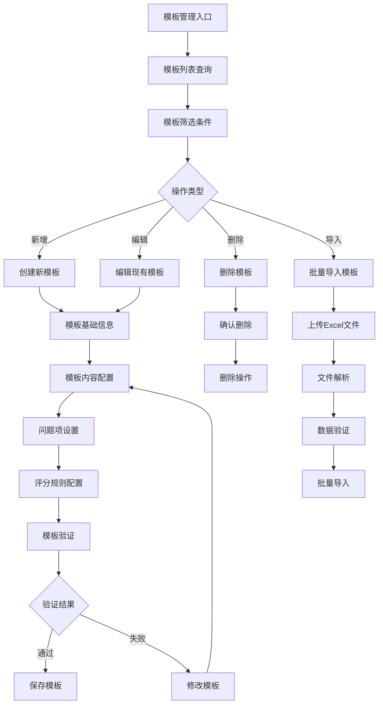
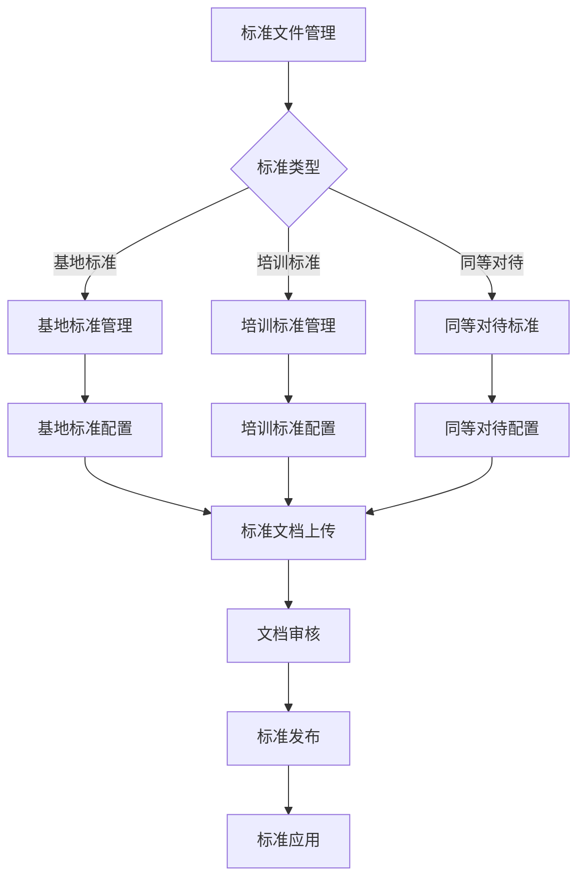

# 360度评估系统 - 深度业务分析报告

## 📋 系统概览

**模块路径**: `src/views/360/`
**开发者**: 邹瑜等团队开发
**开发时间**: 2023年10月-2024年
**文件数量**: 50+个Vue文件
**复杂度**: ⭐⭐⭐⭐⭐ (极高复杂度)

### 系统定位
360度评估系统是医院教育管理的核心评估体系，实现对住院医师、带教老师、轮转科室的全方位、多维度评估，通过科学的评估模板和数据分析，为医院教育质量提升提供决策支持。

---

## 🏗️ 系统架构

### 核心子模块

| 子模块 | 路径 | 文件数 | 主要功能 | 复杂度 |
|--------|------|--------|----------|--------|
| 评估阶段管理 | phase/ | 15个 | 住院医师、轮转科室、带教老师评估 | ⭐⭐⭐⭐⭐ |
| 评估结果分析 | evalResult/ | 12个 | 多维度评估结果统计分析 | ⭐⭐⭐⭐⭐ |
| 评估模板管理 | teachingEvaluationTemp/ | 8个 | 评估模板配置和管理 | ⭐⭐⭐⭐ |
| 标准文件管理 | StandardDocumentMg/ | 6个 | 基地标准、培训标准管理 | ⭐⭐⭐⭐ |
| 模板参数配置 | teachingEvaluationTempParam/ | 5个 | 评价模板参数配置 | ⭐⭐⭐ |
| 360组件系统 | component/ | 10个 | 360评估系统公共组件 | ⭐⭐⭐⭐ |

### 技术架构特色
1. **多维度评估**: 支持住院医师(S)、轮转科室(B)、带教老师等多种评估类型
2. **动态模板系统**: 基于配置的评估模板动态渲染
3. **数据可视化**: ECharts图表展示评估结果和趋势分析
4. **标准化管理**: 统一的评估标准和文件管理

---

## 📊 业务流程分析

### 1. 评估阶段管理模块 (phase)

#### 1.1 核心业务流程

```mermaid
graph TB
    A[评估阶段启动] --> B[选择评估类型]
    B --> C{评估类型}
    C -->|住院医师评估(S)| D[住院医师评估流程]
    C -->|轮转科室评估(B)| E[轮转科室评估流程]
    C -->|带教老师评估| F[带教老师评估流程]
    
    D --> G[加载评估模板]
    E --> G
    F --> G
    
    G --> H[填写评估表单]
    H --> I[数据验证]
    I --> J{验证结果}
    J -->|通过| K[保存评估结果]
    J -->|失败| L[修改评估内容]
    L --> H
    
    K --> M[生成评估报告]
    M --> N[数据统计分析]
    N --> O[评估完成]
```

#### 1.2 评估类型管理

| 评估类型 | 代码 | 组件文件 | 主要功能 | 评估对象 |
|---------|------|----------|----------|----------|
| 住院医师评估 | S | inpatient.vue | 住院医师综合能力评估 | 住院医师 |
| 轮转科室评估 | B | rotationDepartment.vue | 科室轮转质量评估 | 轮转科室 |
| 带教老师评估 | - | teachingTeacher.vue | 教师教学能力评估 | 带教老师 |

#### 1.3 关键API接口

```javascript
// 评估阶段核心API
findEnableEvaSettingTemplateList()  // 获取启用的评估模板列表
getDepartEvaByStuList()            // 获取科室评估学生列表
seachDepartList()                  // 搜索科室列表
studentSupervise()                 // 学生督导功能
queryDepartEvalByStuAnalysisStuAndScore() // 科室评估分析
```

### 2. 评估结果分析模块 (evalResult)

#### 2.1 业务流程



#### 2.2 核心功能点

| 功能模块 | 描述 | 实现方式 |
|---------|------|----------|
| 指标得分 | 多维度评估指标展示 | 动态表格+图表 |
| 改进建议 | 评估改进建议管理 | 文本编辑+存储 |
| 回访记录 | 评估后回访跟踪 | CRUD操作 |
| 数据可视化 | 评估结果图表展示 | ECharts集成 |

#### 2.3 关键API接口

```javascript
// 评估结果相关API
findTeaEvaDetails()           // 查找教师评估详情
saveOrupdateVisitedRecord()   // 保存或更新回访记录
getVisitedRecord()            // 获取回访记录
getUserEvalRecommond()        // 获取用户评估建议
deletedVisitedRecord()        // 删除回访记录
```

### 3. 评估模板管理模块 (teachingEvaluationTemp)

#### 3.1 业务流程



#### 3.2 模板类型管理

| 模板类型 | 描述 | 适用场景 | 配置项 |
|---------|------|----------|--------|
| 单选分值(S) | 单选题带分值 | 量化评估 | 选项+分值 |
| 单选字母(M) | 单选题字母选项 | 等级评估 | 选项+等级 |
| 简答题(A) | 文本输入题 | 主观评价 | 字数限制 |

### 4. 标准文件管理模块 (StandardDocumentMg)

#### 4.1 业务流程



#### 4.2 标准类型

| 标准类型 | 组件文件 | 主要功能 | 管理内容 |
|---------|----------|----------|----------|
| 基地标准 | BaseStandards.vue | 培训基地标准管理 | 基地认证标准 |
| 培训标准 | TrainingStandards.vue | 培训项目标准管理 | 培训大纲标准 |
| 同等对待 | EqualTreatment.vue | 同等对待标准管理 | 公平性标准 |

---

## 👥 用户角色与权限

### 用户角色定义

| 角色 | 权限范围 | 主要操作 |
|------|----------|----------|
| **评估管理员** | 全局评估管理 | 配置模板、查看所有评估结果 |
| **科室主任** | 科室评估管理 | 查看科室评估、管理科室标准 |
| **带教老师** | 教学评估权限 | 评估学生、查看评估结果 |
| **住院医师** | 参与评估权限 | 参与评估、查看个人结果 |
| **系统管理员** | 系统配置权限 | 用户管理、系统配置 |

### 权限控制矩阵

| 功能模块 | 评估管理员 | 科室主任 | 带教老师 | 住院医师 | 系统管理员 |
|---------|------------|----------|----------|----------|------------|
| 创建评估模板 | ✅ | ❌ | ❌ | ❌ | ✅ |
| 配置评估参数 | ✅ | ✅(科室内) | ❌ | ❌ | ✅ |
| 查看评估结果 | ✅ | ✅(科室内) | ✅(相关) | ✅(个人) | ✅ |
| 管理标准文件 | ✅ | ✅(科室内) | ❌ | ❌ | ✅ |
| 添加改进建议 | ✅ | ✅ | ✅ | ❌ | ✅ |
| 回访记录管理 | ✅ | ✅ | ✅ | ❌ | ✅ |

---

## 🔧 技术实现分析

### 前端技术栈
- **Vue 2.6.14**: 主框架
- **Element UI**: UI组件库
- **ECharts**: 数据可视化
- **Vuex**: 状态管理
- **Moment.js**: 时间处理

### 核心技术特点

#### 1. 动态模板系统
```javascript
// 动态加载评估模板
queryEnableEvaSettingTemplateList() {
  const obj = {
    source: this.$route.meta.source,
    isStudent: false
  }
  findEnableEvaSettingTemplateList(obj).then(res => {
    if (res.status === 200 || res.status === 1) {
      this.elTabPaneList = res.data
    }
  })
}
```

#### 2. 组件动态渲染
```javascript
// 根据评估类型动态渲染组件
<inpatient v-if="activeName === 'S'" :evaluation-type="activeName"></inpatient>
<rotation-department v-else-if="activeName === 'B'" :evaluation-type="activeName"></rotation-department>
<teaching-teacher v-else :evaluation-type="activeName"></teaching-teacher>
```

#### 3. 数据可视化集成
```javascript
// ECharts图表组件集成
import echarts from '@/components/echarts/echarts'
components: {
  echarts
}
```

#### 4. 状态管理
```javascript
// Vuex状态管理
handleClick(tab, event) {
  this.$store.commit('evaluation360/setEvaluationType', this.activeName)
}
```

---

## 📈 数据统计与分析

### 关键指标
1. **评估完成率**: 按科室、专业、时间维度统计
2. **评估质量分析**: 评估结果分布、趋势分析
3. **改进效果跟踪**: 改进建议执行情况
4. **回访记录统计**: 回访频率、效果分析

### 可视化功能
1. **雷达图**: 多维度能力评估展示
2. **柱状图**: 评估分数对比分析
3. **折线图**: 评估趋势变化分析
4. **饼图**: 评估结果分布统计

---

## 🎯 业务价值分析

### 核心价值
1. **评估标准化**: 统一评估标准和流程
2. **数据科学化**: 基于数据的客观评估
3. **改进可视化**: 直观展示改进方向
4. **跟踪系统化**: 完整的评估跟踪体系

### 解决的痛点
1. **评估主观性**: 通过标准化模板减少主观因素
2. **数据分散性**: 集中化评估数据管理
3. **改进盲目性**: 基于数据的精准改进建议
4. **跟踪困难性**: 系统化的回访跟踪机制

---

## 🔮 优化建议

### 技术优化
1. **性能优化**: 大数据量图表渲染优化
2. **移动端适配**: 响应式设计支持移动评估
3. **实时更新**: WebSocket实时数据更新
4. **离线功能**: 支持离线评估和同步

### 业务优化
1. **智能分析**: AI辅助评估结果分析
2. **预警机制**: 异常评估结果自动预警
3. **个性化推荐**: 基于历史数据的改进建议
4. **多维度对比**: 跨科室、跨时间的对比分析

这个360度评估系统展现了医院教育管理中评估体系的完整性和科学性！
