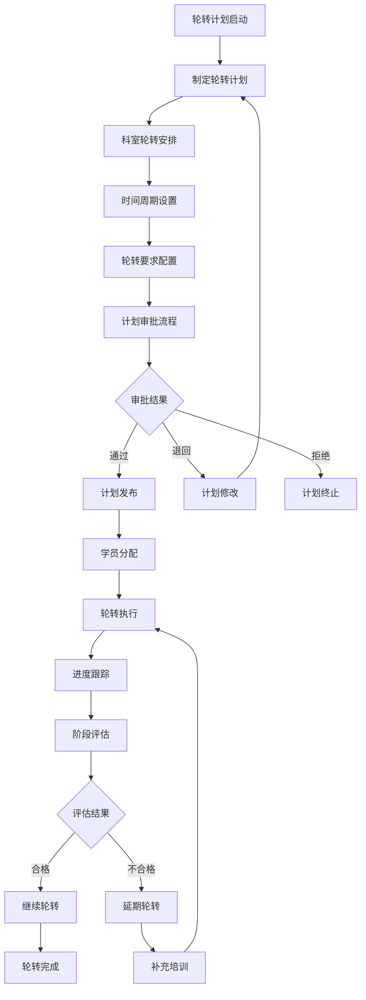
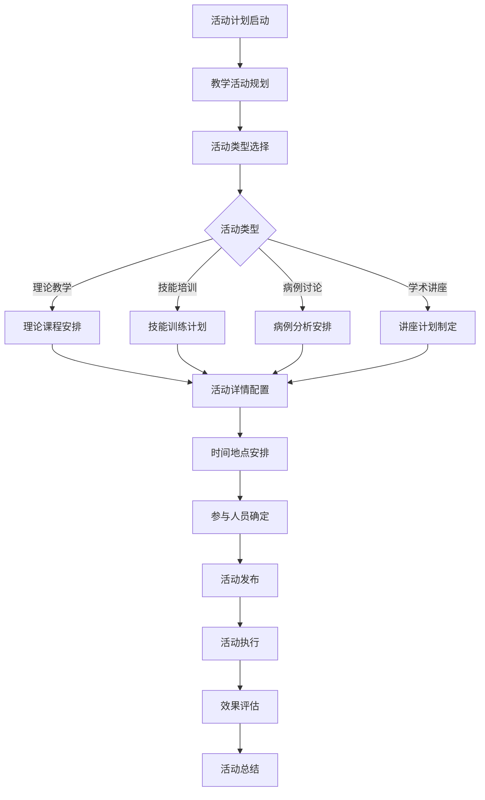
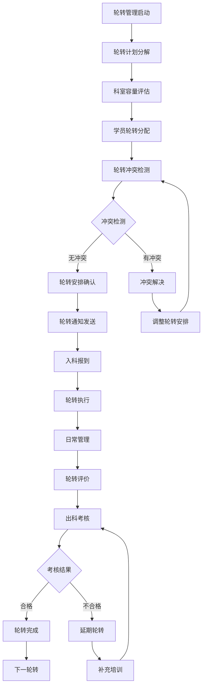
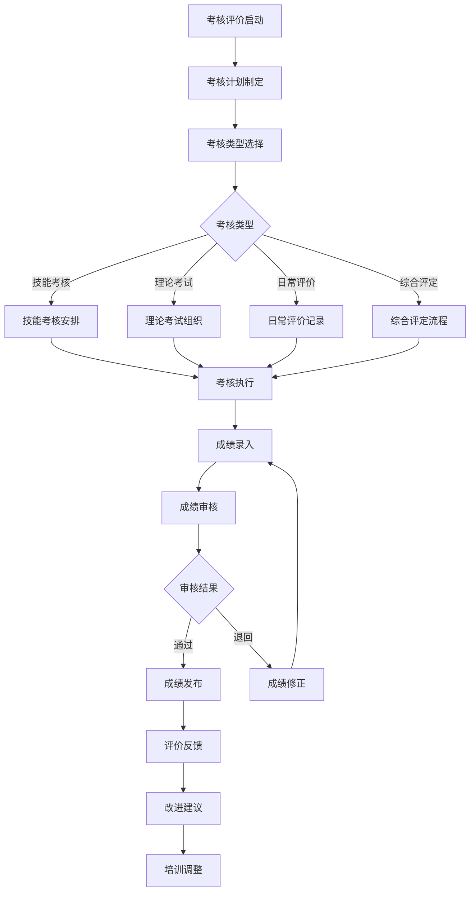
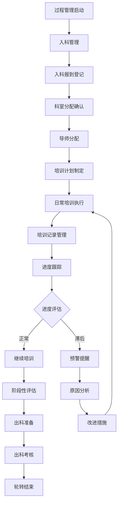

# 住培管理系统 - 深度业务分析报告

## 📋 系统概览

**模块路径**: 分布在多个模块中
**开发者**: 团队协作开发
**开发时间**: 2023年-2024年
**文件数量**: 100+个Vue文件
**复杂度**: ⭐⭐⭐⭐⭐ (极高复杂度)

### 系统定位
住院医师规范化培训管理系统是医院教育管理的核心培训模块，负责管理住院医师规范化培训的全生命周期，包括培训计划制定、轮转安排、考核评价、结业管理等完整的住培业务流程，确保住培质量符合国家标准。

---

## 🏗️ 系统架构

### 核心子模块

| 子模块 | 路径 | 文件数 | 主要功能 | 复杂度 |
|--------|------|--------|----------|--------|
| 轮转计划管理 | rotationPlan/ | 15个 | 轮转计划制定、审批流程 | ⭐⭐⭐⭐⭐ |
| 住培活动计划 | residentPhysicianTraining/ | 12个 | 教学活动计划管理 | ⭐⭐⭐⭐⭐ |
| 轮转管理 | rotationManagement/ | 20个 | 轮转安排、轮转跟踪 | ⭐⭐⭐⭐⭐ |
| 考核评价 | appraisalManagement/ | 25个 | 技能考核、综合评价 | ⭐⭐⭐⭐⭐ |
| 过程管理 | processManagement/ | 18个 | 入科管理、过程跟踪 | ⭐⭐⭐⭐⭐ |
| 统计分析 | statisticalAnalysis/ | 10个 | 教学统计、评价分析 | ⭐⭐⭐⭐ |

### 技术架构特色
1. **全流程管理**: 从入学到结业的完整培训流程管理
2. **智能轮转算法**: 基于规则的轮转科室自动分配
3. **多维度考核**: 技能考核、日常评价、综合评定
4. **实时跟踪**: 培训进度实时跟踪和预警

---

## 📊 业务流程分析

### 1. 轮转计划管理模块 (rotationPlan)

#### 1.1 核心业务流程



#### 1.2 轮转计划类型

| 计划类型 | 培训周期 | 轮转科室 | 考核要求 |
|---------|----------|----------|----------|
| 内科住培 | 33个月 | 内科各专业科室 | 理论+技能+病例 |
| 外科住培 | 33个月 | 外科各专业科室 | 手术技能+理论 |
| 妇产科住培 | 33个月 | 妇科+产科+相关科室 | 专科技能考核 |
| 儿科住培 | 33个月 | 儿科各专业科室 | 儿科专项考核 |
| 急诊科住培 | 33个月 | 急诊+相关科室 | 急救技能考核 |

#### 1.3 关键API接口

```javascript
// 轮转计划核心API
getRotationPlanList()           // 获取轮转计划列表
showRotationPlanListDetail()    // 查看计划详情
savePlanApply()                 // 保存计划申请
queryDropDownPropertyDictionaryList() // 查询下拉字典
```

### 2. 住培活动计划模块 (residentPhysicianTraining)

#### 2.1 业务流程



#### 2.2 教学活动类型

| 活动类型 | 频次要求 | 参与对象 | 考核方式 |
|---------|----------|----------|----------|
| 理论授课 | 每周2次 | 全体住培生 | 理论考试 |
| 技能培训 | 每周1次 | 分专业组 | 技能考核 |
| 病例讨论 | 每周1次 | 科室内部 | 病例分析 |
| 学术讲座 | 每月2次 | 全院开放 | 参与记录 |
| 教学查房 | 每日进行 | 科室住培生 | 现场评价 |

### 3. 轮转管理模块 (rotationManagement)

#### 3.1 业务流程



#### 3.2 轮转安排算法

| 算法要素 | 权重 | 约束条件 | 优化目标 |
|---------|------|----------|----------|
| 科室容量 | 30% | 最大接收人数 | 均衡分配 |
| 轮转顺序 | 25% | 专业要求顺序 | 循序渐进 |
| 时间安排 | 25% | 轮转周期要求 | 时间连续 |
| 个人偏好 | 20% | 学员申请偏好 | 满意度最大 |

### 4. 考核评价模块 (appraisalManagement)

#### 4.1 业务流程



#### 4.2 考核评价体系

| 评价维度 | 权重 | 评价内容 | 评价标准 |
|---------|------|----------|----------|
| 医德医风 | 20% | 职业道德、医患沟通 | 优秀/良好/合格/不合格 |
| 专业知识 | 30% | 理论知识掌握程度 | 90/75/60分线 |
| 临床技能 | 30% | 操作技能、诊疗能力 | 技能考核标准 |
| 团队协作 | 10% | 团队合作、沟通能力 | 同事评价 |
| 学习能力 | 10% | 自主学习、持续改进 | 学习记录 |

### 5. 过程管理模块 (processManagement)

#### 5.1 业务流程



---

## 👥 用户角色与权限

### 用户角色定义

| 角色 | 权限范围 | 主要操作 |
|------|----------|----------|
| **住培管理员** | 全局住培管理 | 计划制定、轮转安排、考核管理 |
| **科室教学秘书** | 科室住培管理 | 科室轮转管理、日常评价 |
| **带教老师** | 学员指导权限 | 学员指导、评价记录 |
| **住培学员** | 个人学习权限 | 学习记录、考核参与、进度查询 |
| **系统管理员** | 系统配置权限 | 用户管理、系统配置 |

### 权限控制矩阵

| 功能模块 | 住培管理员 | 科室秘书 | 带教老师 | 住培学员 | 系统管理员 |
|---------|------------|----------|----------|----------|------------|
| 轮转计划 | ✅ | ✅(科室内) | ❌ | ✅(查看) | ✅ |
| 活动计划 | ✅ | ✅(科室内) | ✅(参与) | ✅(参与) | ✅ |
| 轮转管理 | ✅ | ✅(科室内) | ❌ | ✅(个人) | ✅ |
| 考核评价 | ✅ | ✅(科室内) | ✅(评价) | ✅(参与) | ✅ |
| 过程管理 | ✅ | ✅(科室内) | ✅(指导) | ✅(记录) | ✅ |
| 系统配置 | ❌ | ❌ | ❌ | ❌ | ✅ |

---

## 🔧 技术实现分析

### 前端技术栈
- **Vue 2.6.14**: 主框架
- **Element UI**: UI组件库
- **Moment.js**: 时间处理
- **Lodash**: 工具库

### 核心技术特点

#### 1. 轮转计划管理
```javascript
// 轮转计划API调用
getRotationPlanList(data).then(res => {
  this.planList = res.data.records
  this.total = res.data.total
})

// 计划审批流程
savePlanApply(data).then(res => {
  if (res.code === 0) {
    this.$message.success('审批成功')
    this.getList()
  }
})
```

#### 2. 活动计划管理
```javascript
// 教学活动计划
queryActivityPlanList(data).then(res => {
  this.tableData = res.data.records
  this.searchForm.total = res.data.total
})

// 计划状态管理
planStatusList: {
  N: '未发布',
  P: '已发布', 
  C: '已取消',
  S: '已提交'
}
```

#### 3. 轮转安排算法
```javascript
// 轮转安排详情
scheduleDetailList(data).then(res => {
  this.scheduleList = res.data
  this.processScheduleData()
})

// 轮转冲突检测
upsertScheduleDetail(data).then(res => {
  if (res.code === 0) {
    this.$message.success('安排成功')
  } else {
    this.$message.error('存在冲突：' + res.message)
  }
})
```

#### 4. 考核评价系统
```javascript
// 考核成绩管理
queryOrgStats(params).then(res => {
  this.tableData = res.data.records
  this.processScoreData()
})

// 评分标准
gradeStandard: {
  excellent: 90,  // 优秀
  good: 75,       // 良好
  qualified: 60,  // 合格
  unqualified: 0  // 不合格
}
```

---

## 📈 数据统计与分析

### 关键指标
1. **培训完成率**: 按专业、科室统计培训完成情况
2. **考核通过率**: 各阶段考核通过率分析
3. **轮转效率**: 轮转安排效率和满意度
4. **教学质量**: 教学活动质量评估

### 统计功能
1. **实时监控**: 培训进度实时监控
2. **预警机制**: 进度滞后预警提醒
3. **质量分析**: 培训质量趋势分析
4. **效果评估**: 培训效果综合评估

---

## 🎯 业务价值分析

### 核心价值
1. **标准化培训**: 符合国家住培标准的规范化培训
2. **精细化管理**: 全流程精细化管理和跟踪
3. **质量保证**: 多维度质量控制和评价体系
4. **效率提升**: 自动化轮转安排和管理

### 解决的痛点
1. **培训不规范**: 标准化培训流程和要求
2. **轮转安排复杂**: 智能化轮转安排算法
3. **考核不统一**: 统一的考核评价标准
4. **过程难跟踪**: 全程数字化跟踪管理

---

## 🔮 优化建议

### 技术优化
1. **AI辅助**: AI辅助轮转安排和学习推荐
2. **移动端**: 支持移动端学习和管理
3. **大数据分析**: 深度挖掘培训数据价值
4. **智能预警**: 基于数据的智能预警系统

### 业务优化
1. **个性化培训**: 个性化培训方案制定
2. **质量持续改进**: 基于数据的质量持续改进
3. **跨院交流**: 支持跨医院轮转交流
4. **国际标准**: 对接国际住培标准

这个住培管理系统展现了医院住院医师规范化培训管理的专业性和完整性！
