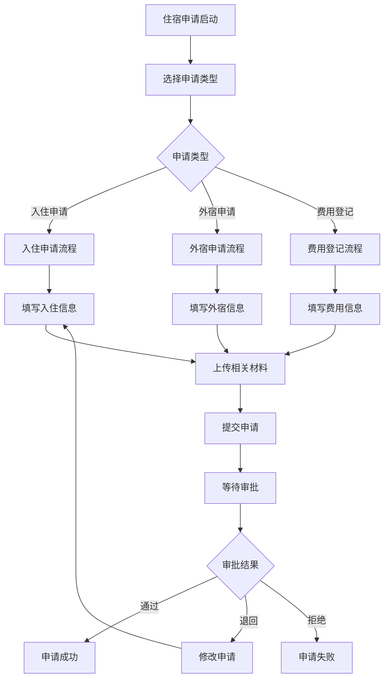
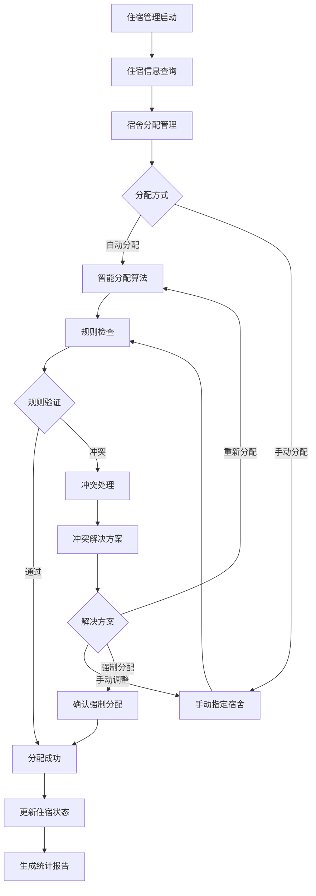
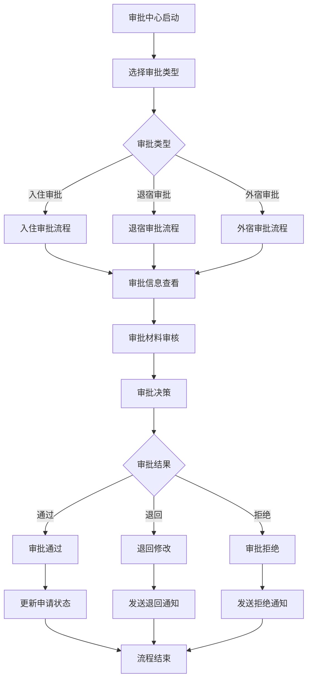
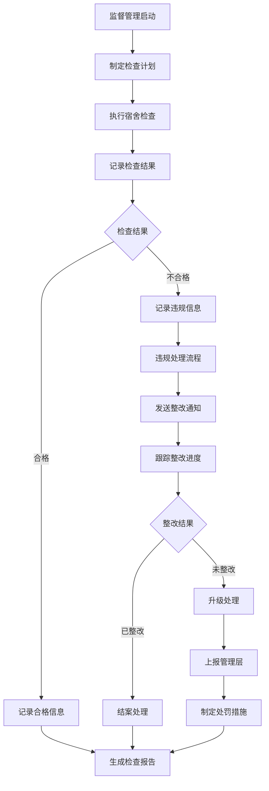

# 住宿管理系统 - 深度业务分析报告

## 📋 系统概览

**模块路径**: `src/views/StayManagement/`
**开发者**: 团队协作开发
**开发时间**: 2023年-2024年
**文件数量**: 60+个Vue文件
**复杂度**: ⭐⭐⭐⭐⭐ (极高复杂度)

### 系统定位
住宿管理系统是医院教育管理的重要支撑模块，负责管理医院住宿人员的入住申请、宿舍分配、审批流程、监督管理、费用管理等全生命周期业务，确保住宿资源的合理分配和规范管理。

---

## 🏗️ 系统架构

### 核心子模块

| 子模块 | 路径 | 文件数 | 主要功能 | 复杂度 |
|--------|------|--------|----------|--------|
| 我的住宿 | myStay/ | 8个 | 入住申请、外宿申请、费用登记 | ⭐⭐⭐⭐ |
| 住宿管理 | stay/ | 12个 | 宿舍分配、住宿统计、冲突处理 | ⭐⭐⭐⭐⭐ |
| 审批中心 | stayApproval/ | 15个 | 入住审批、退宿审批、外宿审批 | ⭐⭐⭐⭐⭐ |
| 宿舍管理 | dormitory/ | 8个 | 宿舍信息维护、楼层房间管理 | ⭐⭐⭐⭐ |
| 设备管理 | device/ | 6个 | 设备维护记录、设备使用统计 | ⭐⭐⭐ |
| 访客管理 | visitor/ | 5个 | 访客登记系统、访客权限控制 | ⭐⭐⭐ |
| 监督管理 | supervision/ | 6个 | 宿舍检查记录、违规处理流程 | ⭐⭐⭐⭐ |
| 费用管理 | expense/ | 4个 | 住宿费用管理、缴费记录 | ⭐⭐⭐ |
| 外出管理 | goOut/ | 3个 | 外出申请、外出记录 | ⭐⭐⭐ |
| 返回宿舍 | returnDormitory/ | 3个 | 未归寝登记、归寝统计 | ⭐⭐⭐ |

### 技术架构特色
1. **智能分配算法**: 基于规则的宿舍自动分配系统
2. **冲突检测机制**: 实时检测和处理住宿冲突
3. **多级审批流程**: 完整的住宿申请审批工作流
4. **统计分析系统**: 全方位的住宿数据统计和分析

---

## 📊 业务流程分析

### 1. 我的住宿模块 (myStay)

#### 1.1 核心业务流程



#### 1.2 申请类型管理

| 申请类型 | 组件文件 | 主要功能 | 审批流程 |
|---------|----------|----------|----------|
| 入住申请 | MoveInto.vue | 新入住申请管理 | 三级审批 |
| 外宿申请 | SleepOver.vue | 外宿申请管理 | 二级审批 |
| 费用登记 | FeeRegistration.vue | 住宿费用登记 | 一级审批 |

#### 1.3 关键API接口

```javascript
// 我的住宿核心API
blendStudentRoomInfo()      // 获取学生住宿信息
blendStudentApply()         // 学生申请提交
```

### 2. 住宿管理模块 (stay)

#### 2.1 业务流程



#### 2.2 宿舍分配规则

| 楼层 | 分配对象 | 分配规则 | 特殊说明 |
|------|----------|----------|----------|
| 2楼 | 本科生、进修生 | 实习生、医疗部、护理部、儿科转岗医生 | 按性别分配 |
| 3楼 | 研究生、住培生 | 学硕、专硕、5+3研究生、学博、专博 | 按年级分配 |
| 4楼 | 5+3本科生 | 5+3本科生专用 | 独立管理 |
| 随机 | 院外游客 | 临时住宿人员 | 灵活分配 |

#### 2.3 关键API接口

```javascript
// 住宿管理核心API
blendRoomUserPageList()     // 住宿人员分页列表
blendRoomUserDelete()       // 删除住宿记录
blendRoomUserExcelImport()  // 批量导入住宿信息
blendRoomUserExcelExport()  // 导出住宿信息
blendRoomUserDaySummary()   // 日汇总统计
```

### 3. 审批中心模块 (stayApproval)

#### 3.1 业务流程



#### 3.2 审批类型管理

| 审批类型 | 组件文件 | 审批权限 | 处理时限 |
|---------|----------|----------|----------|
| 入住审批 | moveInto/index.vue | 宿管、科室主任、教务处 | 3个工作日 |
| 退宿审批 | retreat/index.vue | 宿管、科室主任 | 2个工作日 |
| 外宿审批 | sleepOver/index.vue | 科室主任、教务处 | 1个工作日 |

### 4. 监督管理模块 (supervision)

#### 4.1 业务流程



---

## 👥 用户角色与权限

### 用户角色定义

| 角色 | 权限范围 | 主要操作 |
|------|----------|----------|
| **住宿管理员** | 全局住宿管理 | 宿舍分配、审批管理、统计分析 |
| **宿舍管理员** | 宿舍日常管理 | 入住登记、检查记录、维修报告 |
| **科室管理员** | 科室住宿管理 | 科室人员住宿申请审批 |
| **学员** | 个人住宿权限 | 住宿申请、费用缴纳、信息查询 |
| **系统管理员** | 系统配置权限 | 用户管理、系统配置 |

### 权限控制矩阵

| 功能模块 | 住宿管理员 | 宿舍管理员 | 科室管理员 | 学员 | 系统管理员 |
|---------|------------|------------|------------|------|------------|
| 宿舍分配 | ✅ | ✅ | ❌ | ❌ | ✅ |
| 入住审批 | ✅ | ✅ | ✅(科室内) | ❌ | ✅ |
| 费用管理 | ✅ | ✅ | ❌ | ✅(个人) | ✅ |
| 监督检查 | ✅ | ✅ | ❌ | ❌ | ✅ |
| 统计分析 | ✅ | ✅(宿舍内) | ✅(科室内) | ✅(个人) | ✅ |
| 系统配置 | ❌ | ❌ | ❌ | ❌ | ✅ |

---

## 🔧 技术实现分析

### 前端技术栈
- **Vue 2.6.14**: 主框架
- **Element UI**: UI组件库
- **Vuex**: 状态管理
- **Vue Router**: 路由管理

### 核心技术特点

#### 1. 智能分配算法
```javascript
// 宿舍分配规则检查
if (res.code == '1090001001') {
  let message = `当前住宿人所分配宿舍不满足分配规则，请确认是否继续分配
  分配规则：
  2楼：本科生（实习生）、进修生（医疗部、护理部、儿科转岗医生）
  3楼：研究生（学硕、专硕、5+3研究生、学博、专博）+住培生
  4楼：本科生（5+3本科生）
  随机分配：院外游客`
  
  this.$confirm(message, '提示', {
    confirmButtonText: '确定',
    cancelButtonText: '取消'
  }).then(() => {
    this.submitForm({ autoAllotRoom: true })
  })
}
```

#### 2. 冲突检测机制
```javascript
// 冲突处理对话框
<conflict-dialog ref="conflictDialog" @refresh="getList" />

// 冲突检测和处理
if (res.data && res.data.status == 1) {
  this.dataTimeInfo = res.data
  this.dataTimeVisbile = true
  return false
}
```

#### 3. 状态管理集成
```javascript
// Vuex状态管理
created() {
  this.$store.dispatch('StayManagement/commonGetUserTypeMap')
}
```

#### 4. 批量操作处理
```javascript
// 批量更新住宿信息
let res = await blendRoomUserBatchUpdate(invalidEvent)
if (res.data.errorTimeList && res.data.errorTimeList.length > 0) {
  this.dataTimeInfo = res.data.errorTimeList
  this.dataTimeVisbile = true
}
```

---

## 📈 数据统计与分析

### 关键指标
1. **入住率统计**: 按楼层、房间类型、时间维度统计
2. **申请处理效率**: 审批时长、通过率统计
3. **违规情况分析**: 违规类型、频率、处理情况
4. **费用收缴情况**: 缴费率、欠费统计

### 统计功能
1. **日汇总统计**: 每日住宿情况汇总
2. **住宿统计分析**: 多维度住宿数据分析
3. **归寝统计**: 未归寝登记和统计
4. **设备使用统计**: 设备维护和使用情况

---

## 🎯 业务价值分析

### 核心价值
1. **资源优化配置**: 智能分配算法提高宿舍利用率
2. **流程标准化**: 统一住宿申请和审批流程
3. **管理精细化**: 全方位的住宿监督和管理
4. **数据可视化**: 直观展示住宿管理效果

### 解决的痛点
1. **分配不合理**: 通过智能算法实现合理分配
2. **审批流程混乱**: 标准化审批流程
3. **监督管理困难**: 系统化监督检查机制
4. **数据统计繁琐**: 自动化数据统计和分析

---

## 🔮 优化建议

### 技术优化
1. **算法优化**: 改进宿舍分配算法，提高分配效率
2. **移动端适配**: 支持移动端住宿管理
3. **实时通知**: WebSocket实时推送住宿状态变化
4. **智能预警**: 基于数据分析的异常预警

### 业务优化
1. **自助服务**: 增加自助入住、退宿功能
2. **智能客服**: AI客服解答住宿相关问题
3. **满意度调查**: 定期住宿满意度调查
4. **能耗管理**: 集成能耗监控和管理

这个住宿管理系统展现了医院后勤管理的数字化转型和智能化升级！
