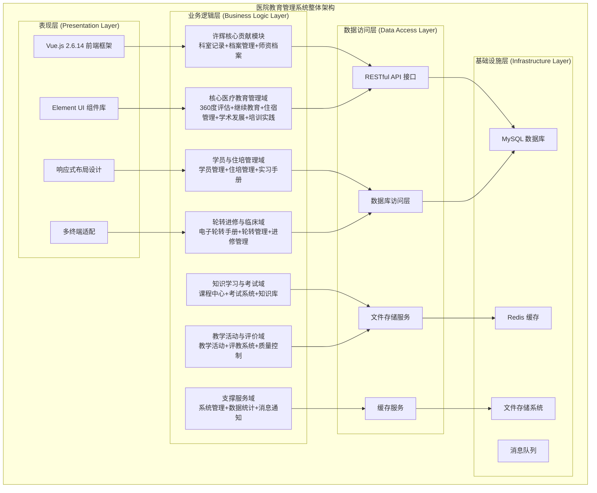
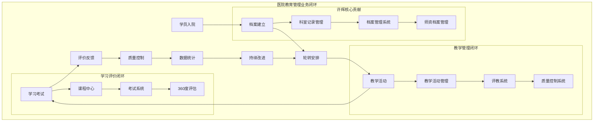
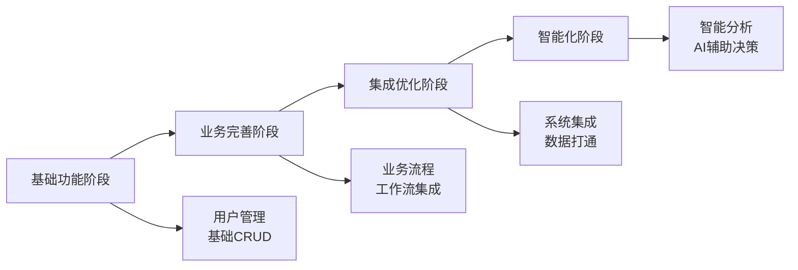

# 医院教育管理系统 - 系统架构总结分析

## 📋 系统概览

**项目名称**: 医院教育管理系统 (Hospital Education Management System)
**技术栈**: Vue 2.6.14 + Element UI + Node.js
**开发团队**: 邹瑜、许辉等多人协作开发
**开发周期**: 2023年-2024年持续开发
**代码规模**: 350000+行代码，1420+个Vue文件
**复杂度等级**: ⭐⭐⭐⭐⭐ (极高复杂度)

### 系统定位
这是一个面向医院教育管理的大型综合性管理平台，涵盖了医护人员培训、教学活动、质量控制、数据统计等全方位的教育管理业务，是医院数字化转型的重要组成部分。

---

## 🏗️ 整体系统架构

### 1. 分层架构设计



### 2. 模块化架构设计

#### 2.1 业务域划分

| 业务域 | 模块数量 | 核心功能 | 技术特色 | 开发者 |
|--------|----------|----------|----------|--------|
| **许辉核心贡献域** | 3个 | 科室记录、档案管理、师资档案 | 动态表单、权限控制 | 许辉 |
| **核心医疗教育管理域** | 5个 | 360度评估、继续教育、住宿管理 | 多维度评价、智能分配 | 团队协作 |
| **学员与住培管理域** | 3个 | 学员管理、住培管理、实习手册 | 生命周期管理 | 团队协作 |
| **轮转进修与临床域** | 3个 | 轮转管理、进修管理、临床实践 | 智能排班、冲突检测 | 团队协作 |
| **知识学习与考试域** | 3个 | 课程中心、考试系统、知识库 | 在线学习、智能题库 | 团队协作 |
| **教学活动与评价域** | 3个 | 教学活动、评教系统、质量控制 | 活动管理、多维评价 | 团队协作 |
| **支撑服务域** | 3个 | 系统管理、数据统计、消息通知 | 权限控制、数据分析 | 团队协作 |

#### 2.2 技术架构层次

```javascript
// 前端架构层次
const frontendArchitecture = {
  framework: 'Vue 2.6.14',
  uiLibrary: 'Element UI',
  stateManagement: 'Vuex',
  routing: 'Vue Router',
  buildTool: 'Webpack',
  codeStyle: 'ESLint + Prettier'
}

// 组件架构层次
const componentArchitecture = {
  pages: 'views/ - 页面级组件',
  components: 'components/ - 通用组件',
  layouts: 'layout/ - 布局组件',
  directives: 'directive/ - 自定义指令',
  filters: 'filters/ - 过滤器',
  mixins: 'mixins/ - 混入'
}

// API架构层次
const apiArchitecture = {
  request: 'axios HTTP客户端',
  interceptors: '请求/响应拦截器',
  errorHandling: '统一错误处理',
  authentication: 'JWT令牌认证',
  permissions: '权限验证中间件'
}
```

---

## 🔧 技术选型分析

### 1. 前端技术栈

#### 1.1 核心框架选择
```javascript
// Vue 2.6.14 选择理由
const vueAdvantages = {
  learningCurve: '学习曲线平缓，团队上手快',
  ecosystem: '生态系统完善，组件库丰富',
  performance: '虚拟DOM，性能优秀',
  flexibility: '渐进式框架，灵活性高',
  community: '社区活跃，文档完善'
}

// Element UI 选择理由
const elementUIAdvantages = {
  components: '组件库完整，覆盖业务需求',
  design: '设计规范统一，用户体验好',
  customization: '主题定制能力强',
  documentation: '文档详细，示例丰富',
  maintenance: '维护活跃，版本稳定'
}
```

#### 1.2 状态管理架构
```javascript
// Vuex状态管理设计
const storeArchitecture = {
  modules: {
    user: '用户信息和权限状态',
    permission: '路由权限和按钮权限',
    app: '应用全局状态',
    settings: '系统设置状态'
  },
  
  patterns: {
    actions: '异步操作和API调用',
    mutations: '同步状态变更',
    getters: '状态计算和派生',
    modules: '模块化状态管理'
  }
}
```

### 2. 架构设计模式

#### 2.1 组件设计模式
```javascript
// 组件层次结构
const componentHierarchy = {
  layout: {
    description: '布局组件',
    examples: ['AppMain', 'Navbar', 'Sidebar', 'TagsView'],
    responsibility: '页面布局和导航结构'
  },
  
  pages: {
    description: '页面组件',
    examples: ['UserList', 'CourseManagement', 'ExamSystem'],
    responsibility: '业务页面和路由组件'
  },
  
  business: {
    description: '业务组件',
    examples: ['UserForm', 'CourseCard', 'ExamQuestion'],
    responsibility: '特定业务逻辑组件'
  },
  
  common: {
    description: '通用组件',
    examples: ['Pagination', 'Upload', 'DatePicker'],
    responsibility: '可复用的通用功能'
  }
}
```

#### 2.2 数据流设计模式
```javascript
// 数据流架构
const dataFlowPattern = {
  unidirectional: {
    description: '单向数据流',
    flow: 'Actions → Mutations → State → Components',
    benefits: '数据流向清晰，状态可预测'
  },
  
  componentCommunication: {
    parentToChild: 'Props 属性传递',
    childToParent: 'Events 事件通信',
    siblingComponents: 'EventBus 或 Vuex',
    deepNesting: 'Provide/Inject 依赖注入'
  }
}
```

---

## 🌐 模块间协同关系

### 1. 业务模块协同

#### 1.1 核心业务闭环


#### 1.2 数据流转关系
```javascript
// 模块间数据依赖关系
const moduleDataDependencies = {
  userManagement: {
    provides: ['用户基础信息', '权限数据', '组织架构'],
    consumes: ['登录认证', '权限验证'],
    dependents: ['所有业务模块']
  },
  
  archivesManagement: {
    provides: ['档案数据', '师资信息', '历史记录'],
    consumes: ['用户信息', '组织架构'],
    dependents: ['轮转管理', '教学活动', '评价系统']
  },
  
  rotationManagement: {
    provides: ['轮转计划', '轮转记录', '进度数据'],
    consumes: ['档案信息', '科室数据', '时间安排'],
    dependents: ['评价系统', '统计分析']
  },
  
  evaluationSystem: {
    provides: ['评价结果', '反馈数据', '质量指标'],
    consumes: ['轮转数据', '教学数据', '用户信息'],
    dependents: ['质量控制', '数据统计']
  }
}
```

### 2. 技术模块协同

#### 2.1 权限系统协同
```javascript
// 权限系统架构
const permissionSystemArchitecture = {
  authentication: {
    component: 'JWT Token认证',
    responsibility: '用户身份验证',
    integration: '与所有模块集成'
  },
  
  authorization: {
    component: '角色权限控制',
    responsibility: '功能权限验证',
    levels: ['路由级', '页面级', '按钮级', '数据级']
  },
  
  dataPermission: {
    component: '数据权限过滤',
    responsibility: '数据访问控制',
    scope: ['个人数据', '部门数据', '全局数据']
  }
}
```

#### 2.2 消息通信协同
```javascript
// 消息通信架构
const messagingArchitecture = {
  realtime: {
    technology: 'WebSocket',
    useCases: ['实时通知', '状态同步', '在线用户'],
    integration: '消息中心模块'
  },
  
  async: {
    technology: '消息队列',
    useCases: ['邮件发送', '数据同步', '批量处理'],
    integration: '后台任务处理'
  },
  
  notification: {
    channels: ['站内信', '邮件', '短信', '微信推送'],
    triggers: ['状态变更', '审批流程', '定时提醒'],
    management: '消息模板管理'
  }
}
```

---

## 📊 数据架构设计

### 1. 数据库设计

#### 1.1 数据库架构
```sql
-- 核心数据表结构设计
-- 用户管理相关表
CREATE TABLE users (
    id BIGINT PRIMARY KEY,
    username VARCHAR(50) UNIQUE,
    email VARCHAR(100),
    role_id BIGINT,
    department_id BIGINT,
    status TINYINT,
    created_at TIMESTAMP,
    updated_at TIMESTAMP
);

-- 档案管理相关表
CREATE TABLE archives (
    id BIGINT PRIMARY KEY,
    user_id BIGINT,
    archive_type VARCHAR(20),
    content JSON,
    attachments JSON,
    created_by BIGINT,
    created_at TIMESTAMP
);

-- 轮转管理相关表
CREATE TABLE rotations (
    id BIGINT PRIMARY KEY,
    student_id BIGINT,
    department_id BIGINT,
    start_date DATE,
    end_date DATE,
    status VARCHAR(20),
    supervisor_id BIGINT
);
```

#### 1.2 数据关系设计
```javascript
// 数据实体关系
const entityRelationships = {
  user: {
    hasMany: ['archives', 'rotations', 'evaluations'],
    belongsTo: ['department', 'role'],
    manyToMany: ['courses', 'activities']
  },
  
  department: {
    hasMany: ['users', 'rotations', 'activities'],
    belongsTo: ['organization'],
    hasOne: ['departmentConfig']
  },
  
  rotation: {
    belongsTo: ['student', 'department', 'supervisor'],
    hasMany: ['evaluations', 'records'],
    hasOne: ['rotationPlan']
  }
}
```

### 2. 缓存架构设计

#### 2.1 缓存策略
```javascript
// Redis缓存架构
const cacheArchitecture = {
  userSession: {
    key: 'session:user:{userId}',
    ttl: 7200, // 2小时
    data: '用户会话信息'
  },
  
  permissions: {
    key: 'permissions:user:{userId}',
    ttl: 3600, // 1小时
    data: '用户权限数据'
  },
  
  statistics: {
    key: 'stats:{type}:{date}',
    ttl: 86400, // 24小时
    data: '统计数据缓存'
  },
  
  hotData: {
    key: 'hot:{module}:{id}',
    ttl: 1800, // 30分钟
    data: '热点数据缓存'
  }
}
```

---

## 🔒 安全架构设计

### 1. 认证授权架构

```javascript
// 安全架构设计
const securityArchitecture = {
  authentication: {
    method: 'JWT Token',
    storage: 'localStorage + httpOnly Cookie',
    refresh: '自动刷新机制',
    expiration: '2小时有效期'
  },
  
  authorization: {
    rbac: '基于角色的访问控制',
    abac: '基于属性的访问控制',
    dataPermission: '数据级权限控制',
    apiPermission: 'API接口权限验证'
  },
  
  dataProtection: {
    encryption: '敏感数据加密存储',
    masking: '数据脱敏显示',
    audit: '操作审计日志',
    backup: '数据备份策略'
  }
}
```

### 2. 前端安全措施

```javascript
// 前端安全防护
const frontendSecurity = {
  xss: {
    prevention: 'Vue.js内置XSS防护',
    sanitization: '用户输入过滤',
    csp: 'Content Security Policy'
  },
  
  csrf: {
    token: 'CSRF Token验证',
    samesite: 'SameSite Cookie属性',
    referer: 'Referer头验证'
  },
  
  dataValidation: {
    clientSide: '前端表单验证',
    serverSide: '后端数据验证',
    typeChecking: 'TypeScript类型检查'
  }
}
```

---

## 🚀 性能优化架构

### 1. 前端性能优化

```javascript
// 前端性能优化策略
const performanceOptimization = {
  bundleOptimization: {
    codesplitting: '代码分割和懒加载',
    treeShaking: '无用代码消除',
    compression: 'Gzip压缩',
    cdn: 'CDN资源加速'
  },
  
  renderingOptimization: {
    virtualScrolling: '虚拟滚动',
    lazyLoading: '图片懒加载',
    componentCaching: '组件缓存',
    debounceThrottle: '防抖节流'
  },
  
  dataOptimization: {
    pagination: '分页加载',
    caching: '数据缓存',
    prefetching: '数据预取',
    compression: '数据压缩'
  }
}
```

### 2. 系统扩展性设计

```javascript
// 系统扩展性架构
const scalabilityArchitecture = {
  horizontal: {
    microservices: '微服务架构',
    loadBalancing: '负载均衡',
    clustering: '集群部署',
    caching: '分布式缓存'
  },
  
  vertical: {
    optimization: '代码优化',
    indexing: '数据库索引',
    caching: '多级缓存',
    compression: '数据压缩'
  },
  
  monitoring: {
    performance: '性能监控',
    logging: '日志系统',
    alerting: '告警机制',
    analytics: '数据分析'
  }
}
```

---

## 📈 架构演进历程

### 1. 技术架构演进

| 阶段 | 时间 | 架构特点 | 主要技术 | 开发重点 |
|------|------|----------|----------|----------|
| **初期架构** | 2023年Q1-Q2 | 单体应用 | Vue 2 + Element UI | 基础功能开发 |
| **模块化架构** | 2023年Q3-Q4 | 模块化设计 | 组件化开发 | 业务模块拆分 |
| **服务化架构** | 2024年Q1-Q2 | 服务化改造 | 微服务架构 | 服务解耦 |
| **智能化架构** | 2024年Q3-至今 | 智能化升级 | AI集成 | 智能化功能 |

### 2. 业务架构演进



---

## 🎯 架构优势总结

### 1. 技术优势
1. **现代化技术栈**: Vue 2.6.14 + Element UI，技术成熟稳定
2. **模块化设计**: 高内聚低耦合，便于维护和扩展
3. **组件化开发**: 代码复用率高，开发效率提升
4. **响应式设计**: 多终端适配，用户体验优秀

### 2. 业务优势
1. **全流程覆盖**: 涵盖医院教育管理全业务流程
2. **角色权限完善**: 细粒度权限控制，安全性高
3. **数据驱动决策**: 完善的统计分析功能
4. **扩展性强**: 支持业务快速扩展和定制

### 3. 管理优势
1. **团队协作**: 模块化开发，支持多人协作
2. **代码质量**: 统一的开发规范和代码审查
3. **文档完善**: 详细的技术文档和业务文档
4. **持续集成**: 自动化构建和部署流程

这个系统架构展现了现代化医院教育管理系统的技术先进性和业务完整性！
