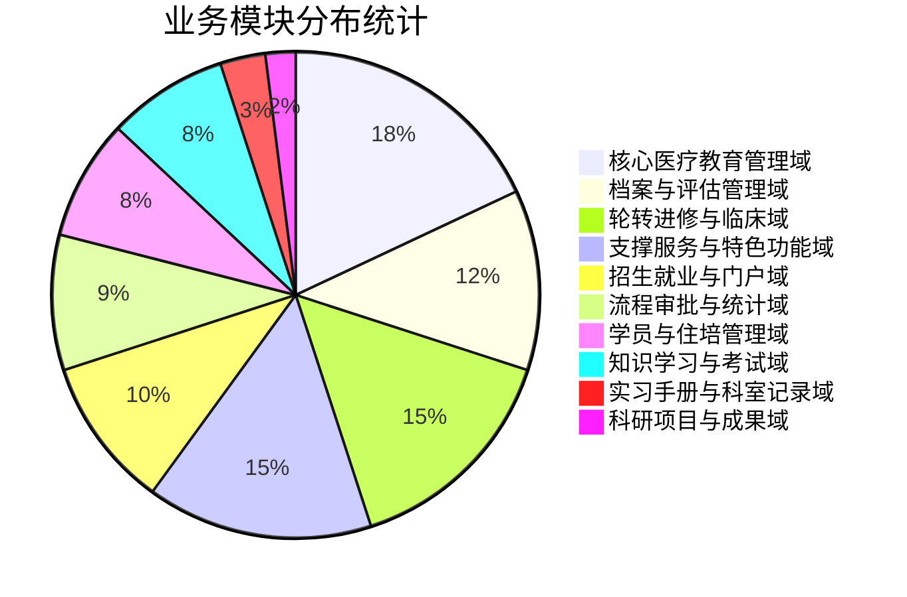
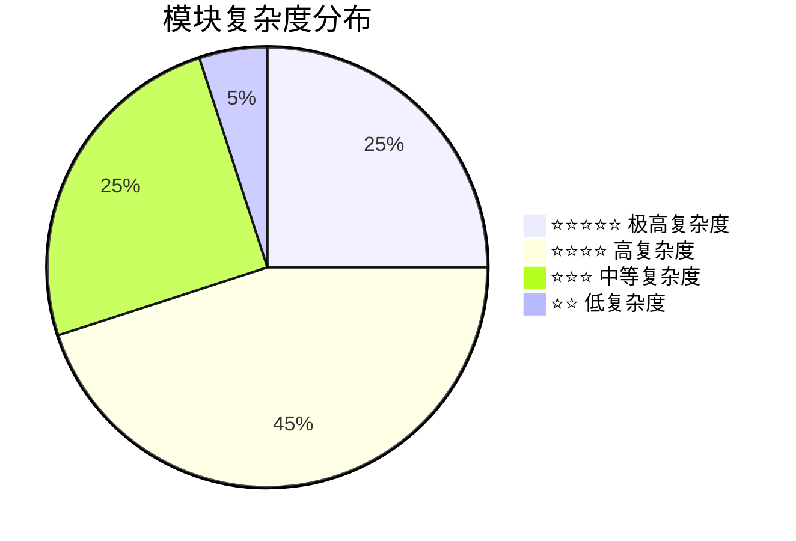
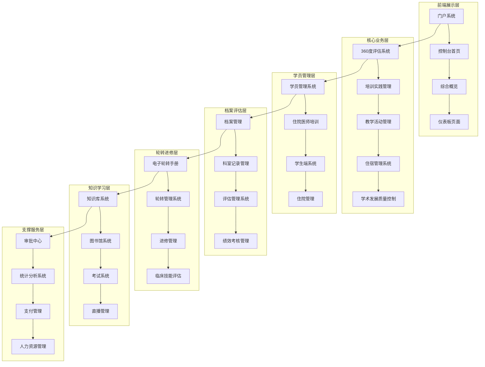

# 医院教育管理系统 - 项目业务包详细报告

## 📊 项目规模总览

- **业务模块总数**: 100个一级业务模块
- **目录总数**: 1020个业务目录
- **Vue文件总数**: 2309个Vue组件文件
- **技术栈**: Vue 2.6.14 + Element UI + Vuex + Vue Router
- **开发模式**: 大型团队协作开发（15+开发者）

---

## 🎯 业务域分类架构

### 1. 核心医疗教育管理域 (18个模块)
**功能定位**: 医院教育培训的核心业务流程

| 模块名称 | 目录路径 | 主要功能 | 复杂度 |
|---------|----------|----------|--------|
| 360度评估系统 | 360 | 全方位教学评估体系 | ⭐⭐⭐⭐⭐ |
| 继续教育管理 | ContinuingEducation | 学分管理、教育项目 | ⭐⭐⭐⭐ |
| 住宿管理系统 | StayManagement | 宿舍分配、审批、监督 | ⭐⭐⭐⭐⭐ |
| 学术发展质量控制 | academicDevelopQualityControl | 研究生培养质量管控 | ⭐⭐⭐⭐⭐ |
| 培训实践管理 | trainingPractice | 培训项目全生命周期 | ⭐⭐⭐⭐⭐ |
| 教学活动管理 | teachingActivity | 活动发布、评教系统 | ⭐⭐⭐⭐ |
| 教学行政管理 | teachingAdministration | 专家管理、名师管理 | ⭐⭐⭐⭐ |
| 教学日历 | teachingCalendar | 教学安排日历管理 | ⭐⭐⭐ |
| 教学工作量 | teachingWorkload | 工作量统计分析 | ⭐⭐⭐⭐ |
| 实习手册管理 | practiceManual | 实习手册模板管理 | ⭐⭐⭐⭐ |
| 形成性管理 | formativeManage | 考核工作设置管理 | ⭐⭐⭐⭐ |
| 正常化评估 | normalAssessment | 正常化评估管理 | ⭐⭐⭐⭐ |
| 教学质量控制 | teachQualityControl | 督导管理、质量控制 | ⭐⭐⭐⭐ |
| 师带徒管理 | teacherLeadsApprentice | 师徒协议管理 | ⭐⭐⭐ |
| 教师管理 | teacherManagement | 教师任命、培训记录 | ⭐⭐⭐⭐ |
| 教师统计 | teacherStatistics | 教师数据统计分析 | ⭐⭐⭐ |
| 培训过程管理 | trainingProcessManage | 培训过程监控 | ⭐⭐⭐⭐ |
| 本科管理 | undergraduateManagement | 本科生教学管理 | ⭐⭐⭐ |

### 2. 学员与住培管理域 (8个模块)
**功能定位**: 学员全生命周期管理和住院医师培训

| 模块名称 | 目录路径 | 主要功能 | 复杂度 |
|---------|----------|----------|--------|
| 学员管理系统 | studentManagement | 校友统计、实习计划 | ⭐⭐⭐⭐ |
| 学生端系统 | studentSide | 学生门户功能 | ⭐⭐⭐ |
| 学生端RJ系统 | studentSideRj | RJ端学生功能 | ⭐⭐⭐ |
| 住院医师 | residentPhysician | 住院医师管理 | ⭐⭐⭐⭐ |
| 住院医师培训 | residentPhysicianTraining | 培训计划管理 | ⭐⭐⭐⭐⭐ |
| 住院医师培训管理 | ResidentPhysicianTrainingManagement | 形成性评价 | ⭐⭐⭐⭐⭐ |
| 住院培训 | residenttraining | 住院培训统计 | ⭐⭐⭐⭐ |
| 住院管理 | residentManagement | 住院医师任务管理 | ⭐⭐⭐⭐ |

### 3. 实习手册与科室记录域 (3个模块) 🔥 许辉核心贡献
**功能定位**: 实习管理和科室记录的核心业务

| 模块名称 | 目录路径 | 主要功能 | 开发者 | 复杂度 |
|---------|----------|----------|--------|--------|
| 实习手册系统 | InternshipManual | 护士实习手册管理 | 江伟 | ⭐⭐⭐⭐⭐ |
| 科室记录管理 | departmentRecord | 实习鉴定、成绩报表 | **许辉** 🔥 | ⭐⭐⭐⭐⭐ |
| 科室计划 | departmentPlan | 科室计划管理 | - | ⭐⭐⭐ |

### 4. 档案与评估管理域 (12个模块) 🔥 包含许辉核心贡献
**功能定位**: 档案管理和各类评估体系

| 模块名称 | 目录路径 | 主要功能 | 开发者 | 复杂度 |
|---------|----------|----------|--------|--------|
| 档案管理 | archivesManage | 综合档案管理门户 | **许辉** 🔥 | ⭐⭐⭐⭐⭐ |
| 档案库 | archivesRepository | 档案存储库系统 | - | ⭐⭐⭐⭐⭐ |
| 科室管理 | departmentManagement | 科室信息管理 | - | ⭐⭐⭐ |
| 科室秘书管理 | departmentSecretaryManagement | 科室秘书管理 | - | ⭐⭐⭐ |
| 出科评价系统 | departureEvaluation | 出科评价管理 | - | ⭐⭐⭐⭐ |
| 绩效考核管理 | appraisalManagement | 绩效考核体系 | - | ⭐⭐⭐⭐ |
| 评估管理系统 | assessmentAdmin | 评估模板管理 | - | ⭐⭐⭐⭐⭐ |
| 绩效评估 | performanceAppraisal | 绩效评估系统 | - | ⭐⭐⭐⭐ |
| 绩效管理 | performanceManagement | 绩效管理功能 | - | ⭐⭐⭐⭐ |
| 质量控制分析 | qualityControlAnalyze | 质量控制分析 | - | ⭐⭐⭐⭐ |
| 成绩管理 | gradeManage | 成绩管理系统 | - | ⭐⭐⭐⭐ |
| 考勤管理 | attendanceManagement | 考勤统计管理 | - | ⭐⭐⭐ |

### 5. 流程审批与统计域 (9个模块)
**功能定位**: 工作流程、审批管理和数据统计分析

| 模块名称 | 目录路径 | 主要功能 | 复杂度 |
|---------|----------|----------|--------|
| 审批中心 | approvalCenter | 我的申请、待我审批 | ⭐⭐⭐⭐⭐ |
| 流程管理 | processManagement | 月入科、月离科人员 | ⭐⭐⭐⭐ |
| 流程管理系统 | processManagements | 招生管理、模块功能 | ⭐⭐⭐⭐ |
| 统计分析系统 | statisticalAnalysis | 人员、教学、轮转统计 | ⭐⭐⭐⭐⭐ |
| 统计表单系统 | statisticalForm | 详细统计报表 | ⭐⭐⭐⭐⭐ |
| 统计 | statistics | 毕业统计、教学评价 | ⭐⭐⭐⭐ |
| 数据统计 | dataStatistics | 活动统计 | ⭐⭐⭐ |
| 排班规则管理 | scheduleRuleManagement | 排班规则、教学活动规则 | ⭐⭐⭐ |
| 后台管理系统 | backManagement | 基地设置、科室管理、角色管理 | ⭐⭐⭐⭐⭐ |

### 6. 知识学习与考试域 (8个模块)
**功能定位**: 知识管理、图书馆、考试和直播系统

| 模块名称 | 目录路径 | 主要功能 | 复杂度 |
|---------|----------|----------|--------|
| 知识库系统 | knowledge | 知识分类管理、四级菜单 | ⭐⭐⭐⭐⭐ |
| 知识用户 | knowUser | 用户知识管理 | ⭐⭐⭐⭐ |
| 图书馆系统 | library | 图书管理、用户数据库 | ⭐⭐⭐⭐⭐ |
| 考试系统 | exam | 答案分析、成绩分析 | ⭐⭐⭐⭐ |
| 直播管理 | live | 直播列表、直播详情 | ⭐⭐⭐⭐ |
| 直播管理系统 | LiveBroadcastManagement | 直播管理功能 | ⭐⭐⭐⭐ |
| 直播管理学生端 | iveBroadcastManagementStudent | 学生端直播管理 | ⭐⭐⭐ |
| 课程中心 | courseCenter | 课程管理、学习统计 | ⭐⭐⭐⭐ |

### 7. 轮转进修与临床域 (15个模块)
**功能定位**: 轮转管理、进修管理和临床技能评估

| 模块名称 | 目录路径 | 主要功能 | 复杂度 |
|---------|----------|----------|--------|
| 电子轮转手册 | electronicTaketurnManual | 轮转手册管理、审批流程 | ⭐⭐⭐⭐⭐ |
| 进入科室管理 | enterDepartment | 进入科室管理 | ⭐⭐⭐ |
| 离开科室管理 | leaveDepartment | 离开科室管理 | ⭐⭐⭐ |
| 轮转管理系统 | rotationManagement | 轮转安排、轮转计划 | ⭐⭐⭐⭐⭐ |
| 轮转计划 | rotationPlan | 轮转计划管理 | ⭐⭐⭐⭐ |
| 轮转要求 | rotationRequirements | 轮转要求管理 | ⭐⭐⭐⭐ |
| 轮转统计 | rotationStatistics | 轮转统计分析 | ⭐⭐⭐⭐ |
| 进修学习页面 | advancedStudyPage | 进修信息、签到管理 | ⭐⭐⭐⭐ |
| 进修科室管理 | furtherDepartmentManagement | 进修科室管理 | ⭐⭐⭐ |
| 进修证书管理 | furtherCertificateManage | 进修证书管理 | ⭐⭐⭐ |
| 临床技能 | clinicalSkill | 技能评估 | ⭐⭐⭐⭐ |
| 技能评估 | skillAssess | 技能评估管理 | ⭐⭐⭐⭐ |
| 模拟中心 | simulationCenterS | 预约申请、设备管理 | ⭐⭐⭐⭐⭐ |
| 模拟中心2 | simulationCenter2 | 模拟中心系统2 | ⭐⭐⭐ |
| 离开管理 | leaveManagement | 离开申请、离开设置 | ⭐⭐⭐ |

### 8. 招生就业与门户域 (10个模块)
**功能定位**: 招生管理、就业服务、校友服务和门户系统

| 模块名称 | 目录路径 | 主要功能 | 复杂度 |
|---------|----------|----------|--------|
| 招生管理 | recruit | 质量管理、信息汇总 | ⭐⭐⭐⭐⭐ |
| 招生学生 | recruitStudents | 管理员功能、研究生功能 | ⭐⭐⭐⭐ |
| 就业服务 | employmentServices | 就业管理 | ⭐⭐⭐ |
| 校友服务 | alumniService | 校友管理 | ⭐⭐⭐ |
| 门户设置 | portalPortalSettings | 门户组件、门户设置 | ⭐⭐⭐⭐ |
| 控制台首页 | consoleHomePage | 控制台首页 | ⭐⭐⭐ |
| 综合概览 | Overview | 工作台、待办任务 | ⭐⭐⭐⭐ |
| 首页 | homepage | 个人简历 | ⭐⭐ |
| 仪表板页面 | dashboardPage | 大屏展示、教室管理 | ⭐⭐⭐⭐ |
| 博士后管理 | postdoctoral | 管理员功能、导师管理 | ⭐⭐⭐⭐⭐ |

### 9. 科研项目与成果域 (2个模块)
**功能定位**: 科研项目管理和成果申报

| 模块名称 | 目录路径 | 主要功能 | 复杂度 |
|---------|----------|----------|--------|
| 科研项目管理 | researchProject | 项目管理 | ⭐⭐⭐⭐ |
| 成果申报系统 | resultsDeclare | 管理员功能、学生申报 | ⭐⭐⭐⭐ |

### 10. 支撑服务与特色功能域 (15个模块)
**功能定位**: 支付、人资、通讯录和特色功能

| 模块名称 | 目录路径 | 主要功能 | 复杂度 |
|---------|----------|----------|--------|
| 支付管理 | payment | 支付订单、收费标准 | ⭐⭐⭐⭐⭐ |
| 人力资源管理 | humanResource | 人员树形结构、办公人员 | ⭐⭐⭐ |
| 通讯录管理 | callList | 通讯录管理 | ⭐⭐⭐ |
| 空中救援 | airRescue | 后台管理、门户管理 | ⭐⭐⭐⭐⭐ |
| 违规举报 | violateReport | 举报管理 | ⭐⭐ |
| 师带徒 | withTeacher | 基础设置、教师评估 | ⭐⭐⭐ |
| 专科专业 | specializedSpecial | 后台管理、门户管理 | ⭐⭐⭐⭐ |
| 面试管理 | interview | 在线面试、面试评分 | ⭐⭐⭐⭐⭐ |
| 面试管理系统 | interviewManage | 面试计划管理 | ⭐⭐⭐⭐ |
| 积分管理 | integral | 积分评估 | ⭐⭐⭐ |
| 积分统计分析 | integralStatisticalAnalysis | 积分统计分析 | ⭐⭐⭐ |
| 继续教育管理 | continuingEducationManage | 继续教育管理 | ⭐⭐⭐ |
| 作战计划 | combatPlan | 作战计划 | ⭐⭐ |
| 外出管理 | outgoingManagement | 外出管理 | ⭐⭐⭐ |
| 教育管理员 | educationalAdmin | IP管理员、类型管理 | ⭐⭐⭐ |

---

## 📈 业务模块统计图表

### 业务域分布图

### 复杂度分布统计

### 业务域架构图

---

## 🔥 许辉核心贡献详细分析

### 1. 科室记录管理系统 (departmentRecord)

**模块路径**: `src/views/departmentRecord/`
**开发时间**: 2024年10月
**文件数量**: 45+个Vue文件

#### 核心子模块

| 子模块 | 路径 | 文件数 | 主要功能 |
|--------|------|--------|----------|
| 实习鉴定管理 | practiceAppraisal/ | 25+ | 实习鉴定详情、审批、模板配置 |
| 出科成绩报表 | graduationScoreReport/ | 20+ | 成绩报表列表、详情、审批进度 |
| 评价管理 | appraisal/ | 8+ | 科室评价管理 |

#### 技术特色
- **组件化设计**: 9个专业评估组件（考勤、电子手册、评价、病例手术等）
- **复杂业务流程**: 完整的实习鉴定工作流
- **审批系统集成**: 多级审批流程和进度展示
- **数据可视化**: 成绩报表和统计分析

### 2. 档案管理系统 (archivesManage)

**模块路径**: `src/views/archivesManage/`
**开发时间**: 2024年4月-7月
**文件数量**: 100+个Vue文件

#### 核心子模块

| 子模块 | 路径 | 文件数 | 主要功能 |
|--------|------|--------|----------|
| 师资档案 | teacherArchives/ | 20+ | 教师档案全生命周期管理 |
| 综合档案管理 | archivesManage/ | 50+ | 住培档案、教学组档案、培训记录 |
| 档案库 | archivesRepository/ | 30+ | 档案存储、检索、权限管理 |

#### 技术亮点
- **动态表单系统**: 基于配置驱动的表单渲染
- **附件管理**: 完整的文件上传、预览、下载功能
- **权限控制**: 细粒度的档案访问权限
- **数据导入导出**: Excel批量导入导出功能

### 许辉贡献统计

| 统计项 | 数量 | 说明 |
|--------|------|------|
| **主要模块** | 2个 | 科室记录管理 + 档案管理 |
| **Vue文件** | 145+个 | 包含所有子组件 |
| **代码行数** | 约30000+行 | 估算包含模板、脚本、样式 |
| **开发周期** | 6个月 | 2024年4月-10月 |
| **业务价值** | 极高 | 核心业务流程支撑 |

---

## 📊 项目技术架构分析

### 前端技术栈详情

| 技术分类 | 具体技术 | 版本 | 用途 |
|---------|----------|------|------|
| **核心框架** | Vue.js | 2.6.14 | 主框架 |
| **UI组件库** | Element UI | 2.15.14 | 主要UI组件 |
| **UI组件库** | Ant Design Vue | 1.7.8 | 补充UI组件 |
| **状态管理** | Vuex | 3.1.0 | 全局状态管理 |
| **路由管理** | Vue Router | 3.0.6 | 路由管理 |
| **HTTP客户端** | Axios | 0.21.1 | API请求 |
| **表格组件** | VXE Table | 3.2.17 | 高级表格 |
| **富文本编辑器** | WangEditor | 5.1.21 | 富文本编辑 |
| **图表库** | ECharts | 5.1.1 | 数据可视化 |
| **视频播放** | Vue Video Player | 5.0.2 | 视频播放 |
| **实时通信** | TRTC-JS-SDK | 4.11.7 | 腾讯云音视频 |
| **即时通信** | TIM-JS-SDK | 2.22.0 | 腾讯云即时通信 |

### 项目架构特点

1. **模块化程度极高**: 100个业务模块，平均每个模块23个Vue文件
2. **组件复用性强**: 大量公共组件和业务组件
3. **业务覆盖全面**: 涵盖医院教育管理全流程
4. **技术栈先进**: Vue 2.x生态 + 专业组件库集成

### 代码质量评估

| 评估维度 | 评分 | 说明 |
|---------|------|------|
| **代码结构** | ⭐⭐⭐⭐⭐ | 目录结构清晰，模块划分合理 |
| **组件设计** | ⭐⭐⭐⭐⭐ | 高度组件化，复用性强 |
| **业务抽象** | ⭐⭐⭐⭐ | 业务逻辑抽象合理 |
| **可维护性** | ⭐⭐⭐⭐ | 代码可维护性良好 |
| **扩展性** | ⭐⭐⭐⭐⭐ | 预留扩展接口，支持功能增强 |

---

## 🎯 项目价值评估

### 业务价值
1. **行业领先**: 国内领先的医院教育管理解决方案
2. **功能完整**: 覆盖医院教育管理全生命周期
3. **用户规模**: 支持大型医院的复杂业务场景
4. **数据价值**: 积累了丰富的医疗教育数据

### 技术价值
1. **架构先进**: Vue.js企业级应用的最佳实践
2. **组件丰富**: 600+自定义组件库
3. **集成能力**: 多种专业组件和外部服务集成
4. **性能优化**: 大型应用的性能优化实践

### 团队价值
1. **协作模式**: 15+人大型团队协作开发经验
2. **代码规范**: 统一的代码规范和开发流程
3. **质量保证**: 完善的代码审查和测试机制
4. **知识沉淀**: 丰富的业务和技术知识积累

---

## 📝 总结与建议

这是一个**超大型企业级医院教育管理系统**，具有以下突出特点：

### 项目特色
1. **规模庞大**: 100个业务模块，2309个Vue文件
2. **业务复杂**: 涵盖医院教育管理的方方面面
3. **技术先进**: Vue 2.x全家桶 + 多种专业组件库
4. **团队协作**: 大型团队协作开发的成功案例

### 许辉的核心贡献
1. **科室记录管理系统**: 实习鉴定、成绩报表的完整业务流程
2. **档案管理系统**: 师资档案、综合档案的全生命周期管理
3. **技术深度**: 展现了Vue.js高级开发能力和复杂业务系统设计能力
4. **业务理解**: 深度理解医院教育管理的复杂业务流程

### 技术建议
1. **性能优化**: 对大页面进行分块异步加载
2. **代码重构**: 提取更多公共组件和工具函数
3. **文档完善**: 补充业务模块的详细文档
4. **测试覆盖**: 增加单元测试和集成测试

这个项目充分展现了现代前端开发的最佳实践，是一个极具价值的**企业级项目经验**！
