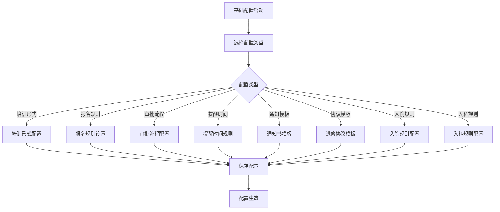
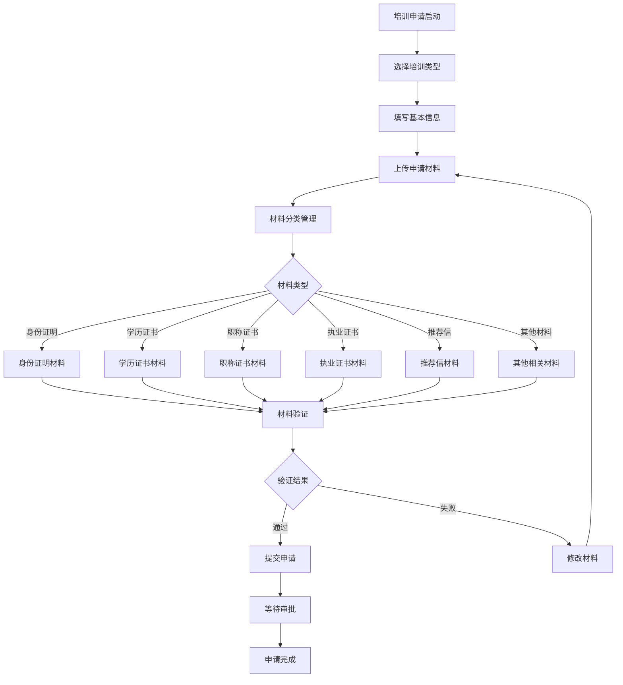
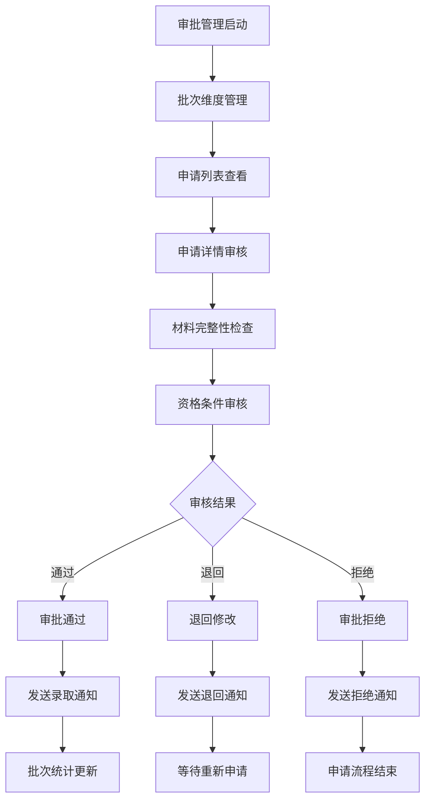
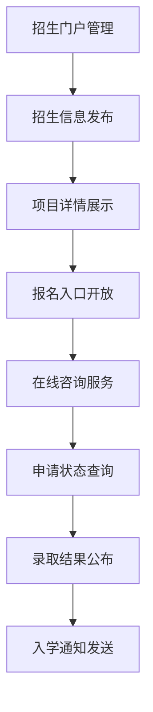
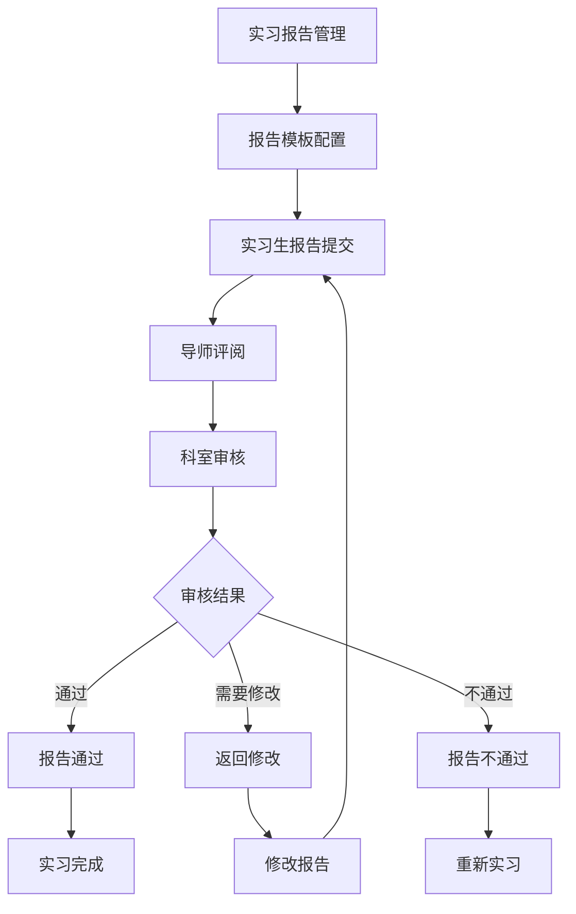

# 培训实践管理系统 - 深度业务分析报告

## 📋 系统概览

**模块路径**: `src/views/trainingPractice/`
**开发者**: 邹瑜等团队开发
**开发时间**: 2024年6月-至今
**文件数量**: 80+个Vue文件
**复杂度**: ⭐⭐⭐⭐⭐ (极高复杂度)

### 系统定位
培训实践管理系统是医院教育管理的核心培训模块，负责管理进修生、实习生等各类培训人员的全生命周期管理，包括基础配置、项目管理、申请审批、招生门户、实习报告等完整的培训业务流程。

---

## 🏗️ 系统架构

### 核心子模块

| 子模块 | 路径 | 文件数 | 主要功能 | 复杂度 |
|--------|------|--------|----------|--------|
| 基础配置 | basicConfig/ | 8个 | 培训形式、报名规则、审批流程配置 | ⭐⭐⭐⭐⭐ |
| 项目管理 | projectManagement/ | 6个 | 培训项目创建、进度跟踪 | ⭐⭐⭐⭐⭐ |
| 申请管理 | applicationMenu/ | 12个 | 培训申请流程、材料提交 | ⭐⭐⭐⭐⭐ |
| 审批管理 | approvalMenu/ | 15个 | 批次维度管理、详情编辑 | ⭐⭐⭐⭐⭐ |
| 招生门户 | recruitmentPortal/ | 8个 | 招生信息发布、项目详情展示 | ⭐⭐⭐⭐ |
| 实习报告 | InternshipReporting/ | 6个 | 实习报告提交、审核流程 | ⭐⭐⭐⭐ |
| 协议管理 | agreement/ | 4个 | 进修协议模板管理 | ⭐⭐⭐ |
| 批次创建 | createEnrollmentBatch/ | 5个 | 招生批次创建管理 | ⭐⭐⭐⭐ |
| 科室管理 | departmentAdmin/ | 8个 | 科室培训管理 | ⭐⭐⭐⭐ |
| 进修管理 | jxglMenu/ | 10个 | 进修生管理 | ⭐⭐⭐⭐⭐ |
| 实习管理 | sxglMenu/ | 8个 | 实习生管理 | ⭐⭐⭐⭐ |
| 专业管理 | subjectMenu/ | 6个 | 专业科目管理 | ⭐⭐⭐ |
| 培训类型管理 | trainingTypeManagement/ | 4个 | 培训类型配置 | ⭐⭐⭐ |

### 技术架构特色
1. **全生命周期管理**: 从申请、审批、入学到毕业的完整流程
2. **多角色协同**: 支持学员、科室、管理员等多角色操作
3. **灵活配置系统**: 高度可配置的培训规则和流程
4. **批量处理能力**: 支持批量导入、批量审批等操作

---

## 📊 业务流程分析

### 1. 基础配置模块 (basicConfig)

#### 1.1 核心业务流程



#### 1.2 配置组件系统

| 组件名称 | 文件路径 | 功能描述 | 配置内容 |
|---------|----------|----------|----------|
| 培训形式 | TrainingForm.vue | 培训形式配置 | 进修生、实习生等类型 |
| 报名规则 | EnrollmentRules.vue | 报名规则设置 | 报名条件、时间限制 |
| 审批流程 | Approvalprocess.vue | 审批流程配置 | 多级审批流程设置 |
| 提醒时间 | ReminderTime.vue | 提醒时间规则 | 自动提醒时间设置 |
| 通知模板 | Notification.vue | 通知书模板 | 录取通知书模板 |
| 协议模板 | LearningAgreement.vue | 进修协议模板 | 进修协议内容模板 |
| 入院规则 | BeHospitalized.vue | 入院规则配置 | 入院流程和规则 |
| 入科规则 | EnterDepartment.vue | 入科规则配置 | 入科流程和规则 |

#### 1.3 关键API接口

```javascript
// 基础配置核心API
getEnableBranchList()           // 获取启用分院列表
saveTrainingForm()              // 保存培训形式
saveEnrollmentRules()           // 保存报名规则
saveApprovalProcess()           // 保存审批流程
saveReminderTime()              // 保存提醒时间
```

### 2. 申请管理模块 (applicationMenu)

#### 2.1 业务流程



#### 2.2 申请材料管理

| 材料类型 | 组件文件 | 验证规则 | 必填要求 |
|---------|----------|----------|----------|
| 身份证明 | identityAnnex.vue | 身份证正反面 | 必填 |
| 学历证书 | educationAnnex.vue | 学历学位证书 | 必填 |
| 职称证书 | postTitleAnnex.vue | 职称证书扫描件 | 选填 |
| 执业证书 | practiceAnnex.vue | 执业证书及注册页 | 必填 |
| 推荐信 | introduceAnnex.vue | 单位推荐信 | 必填 |
| 辐射证明 | radiationAnnex.vue | 辐射安全证明 | 选填 |
| 疫苗接种 | vaccinesAnnex.vue | 疫苗接种证明 | 必填 |
| 资格证书 | qualificationsAnnex.vue | 其他资格证书 | 选填 |

#### 2.3 关键API接口

```javascript
// 申请管理核心API
queryApplyMaterial()            // 查询申请材料
saveApplyMaterialInfo()         // 保存申请材料信息
submitApplyFlow()               // 提交申请流程
saveSpecialPassagewayApplyRecord() // 保存特殊通道申请记录
previewDetails()                // 预览申请详情
```

### 3. 审批管理模块 (approvalMenu)

#### 3.1 业务流程



#### 3.2 审批维度管理

| 审批维度 | 描述 | 审批权限 | 处理时限 |
|---------|------|----------|----------|
| 材料审核 | 申请材料完整性审核 | 教务管理员 | 3个工作日 |
| 资格审核 | 申请人资格条件审核 | 科室主任 | 5个工作日 |
| 最终审批 | 最终录取决定 | 教务处长 | 2个工作日 |

### 4. 招生门户模块 (recruitmentPortal)

#### 4.1 业务流程



#### 4.2 门户功能

| 功能模块 | 描述 | 用户群体 | 更新频率 |
|---------|------|----------|----------|
| 招生简章 | 招生政策和要求 | 所有访客 | 每季度 |
| 项目介绍 | 培训项目详细介绍 | 潜在申请者 | 实时更新 |
| 报名系统 | 在线报名功能 | 申请者 | 实时可用 |
| 进度查询 | 申请进度查询 | 申请者 | 实时更新 |
| 结果公示 | 录取结果公示 | 申请者 | 定期更新 |

### 5. 实习报告模块 (InternshipReporting)

#### 5.1 业务流程



---

## 👥 用户角色与权限

### 用户角色定义

| 角色 | 权限范围 | 主要操作 |
|------|----------|----------|
| **培训管理员** | 全局培训管理 | 配置管理、审批管理、统计分析 |
| **科室管理员** | 科室培训管理 | 科室申请审核、学员管理 |
| **导师** | 学员指导权限 | 学员指导、报告评阅 |
| **申请者** | 申请提交权限 | 申请提交、材料上传、进度查询 |
| **系统管理员** | 系统配置权限 | 用户管理、系统配置 |

### 权限控制矩阵

| 功能模块 | 培训管理员 | 科室管理员 | 导师 | 申请者 | 系统管理员 |
|---------|------------|------------|------|--------|------------|
| 基础配置 | ✅ | ❌ | ❌ | ❌ | ✅ |
| 项目管理 | ✅ | ✅(科室内) | ❌ | ❌ | ✅ |
| 申请审批 | ✅ | ✅(科室内) | ❌ | ❌ | ✅ |
| 招生门户 | ✅ | ✅(科室内) | ❌ | ✅(查看) | ✅ |
| 实习报告 | ✅ | ✅(科室内) | ✅(评阅) | ✅(提交) | ✅ |
| 系统配置 | ❌ | ❌ | ❌ | ❌ | ✅ |

---

## 🔧 技术实现分析

### 前端技术栈
- **Vue 2.6.14**: 主框架
- **Element UI**: UI组件库
- **Lodash**: 工具库
- **Vuex**: 状态管理

### 核心技术特点

#### 1. 动态配置系统
```javascript
// 左侧配置菜单
leftTabs: [
  { key: 'TrainingForm', name: '培训形式' },
  { key: 'EnrollmentRules', name: '报名规则' },
  { key: 'Approvalprocess', name: '审批流程' },
  { key: 'ReminderTime', name: '提醒&时间规则' },
  { key: 'Notification', name: '通知书模版' },
  { key: 'LearningAgreement', name: '进修协议模版' },
  { key: 'BeHospitalized', name: '入院规则' },
  { key: 'EnterDepartment', name: '入科规则' }
]
```

#### 2. 文件上传管理
```javascript
// 申请材料上传组件
import upload from './components/upload'

// 材料分类管理
declareMaterialDetailVoList: [
  { type: 'identity', name: '身份证明' },
  { type: 'education', name: '学历证书' },
  { type: 'practice', name: '执业证书' }
]
```

#### 3. 步骤流程控制
```javascript
// 申请步骤组件
import Steps from '@/views/trainingPractice/approvalMenu/components/subject/steps.vue'

// 步骤状态管理
<Steps :model="4" />  // 提交完成状态
<Steps :model="3" v-if="roleType == 'S'"/>  // 申请中状态
```

#### 4. 批量操作处理
```javascript
// 批量导入功能
importSubjectFile(formData).then(res => {
  if (res.code === 0) {
    this.$message.success('导入成功')
    this.getList()
  }
})

// 批量导出功能
exportSubjectFile(params).then(res => {
  this.downloadFile(res.data)
})
```

---

## 📈 数据统计与分析

### 关键指标
1. **申请统计**: 申请人数、通过率、拒绝率统计
2. **培训效果**: 培训完成率、满意度调查
3. **资源利用**: 培训资源使用情况分析
4. **质量评估**: 培训质量评估和改进建议

### 统计功能
1. **批次统计**: 各批次招生和培训情况
2. **科室统计**: 各科室培训数据分析
3. **时间统计**: 按时间维度的培训数据
4. **效果统计**: 培训效果和质量分析

---

## 🎯 业务价值分析

### 核心价值
1. **流程标准化**: 统一培训申请和管理流程
2. **管理精细化**: 全生命周期精细化管理
3. **效率提升**: 自动化审批和通知流程
4. **质量保证**: 多层次质量控制机制

### 解决的痛点
1. **申请流程复杂**: 简化在线申请流程
2. **材料管理混乱**: 电子化材料管理
3. **审批效率低**: 自动化审批流程
4. **信息不透明**: 实时进度查询和通知

---

## 🔮 优化建议

### 技术优化
1. **移动端适配**: 支持移动端申请和管理
2. **智能推荐**: 基于用户画像的培训推荐
3. **实时通知**: WebSocket实时推送申请状态
4. **AI辅助**: AI辅助材料审核和资格检查

### 业务优化
1. **个性化服务**: 个性化培训方案推荐
2. **质量评估**: 更完善的培训质量评估体系
3. **资源整合**: 整合更多培训资源和机会
4. **国际化**: 支持国际交流培训项目

这个培训实践管理系统展现了医院教育培训管理的完整性和专业性！
