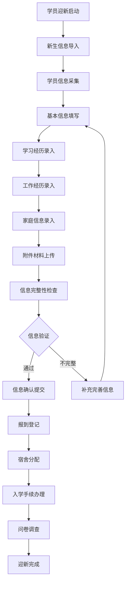
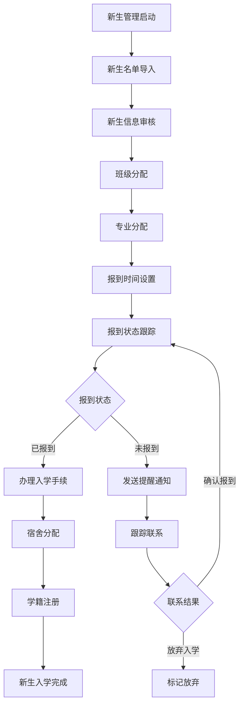
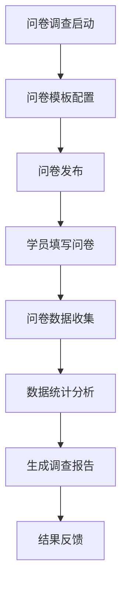
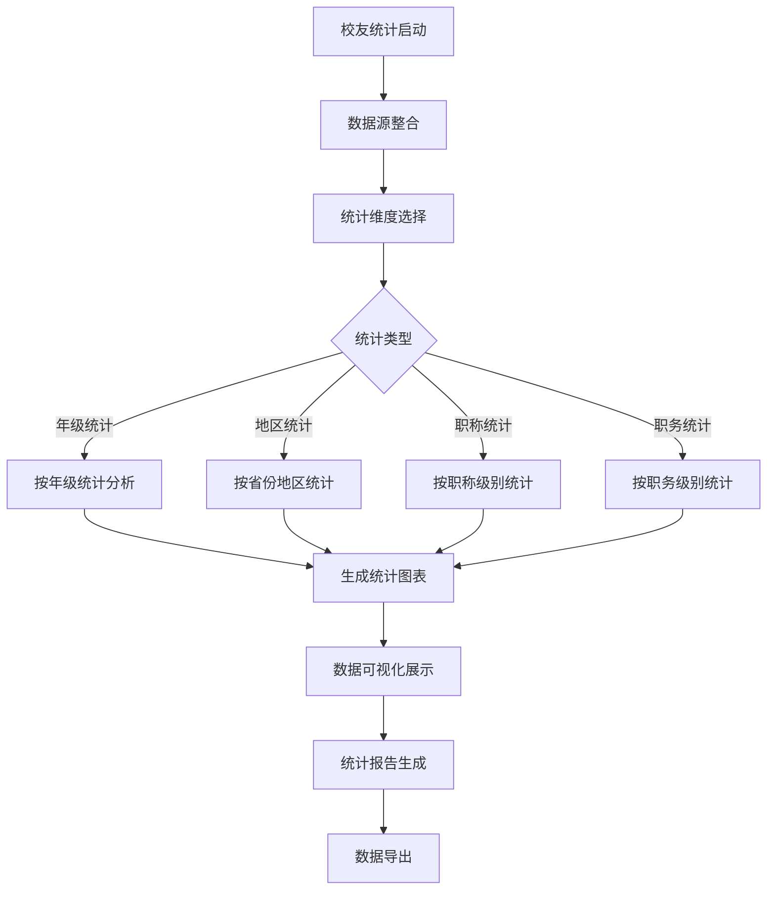

# 学员管理系统 - 深度业务分析报告

## 📋 系统概览

**模块路径**: `src/views/studentManagement/`
**开发者**: 邹瑜等团队开发
**开发时间**: 2024年6月-至今
**文件数量**: 50+个Vue文件
**复杂度**: ⭐⭐⭐⭐⭐ (极高复杂度)

### 系统定位
学员管理系统是医院教育管理的核心学员服务模块，负责管理各类学员（本科生、研究生、住培生、进修生等）的全生命周期管理，包括学员迎新、档案管理、轮转安排、评价统计等完整的学员服务体系。

---

## 🏗️ 系统架构

### 核心子模块

| 子模块 | 路径 | 文件数 | 主要功能 | 复杂度 |
|--------|------|--------|----------|--------|
| 学员迎新 | studentOrientation/ | 20个 | 新生迎新、信息采集、问卷调查 | ⭐⭐⭐⭐⭐ |
| 校友统计 | alumniStatistics/ | 8个 | 校友数据统计分析 | ⭐⭐⭐⭐ |
| 学员档案 | student/ | 12个 | 学员档案管理 | ⭐⭐⭐⭐ |
| 本科生管理 | ystudent/ | 10个 | 本科生专项管理 | ⭐⭐⭐⭐ |

### 技术架构特色
1. **多层级学员分类**: 支持本科生、研究生、住培生等多类型学员
2. **全生命周期管理**: 从入学迎新到毕业离校的完整流程
3. **数据统计分析**: 完善的学员数据统计和分析功能
4. **档案信息管理**: 完整的学员档案信息管理体系

---

## 📊 业务流程分析

### 1. 学员迎新模块 (studentOrientation)

#### 1.1 核心业务流程



#### 1.2 信息采集管理

| 信息类型 | 组件文件 | 数据内容 | 必填要求 |
|---------|----------|----------|----------|
| 基本信息 | infoCollection/index.vue | 姓名、性别、身份证、联系方式 | 必填 |
| 学习经历 | studyExperience.vue | 教育背景、学历学位 | 必填 |
| 工作经历 | workExperience.vue | 工作单位、职务、时间 | 选填 |
| 家庭信息 | familyInfo.vue | 家庭成员、联系方式 | 必填 |
| 政治面貌 | politicalBackground.vue | 党派、入党时间 | 必填 |
| 城市信息 | cityInfo.vue | 籍贯、现居住地 | 必填 |

#### 1.3 关键API接口

```javascript
// 学员迎新核心API
importResult()                  // 导入新生信息
queryNewbornUserList()          // 查询新生列表
saveNewbornUserBasic()          // 保存新生基本信息
saveStudyExperien()             // 保存学习经历
saveUserWorkExper()             // 保存工作经历
saveUserFamily()                // 保存家庭信息
checkIn()                       // 报到登记
resetCheckIn()                  // 重置报到状态
```

### 2. 新生管理模块 (newborn)

#### 2.1 业务流程



#### 2.2 新生状态管理

| 状态类型 | 状态描述 | 操作权限 | 后续流程 |
|---------|----------|----------|----------|
| 待报到 | 新生信息已录入，等待报到 | 管理员查看 | 报到登记 |
| 已报到 | 新生已完成报到登记 | 管理员确认 | 办理手续 |
| 已入学 | 完成所有入学手续 | 系统自动 | 正常学习 |
| 放弃入学 | 新生放弃入学资格 | 管理员标记 | 流程结束 |

### 3. 问卷调查模块 (questionnaire)

#### 3.1 业务流程



#### 3.2 问卷类型

| 问卷类型 | 发送时机 | 调查内容 | 数据用途 |
|---------|----------|----------|----------|
| 入学调查 | 新生报到后 | 基本情况、期望了解 | 迎新改进 |
| 满意度调查 | 学期结束 | 教学服务满意度 | 服务优化 |
| 需求调查 | 定期发送 | 学习生活需求 | 资源配置 |
| 毕业调查 | 毕业前 | 就业意向、建议 | 培养改进 |

### 4. 校友统计模块 (alumniStatistics)

#### 4.1 业务流程



#### 4.2 统计维度

| 统计维度 | 分析指标 | 图表类型 | 数据来源 |
|---------|----------|----------|----------|
| 年级分布 | 各年级人数、比例 | 柱状图、饼图 | 学员档案 |
| 地区分布 | 各省份人数分布 | 地图、柱状图 | 籍贯信息 |
| 职称分布 | 各职称级别分布 | 饼图、环形图 | 职称信息 |
| 职务分布 | 各职务级别分布 | 柱状图 | 职务信息 |

---

## 👥 用户角色与权限

### 用户角色定义

| 角色 | 权限范围 | 主要操作 |
|------|----------|----------|
| **学员管理员** | 全局学员管理 | 学员信息管理、统计分析、系统配置 |
| **招生管理员** | 招生迎新管理 | 新生信息导入、报到管理、迎新流程 |
| **班主任/辅导员** | 班级学员管理 | 班级学员信息、日常管理 |
| **学员** | 个人信息权限 | 信息填写、问卷填写、状态查询 |
| **系统管理员** | 系统配置权限 | 用户管理、系统配置 |

### 权限控制矩阵

| 功能模块 | 学员管理员 | 招生管理员 | 班主任 | 学员 | 系统管理员 |
|---------|------------|------------|--------|------|------------|
| 新生导入 | ✅ | ✅ | ❌ | ❌ | ✅ |
| 信息采集 | ✅ | ✅ | ✅(班级内) | ✅(个人) | ✅ |
| 报到管理 | ✅ | ✅ | ✅(班级内) | ✅(个人) | ✅ |
| 问卷调查 | ✅ | ✅ | ✅(班级内) | ✅(填写) | ✅ |
| 统计分析 | ✅ | ✅ | ✅(班级内) | ✅(个人) | ✅ |
| 系统配置 | ❌ | ❌ | ❌ | ❌ | ✅ |

---

## 🔧 技术实现分析

### 前端技术栈
- **Vue 2.6.14**: 主框架
- **Element UI**: UI组件库
- **ECharts**: 数据可视化
- **Vuex**: 状态管理

### 核心技术特点

#### 1. 多级路由结构
```javascript
// 学员管理路由结构
{
  redirect: '/studentOrientation',
  path: '/studentManagement',
  component: Layout,
  children: [
    {
      redirect: '/student',
      path: '/studentOrientation',
      component: () => import('@/views/studentManagement/studentOrientation/index'),
      children: [
        {
          redirect: '/undergraduate',
          path: '/student',
          component: () => import('@/views/studentManagement/studentOrientation/student'),
          children: [...]
        }
      ]
    }
  ]
}
```

#### 2. 信息采集表单
```javascript
// 学员信息采集
data() {
  return {
    userBasic: {
      userName: '',
      userSex: '',
      userIdCard: '',
      userPhone: '',
      userEmail: '',
      politicalBackground: '',
      nativePlace: '',
      currentAddress: ''
    },
    studyExperiences: [],
    workExperiences: [],
    familyMembers: []
  }
}
```

#### 3. 数据统计可视化
```javascript
// ECharts统计图表
import Echarts from '@/components/echarts/echarts'

// 统计数据处理
getGradeStatisticalAnalysis().then(res => {
  this.gradeChartData = {
    xAxis: res.data.map(item => item.gradeName),
    series: [{
      name: '人数',
      data: res.data.map(item => item.count)
    }]
  }
})
```

#### 4. 批量操作处理
```javascript
// 批量导入新生
importResult(formData).then(res => {
  if (res.code === 0) {
    this.$message.success('导入成功')
    this.getNewbornList()
  } else {
    this.$message.error(res.message)
  }
})
```

---

## 📈 数据统计与分析

### 关键指标
1. **入学统计**: 新生报到率、入学完成率
2. **分布统计**: 学员地区分布、专业分布
3. **成长统计**: 学员职业发展、职称晋升
4. **满意度统计**: 教学服务满意度调查

### 统计功能
1. **实时统计**: 报到状态实时统计
2. **趋势分析**: 多年度数据趋势分析
3. **对比分析**: 不同维度数据对比
4. **预测分析**: 基于历史数据的趋势预测

---

## 🎯 业务价值分析

### 核心价值
1. **服务标准化**: 统一学员服务标准和流程
2. **管理精细化**: 全生命周期精细化管理
3. **数据驱动**: 基于数据的决策支持
4. **体验优化**: 提升学员服务体验

### 解决的痛点
1. **信息收集困难**: 电子化信息采集和管理
2. **统计分析繁琐**: 自动化数据统计和分析
3. **服务不规范**: 标准化服务流程
4. **跟踪管理困难**: 系统化跟踪管理

---

## 🔮 优化建议

### 技术优化
1. **移动端适配**: 支持移动端信息填写和查询
2. **智能推荐**: 基于学员特征的个性化推荐
3. **实时通知**: WebSocket实时推送重要通知
4. **AI辅助**: AI辅助信息验证和异常检测

### 业务优化
1. **个性化服务**: 个性化学员服务方案
2. **预警机制**: 学员异常情况预警
3. **校友网络**: 建立完善的校友网络体系
4. **数据挖掘**: 深度挖掘学员数据价值

这个学员管理系统展现了医院教育管理中学员服务的完整性和专业性！
