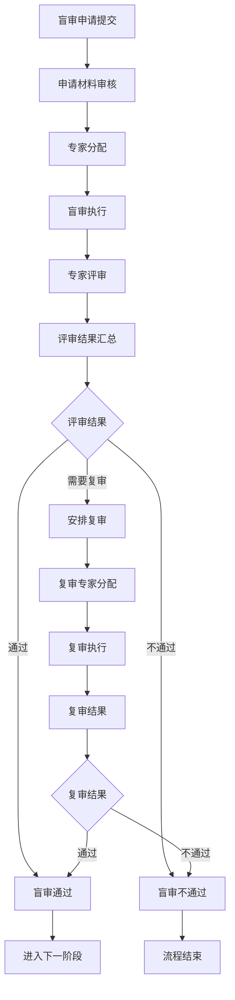
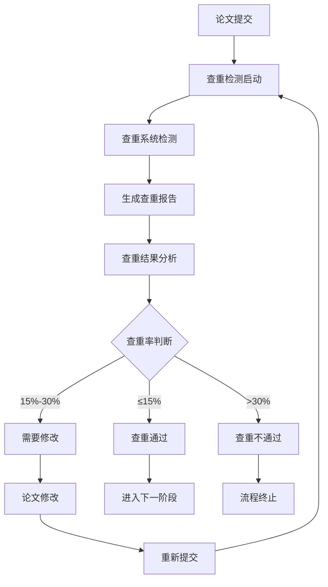
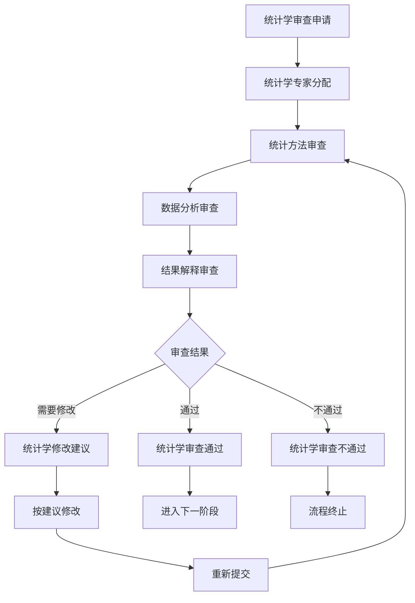
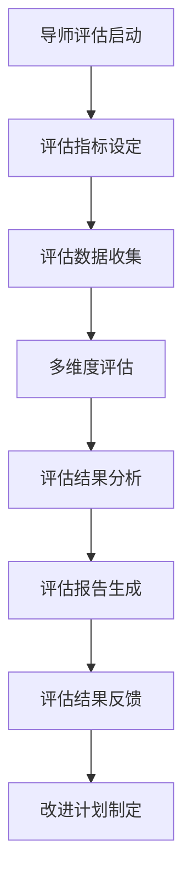
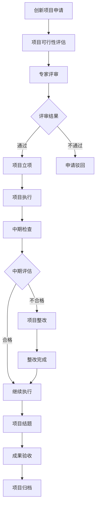

# 学术发展质量控制系统 - 深度业务分析报告

## 📋 系统概览

**模块路径**: `src/views/academicDevelopQualityControl/`
**开发者**: 团队协作开发
**开发时间**: 2023年-2024年
**文件数量**: 40+个Vue文件
**复杂度**: ⭐⭐⭐⭐⭐ (极高复杂度)

### 系统定位
学术发展质量控制系统是医院研究生培养质量管控的核心模块，负责管理研究生学位论文的盲审、查重检测、统计学审查、导师评估、创新项目管理等全流程质量控制，确保学术研究的规范性和质量。

---

## 🏗️ 系统架构

### 核心子模块

| 子模块 | 路径 | 文件数 | 主要功能 | 复杂度 |
|--------|------|--------|----------|--------|
| 盲审管理 | administrator/blindCheck/ | 8个 | 论文盲审流程管理 | ⭐⭐⭐⭐⭐ |
| 查重检测 | administrator/checkDuplicate/ | 6个 | 论文查重检测管理 | ⭐⭐⭐⭐ |
| 统计学审查 | administrator/statisticsCheck/ | 6个 | 统计学方法审查 | ⭐⭐⭐⭐ |
| 导师评估 | administrator/mentorAssessment/ | 6个 | 导师评估管理 | ⭐⭐⭐⭐ |
| 创新项目 | administrator/innovationProject/ | 8个 | 创新项目管理 | ⭐⭐⭐⭐⭐ |
| 研究生端 | graduateStudent/ | 6个 | 研究生申请端 | ⭐⭐⭐⭐ |

### 技术架构特色
1. **多阶段审查流程**: 支持盲审、查重、统计学等多阶段质量控制
2. **专家评审系统**: 完整的专家分配和评审管理
3. **状态流转管理**: 复杂的审查状态流转和跟踪
4. **批量处理能力**: 支持批量导入、批量审批等操作

---

## 📊 业务流程分析

### 1. 盲审管理模块 (blindCheck)

#### 1.1 核心业务流程



#### 1.2 盲审状态管理

| 状态码 | 状态名称 | 描述 | 操作权限 |
|--------|----------|------|----------|
| 301 | 待审核 | 申请材料待审核 | 管理员审核 |
| 302 | 审核通过 | 材料审核通过 | 系统自动 |
| 303 | 专家评审中 | 专家正在评审 | 专家操作 |
| 304 | 评审完成 | 专家评审完成 | 系统自动 |
| 305 | 盲审通过 | 盲审结果通过 | 管理员确认 |
| 306 | 盲审不通过 | 盲审结果不通过 | 管理员确认 |
| 307 | 需要复审 | 安排复审 | 管理员操作 |

#### 1.3 关键API接口

```javascript
// 盲审管理核心API
getOpenTime()                    // 查看开放时间
getList()                       // 获取盲审列表
getCourseMajor()                // 获取学科专业
graduatePropertyDictionary()     // 获取层次字典
qualityParentsDeleteAll()       // 批量删除
uploadFileExcel()               // 批量导入
releaseResultApi()              // 发布结果
graduateBlindExamine()          // 盲审审批
```

### 2. 查重检测模块 (checkDuplicate)

#### 2.1 业务流程



#### 2.2 查重标准

| 查重率范围 | 处理结果 | 后续操作 |
|-----------|----------|----------|
| ≤15% | 直接通过 | 进入下一阶段 |
| 15%-30% | 需要修改 | 修改后重新检测 |
| >30% | 不通过 | 重新撰写论文 |

### 3. 统计学审查模块 (statisticsCheck)

#### 3.1 业务流程



### 4. 导师评估模块 (mentorAssessment)

#### 4.1 业务流程



#### 4.2 评估维度

| 评估维度 | 权重 | 评估内容 | 数据来源 |
|---------|------|----------|----------|
| 学术指导 | 30% | 指导质量、指导频次 | 学生评价 |
| 科研能力 | 25% | 科研项目、论文发表 | 系统数据 |
| 培养质量 | 25% | 学生毕业率、就业质量 | 统计数据 |
| 师德师风 | 20% | 师德表现、学生反馈 | 综合评价 |

### 5. 创新项目管理模块 (innovationProject)

#### 5.1 业务流程



---

## 👥 用户角色与权限

### 用户角色定义

| 角色 | 权限范围 | 主要操作 |
|------|----------|----------|
| **质量控制管理员** | 全局质量管理 | 流程配置、专家分配、结果审核 |
| **学科专家** | 专业领域评审 | 盲审评审、学术评价 |
| **统计学专家** | 统计学审查 | 统计方法审查、数据分析 |
| **导师** | 学生指导评估 | 学生评价、指导记录 |
| **研究生** | 申请提交权限 | 材料提交、进度查询 |
| **系统管理员** | 系统配置权限 | 用户管理、系统配置 |

### 权限控制矩阵

| 功能模块 | 质量管理员 | 学科专家 | 统计专家 | 导师 | 研究生 | 系统管理员 |
|---------|------------|----------|----------|------|--------|------------|
| 盲审管理 | ✅ | ✅(评审) | ❌ | ❌ | ✅(申请) | ✅ |
| 查重检测 | ✅ | ❌ | ❌ | ❌ | ✅(查看) | ✅ |
| 统计审查 | ✅ | ❌ | ✅ | ❌ | ✅(申请) | ✅ |
| 导师评估 | ✅ | ✅(参与) | ❌ | ✅(被评) | ✅(评价) | ✅ |
| 创新项目 | ✅ | ✅(评审) | ❌ | ✅(指导) | ✅(申请) | ✅ |
| 系统配置 | ❌ | ❌ | ❌ | ❌ | ❌ | ✅ |

---

## 🔧 技术实现分析

### 前端技术栈
- **Vue 2.6.14**: 主框架
- **Element UI**: UI组件库
- **Moment.js**: 时间处理
- **Vuex**: 状态管理

### 核心技术特点

#### 1. 状态流转管理
```javascript
// 状态判断和结果选项
if (this.quality.status > 305) {
  if (this.quality.isRecheck != 1) {
    this.resultData = [
      { value: "1", label: "通过" },
      { value: "2", label: "拒绝" },
      { value: "3", label: "复审" }
    ]
  } else {
    this.resultData = [
      { value: "1", label: "通过" },
      { value: "2", label: "拒绝" }
    ]
  }
}
```

#### 2. 批量操作处理
```javascript
// 批量审批功能
multipleCheck: {
  show: false,
  list: [],
  classify: ''
}

// 批量删除
qualityParentsDeleteAll(params).then(res => {
  if (res.code === 0) {
    this.$message.success('删除成功')
    this.getList()
  }
})
```

#### 3. 文件上传管理
```javascript
// 文件上传组件
import uploadBox from '@/components/jqComponents/fileUpload/uploadBox.vue'

// 批量导入
uploadFileExcel(formData).then(res => {
  if (res.code === 0) {
    this.$message.success('导入成功')
    this.getList()
  }
})
```

#### 4. 专家评审系统
```javascript
// 专家评审API调用
graduateBlindExamine(params)      // 盲审评审
graduateStatisticsExamine(params) // 统计学评审
graduateAssessmentExamine(params) // 导师评估
graduatInnovationProjectExamine(params) // 创新项目评审
```

---

## 📈 数据统计与分析

### 关键指标
1. **通过率统计**: 各阶段审查通过率分析
2. **审查效率**: 审查时长、处理效率统计
3. **专家工作量**: 专家评审工作量分析
4. **质量趋势**: 学术质量变化趋势分析

### 统计功能
1. **审查进度统计**: 各阶段审查进度跟踪
2. **专家评审统计**: 专家评审工作量和质量
3. **学科分布统计**: 按学科统计审查情况
4. **时间分布统计**: 按时间维度统计审查数据

---

## 🎯 业务价值分析

### 核心价值
1. **质量标准化**: 统一学术质量控制标准
2. **流程规范化**: 标准化审查流程和程序
3. **评审客观化**: 多专家盲审保证评审公正性
4. **管理精细化**: 全流程质量跟踪和管理

### 解决的痛点
1. **质量参差不齐**: 通过多阶段审查保证质量
2. **评审不公正**: 盲审机制保证评审公正性
3. **流程不规范**: 标准化审查流程
4. **监管困难**: 系统化质量监管和跟踪

---

## 🔮 优化建议

### 技术优化
1. **AI辅助审查**: 引入AI技术辅助初步审查
2. **智能分配**: 基于专家专业领域的智能分配
3. **实时通知**: WebSocket实时推送审查进度
4. **移动端支持**: 支持移动端专家评审

### 业务优化
1. **评审标准细化**: 更加细化的评审标准和指标
2. **专家库扩充**: 扩大专家库规模和专业覆盖
3. **质量预警**: 基于历史数据的质量预警机制
4. **国际化标准**: 对接国际学术质量标准

这个学术发展质量控制系统展现了医院研究生培养质量管控的专业性和严谨性！
