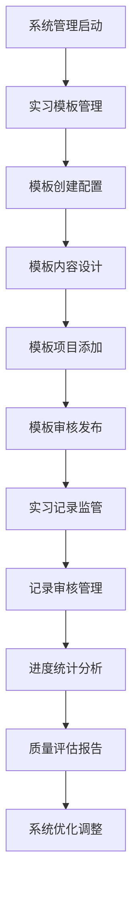
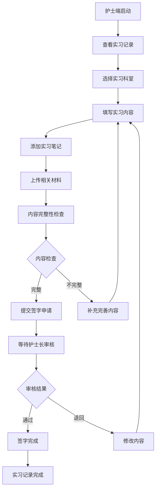
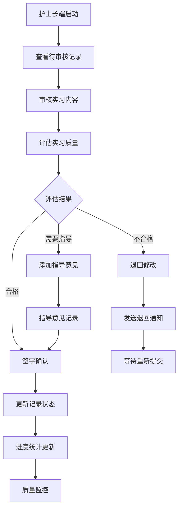
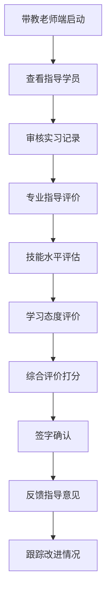

# 实习手册管理系统 - 深度业务分析报告

## 📋 系统概览

**模块路径**: `src/views/InternshipManual/`
**开发者**: 江伟等团队开发
**开发时间**: 2024年7月-8月
**文件数量**: 30+个Vue文件
**复杂度**: ⭐⭐⭐⭐⭐ (极高复杂度)

### 系统定位
实习手册管理系统是医院教育管理的核心实习管理模块，负责管理实习生的实习记录、模板管理、进度跟踪、评价记录等全流程业务，确保实习过程的规范化和标准化管理。

---

## 🏗️ 系统架构

### 核心子模块

| 子模块 | 路径 | 文件数 | 主要功能 | 复杂度 |
|--------|------|--------|----------|--------|
| 系统管理端 | sys/ | 12个 | 模板管理、记录管理、审核流程 | ⭐⭐⭐⭐⭐ |
| 护士端 | nurse/ | 8个 | 实习记录填写、提交签字 | ⭐⭐⭐⭐ |
| 护士长端 | headNurse/ | 6个 | 审核签字、进度监督 | ⭐⭐⭐⭐ |
| 带教老师端 | teacher/ | 4个 | 指导评价、签字确认 | ⭐⭐⭐ |

### 技术架构特色
1. **多角色权限管理**: 支持护士、护士长、带教老师、管理员等多角色
2. **模板化管理**: 灵活的实习内容模板配置和管理
3. **电子签字系统**: 完整的电子签字和审批流程
4. **进度跟踪**: 实时跟踪实习进度和完成情况

---

## 📊 业务流程分析

### 1. 系统管理端模块 (sys)

#### 1.1 核心业务流程



#### 1.2 模板管理功能

| 功能模块 | 组件文件 | 主要功能 | 权限要求 |
|---------|----------|----------|----------|
| 模板列表 | internshipTemplate.vue | 查看所有科室模板 | 管理员 |
| 模板详情 | recordTemplate.vue | 科室模板详细管理 | 管理员 |
| 模板创建 | recordTemplateAdd.vue | 创建编辑模板 | 管理员 |
| 记录管理 | internshipRecords.vue | 实习记录列表管理 | 管理员 |
| 记录详情 | recordDetail.vue | 实习记录详情查看 | 管理员 |

#### 1.3 关键API接口

```javascript
// 系统管理核心API
rotateLogTemplatePage()         // 获取模板列表
addRotateLogTemplate()          // 添加轮转模板
updateRotateLogTemplate()       // 更新轮转模板
getRotateTemplateDetail()       // 获取模板详情
importTemplateItems()           // 导入模板项目
downloadTemplate()              // 下载模板
nurseResultPage()               // 实习记录分页
queryNurseTemplateItemDetail()  // 查询模板项详情
```

### 2. 护士端模块 (nurse)

#### 2.1 业务流程



#### 2.2 实习记录管理

| 记录类型 | 填写内容 | 评价标准 | 签字要求 |
|---------|----------|----------|----------|
| 基础护理 | 基础护理操作记录 | 操作规范性 | 护士长签字 |
| 专科护理 | 专科护理技能记录 | 专业技能水平 | 带教老师签字 |
| 病例分析 | 典型病例护理分析 | 分析深度和准确性 | 护士长+带教老师 |
| 学习心得 | 实习期间学习总结 | 学习态度和收获 | 护士长签字 |

### 3. 护士长端模块 (headNurse)

#### 3.1 业务流程



#### 3.2 审核管理功能

| 审核类型 | 审核内容 | 审核标准 | 处理时限 |
|---------|----------|----------|----------|
| 内容审核 | 实习记录内容完整性 | 内容规范、完整 | 2个工作日 |
| 质量审核 | 实习记录质量评估 | 专业水平、深度 | 3个工作日 |
| 签字审核 | 最终签字确认 | 综合评价 | 1个工作日 |

### 4. 带教老师端模块 (teacher)

#### 4.1 业务流程



#### 4.2 指导评价体系

| 评价维度 | 权重 | 评价内容 | 评分标准 |
|---------|------|----------|----------|
| 专业技能 | 40% | 护理操作技能水平 | 优秀/良好/合格/不合格 |
| 理论知识 | 30% | 专业理论掌握程度 | 90/80/70/60分线 |
| 学习态度 | 20% | 学习积极性、主动性 | 态度评价 |
| 沟通能力 | 10% | 与患者、同事沟通 | 沟通效果评价 |

---

## 👥 用户角色与权限

### 用户角色定义

| 角色 | 权限范围 | 主要操作 |
|------|----------|----------|
| **系统管理员** | 全局管理权限 | 模板管理、记录监管、系统配置 |
| **护士长** | 科室管理权限 | 审核签字、进度监督、质量控制 |
| **带教老师** | 指导评价权限 | 专业指导、评价打分、签字确认 |
| **实习护士** | 个人记录权限 | 记录填写、材料上传、进度查询 |

### 权限控制矩阵

| 功能模块 | 系统管理员 | 护士长 | 带教老师 | 实习护士 |
|---------|------------|--------|----------|----------|
| 模板管理 | ✅ | ❌ | ❌ | ❌ |
| 记录审核 | ✅ | ✅ | ✅(专业评价) | ❌ |
| 签字确认 | ✅ | ✅ | ✅ | ❌ |
| 记录填写 | ✅ | ❌ | ❌ | ✅ |
| 进度查询 | ✅ | ✅ | ✅ | ✅ |
| 统计分析 | ✅ | ✅(科室内) | ✅(指导学员) | ✅(个人) |

---

## 🔧 技术实现分析

### 前端技术栈
- **Vue 2.6.14**: 主框架
- **Element UI**: UI组件库
- **Vuex**: 状态管理
- **Vue Router**: 路由管理

### 核心技术特点

#### 1. 组件化设计
```javascript
// 江伟开发的组件结构
InternshipManual/
├── nurse/
│   ├── components/
│   │   ├── internshipSubmitSign.vue    // 签字提交组件
│   │   ├── internshipTakeNotes.vue     // 实习笔记组件
│   │   └── templateItemAdd.vue         // 模板项添加组件
│   ├── internshipRecords.vue           // 实习记录列表
│   └── internshipRecordsDetail.vue     // 实习记录详情
```

#### 2. 状态管理
```javascript
// 实习记录状态管理
rotateStatus: {
  UNSTART: '未开始',
  RUN: '轮转中',
  END: '已出科'
},
logStatus: {
  UN: '未提交',
  SUBMIT: '已提交',
  REJECT: '退回'
},
isSign: {
  0: '未签字',
  1: '已签字'
}
```

#### 3. 模板管理系统
```javascript
// 模板导入导出功能
importTemplateItems(formData).then(res => {
  if (res.code === 0) {
    this.$message.success('导入成功')
    this.getTemplateList()
  }
})

// 模板下载
downloadTemplate().then(res => {
  this.downloadFile(res.data, '模板.xlsx')
})
```

#### 4. 电子签字系统
```javascript
// 签字提交组件
<internshipSubmitSign 
  ref="sign" 
  v-if="dialog.sign.visible" 
  :visible.sync="dialog.sign.visible" 
  @success="onSignSuccess" 
/>

// 签字成功回调
onSignSuccess() {
  this.$message.success('签字成功')
  this.getRecordDetail()
}
```

---

## 📈 数据统计与分析

### 关键指标
1. **完成率统计**: 实习记录完成率、签字完成率
2. **质量评估**: 实习记录质量评分统计
3. **进度跟踪**: 实习进度实时跟踪
4. **效果分析**: 实习效果评估和分析

### 统计功能
1. **实时监控**: 实习进度实时监控
2. **质量分析**: 实习质量趋势分析
3. **效率统计**: 审核效率统计
4. **满意度调查**: 实习满意度调查

---

## 🎯 业务价值分析

### 核心价值
1. **流程标准化**: 统一实习记录标准和流程
2. **质量保证**: 多层次质量控制和评价
3. **效率提升**: 电子化管理提升效率
4. **过程可追溯**: 完整的实习过程记录

### 解决的痛点
1. **记录不规范**: 标准化实习记录模板
2. **审核流程复杂**: 简化电子化审核流程
3. **进度难跟踪**: 实时进度跟踪和监控
4. **质量难控制**: 多维度质量控制体系

---

## 🔮 优化建议

### 技术优化
1. **移动端适配**: 支持移动端记录填写
2. **智能提醒**: 基于进度的智能提醒
3. **数据分析**: 深度挖掘实习数据价值
4. **AI辅助**: AI辅助质量评估和建议

### 业务优化
1. **个性化指导**: 个性化实习指导方案
2. **质量持续改进**: 基于数据的质量改进
3. **跨科室交流**: 支持跨科室实习交流
4. **标准化评估**: 更加标准化的评估体系

---

## 💡 江伟的技术贡献亮点

### 开发时间线
- **2024年7月**: 核心功能开发期
  - 实习记录列表页开发
  - 实习记录详情页开发
  - 签字提交功能实现
  - 模板管理组件开发

- **2024年8月**: 优化完善期
  - 验收问题修改
  - 样式优化调整
  - 功能细节完善
  - 用户体验提升

### 技术实现亮点
1. **组件化设计**: 高度模块化的组件设计
2. **状态管理优化**: 复杂状态流转逻辑实现
3. **用户体验设计**: 状态颜色区分、智能按钮显示
4. **权限控制实现**: 基于身份的细粒度权限控制

这个实习手册管理系统展现了医院实习管理的数字化转型和规范化管理！
