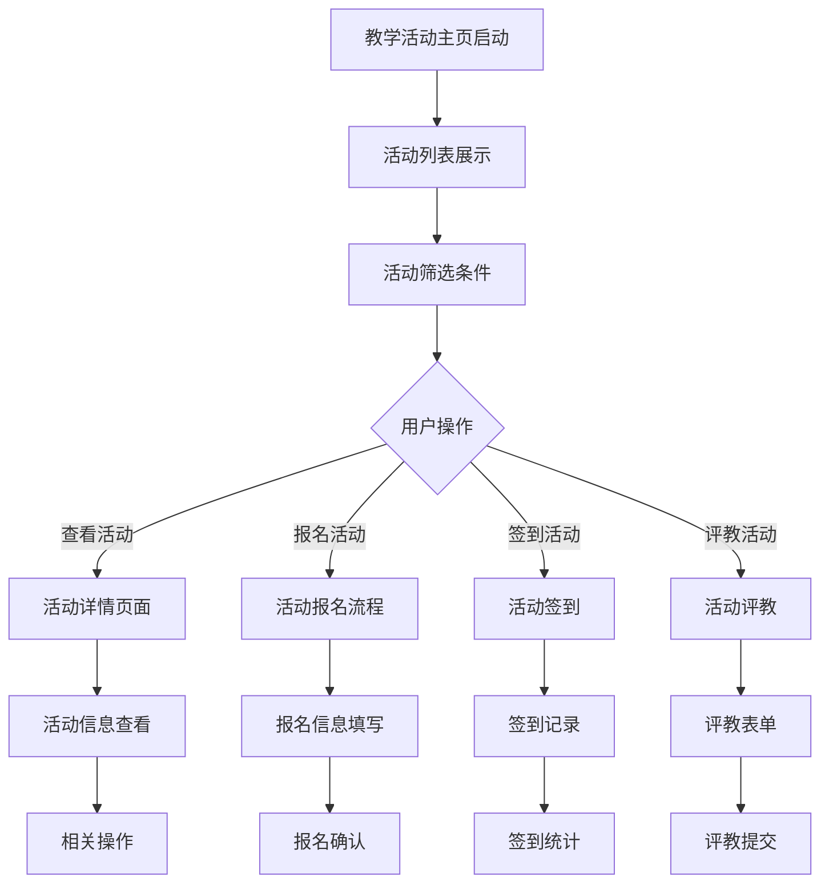
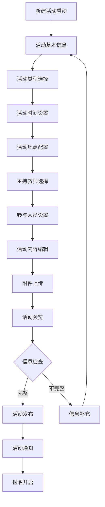
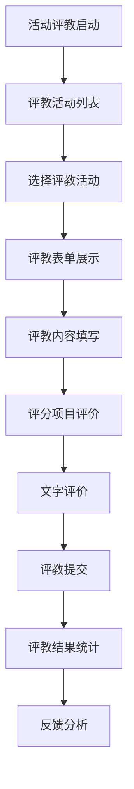
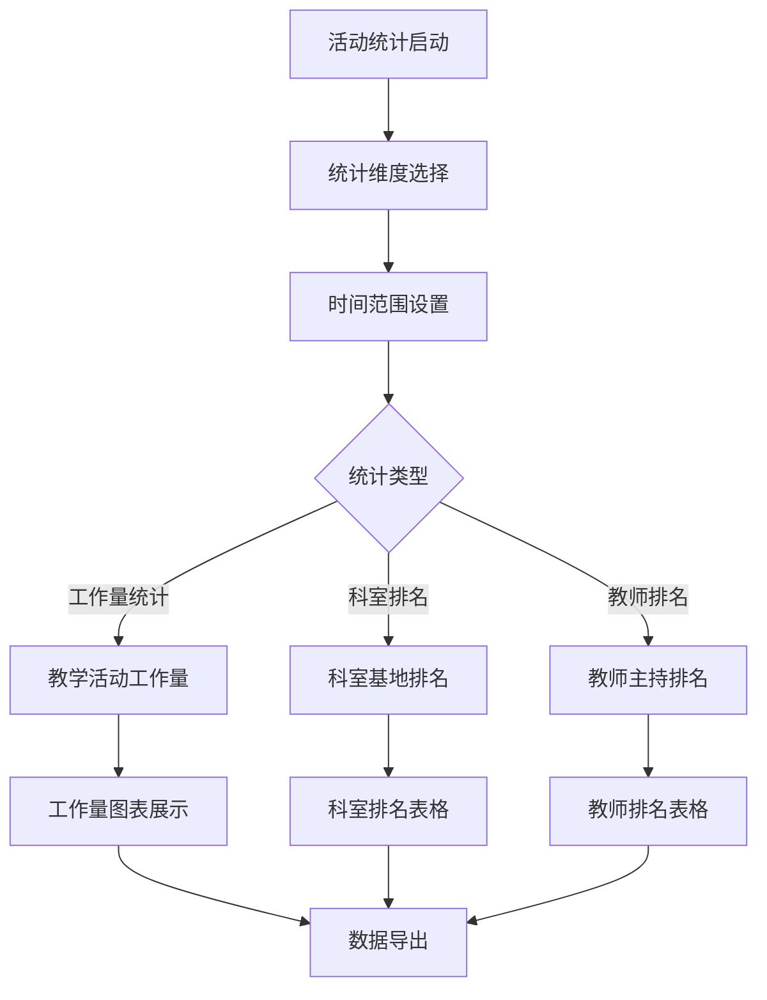

# 教学活动管理系统 - 深度业务分析报告

## 📋 系统概览

**模块路径**: `src/views/teachingActivity/`
**开发者**: 团队协作开发
**开发时间**: 2023年-2024年
**文件数量**: 30+个Vue文件
**复杂度**: ⭐⭐⭐⭐⭐ (极高复杂度)

### 系统定位
教学活动管理系统是医院教育管理的核心活动平台，负责管理教学活动的发布、报名、签到、评教等全生命周期，提供完整的教学活动组织和管理解决方案，确保医护人员的教学活动规范化和标准化。

---

## 🏗️ 系统架构

### 核心子模块

| 子模块 | 路径 | 文件数 | 主要功能 | 复杂度 |
|--------|------|--------|----------|--------|
| 教学活动主页 | teachingActivity/ | 8个 | 活动列表、筛选、统计展示 | ⭐⭐⭐⭐ |
| 新建活动 | newactivity/ | 6个 | 活动创建、编辑、发布 | ⭐⭐⭐⭐⭐ |
| 活动评教 | components/teachact.vue | 1个 | 教学活动评教管理 | ⭐⭐⭐⭐ |
| 活动统计 | statisticalAnalysis/teaching/ | 8个 | 活动工作量统计、排名分析 | ⭐⭐⭐⭐ |
| 活动计划 | components/planIndex.vue | 1个 | 教学计划管理 | ⭐⭐⭐⭐ |
| 类型管理 | components/typeManagement.vue | 1个 | 活动类型配置管理 | ⭐⭐⭐ |
| 审批活动 | components/approvalActivity.vue | 1个 | 活动审批流程管理 | ⭐⭐⭐⭐ |

### 技术架构特色
1. **全生命周期管理**: 从活动创建到评教反馈的完整流程
2. **多角色协同**: 支持管理员、教师、学员等多角色操作
3. **智能统计分析**: 活动工作量、参与度等多维度统计
4. **灵活评教体系**: 可配置的评教规则和反馈机制

---

## 📊 业务流程分析

### 1. 教学活动主页模块 (teachingActivity)

#### 1.1 核心业务流程



#### 1.2 活动管理功能

| 功能模块 | 组件文件 | 主要功能 | 权限要求 |
|---------|----------|----------|----------|
| 活动列表 | index.vue | 活动展示、筛选、分页 | 所有用户 |
| 活动详情 | activityDetail.vue | 活动详细信息展示 | 所有用户 |
| 活动统计 | dataPopup.vue | 活动数据统计弹窗 | 管理员 |
| 批量操作 | numbePopup.vue | 批量删除、导入等 | 管理员 |

#### 1.3 关键API接口

```javascript
// 教学活动主页核心API
postQueryAll()                  // 查询所有的活动类型
getQueryPages()                 // 查询教学活动列表
getfindAllOrgs()               // 获取科室列表
batchDelete()                  // 批量删除活动
getActivityImport()            // 活动导入
```

### 2. 新建活动模块 (newactivity)

#### 2.1 业务流程



#### 2.2 活动创建功能

| 创建步骤 | 功能描述 | 技术实现 | 验证规则 |
|---------|----------|----------|----------|
| 基本信息 | 活动标题、描述、类型 | 表单验证 | 必填验证 |
| 时间地点 | 活动时间、地点、容量 | 日期选择器 | 时间冲突检查 |
| 人员配置 | 主持教师、参与人员 | 人员选择器 | 权限验证 |
| 内容编辑 | 活动内容、富文本编辑 | Quill编辑器 | 内容长度限制 |
| 附件管理 | 教案、PPT等文件上传 | 文件上传组件 | 文件类型限制 |

#### 2.3 关键API接口

```javascript
// 新建活动核心API
getActivityQueryAll()           // 获取活动类型列表
getRotateOrgList()             // 获取轮转科室列表
findUserIByIdentity()          // 根据身份查找用户
addTeachActiv()                // 新增教学活动
commonFile()                   // 文件上传
```

### 3. 活动评教模块 (teachact)

#### 3.1 业务流程



#### 3.2 评教功能模块

| 评教维度 | 评价内容 | 评分标准 | 权重设置 |
|---------|----------|----------|----------|
| 教学内容 | 内容准确性、实用性 | 5分制 | 30% |
| 教学方法 | 方法适当性、创新性 | 5分制 | 25% |
| 教学效果 | 学习效果、参与度 | 5分制 | 25% |
| 教师素养 | 专业水平、表达能力 | 5分制 | 20% |

#### 3.3 关键API接口

```javascript
// 活动评教核心API
queryTeachAct()                // 教学活动评教分析
queryStatsList()               // 教学活动评教详细
exportStatsList()              // 导出评教统计列表
```

### 4. 活动统计模块 (statisticalAnalysis)

#### 4.1 业务流程



#### 4.2 统计分析功能

| 统计类型 | 统计内容 | 计算公式 | 展示方式 |
|---------|----------|----------|----------|
| 工作量统计 | 各类型教学活动工作量 | 人次×学时 | 柱状图 |
| 科室排名 | 科室基地工作量排名 | 总工作量排序 | 排名表格 |
| 教师排名 | 教师主持次数排名 | 主持次数统计 | 排名表格 |
| 参与度分析 | 活动参与度统计 | 参与率计算 | 饼图 |

---

## 👥 用户角色与权限

### 用户角色定义

| 角色 | 权限范围 | 主要操作 |
|------|----------|----------|
| **教学管理员** | 全局活动管理 | 活动创建、审批、统计分析 |
| **科室教学秘书** | 科室活动管理 | 科室活动管理、人员安排 |
| **主持教师** | 活动主持权限 | 活动主持、内容管理 |
| **参与学员** | 活动参与权限 | 活动报名、签到、评教 |
| **系统管理员** | 系统配置权限 | 用户管理、系统配置 |

### 权限控制矩阵

| 功能模块 | 教学管理员 | 科室秘书 | 主持教师 | 参与学员 | 系统管理员 |
|---------|------------|----------|----------|----------|------------|
| 活动创建 | ✅ | ✅(科室内) | ✅(授权) | ❌ | ✅ |
| 活动审批 | ✅ | ✅(科室内) | ❌ | ❌ | ✅ |
| 活动参与 | ✅ | ✅ | ✅ | ✅ | ✅ |
| 活动评教 | ✅ | ✅ | ✅ | ✅ | ✅ |
| 统计分析 | ✅ | ✅(科室内) | ✅(相关) | ✅(个人) | ✅ |
| 系统配置 | ❌ | ❌ | ❌ | ❌ | ✅ |

---

## 🔧 技术实现分析

### 前端技术栈
- **Vue 2.6.14**: 主框架
- **Element UI**: UI组件库
- **Quill**: 富文本编辑器
- **ECharts**: 数据可视化

### 核心技术特点

#### 1. 富文本编辑器
```javascript
// Quill富文本编辑器配置
import quillConfig from '@/utils/quill-config'

// 活动内容编辑
data() {
  return {
    editorOption: quillConfig,
    activityContent: ''
  }
}
```

#### 2. 文件上传管理
```javascript
// 文件上传处理
commonFile(fileData).then(res => {
  if (res.code === 0) {
    this.fileList.push({
      name: res.data.fileName,
      url: res.data.fileUrl,
      type: res.data.fileType
    })
  }
})
```

#### 3. 动态表单验证
```javascript
// 活动表单验证规则
rules: {
  activityTitle: [
    { required: true, message: '请输入活动标题', trigger: 'blur' }
  ],
  activityType: [
    { required: true, message: '请选择活动类型', trigger: 'change' }
  ],
  activityTime: [
    { required: true, message: '请选择活动时间', trigger: 'change' }
  ]
}
```

#### 4. 统计数据可视化
```javascript
// 教学活动工作量统计
getTeacherWorkCount(params).then(res => {
  this.teachingActivitiesData = {
    xAxis: res.data.map(item => item.activityType),
    series: [{
      name: '工作量',
      data: res.data.map(item => item.workload)
    }]
  }
})
```

---

## 📈 数据统计与分析

### 关键指标
1. **活动参与率**: 按活动类型、科室、时间统计参与情况
2. **教学工作量**: 教师教学活动工作量统计
3. **评教满意度**: 活动评教满意度和反馈分析
4. **活动效果**: 活动效果评估和改进建议

### 统计功能
1. **实时监控**: 活动进行状态实时监控
2. **数据分析**: 多维度活动数据分析
3. **趋势预测**: 基于历史数据的趋势分析
4. **效果评估**: 活动效果评估和质量分析

---

## 🎯 业务价值分析

### 核心价值
1. **活动规范化**: 统一的教学活动管理标准
2. **效率提升**: 自动化活动管理流程
3. **质量保证**: 完整的评教和反馈体系
4. **数据驱动**: 基于数据的活动优化决策

### 解决的痛点
1. **活动管理分散**: 统一的活动管理平台
2. **报名签到繁琐**: 电子化报名签到流程
3. **评教不规范**: 标准化评教体系
4. **统计分析困难**: 自动化数据统计分析

---

## 🔮 优化建议

### 技术优化
1. **移动端适配**: 支持移动端活动管理
2. **智能推荐**: 基于兴趣的活动推荐
3. **实时通知**: WebSocket实时活动通知
4. **AI分析**: AI辅助活动效果分析

### 业务优化
1. **个性化活动**: 个性化活动推荐和安排
2. **跨院协作**: 支持跨医院教学活动
3. **国际化标准**: 对接国际教学活动标准
4. **持续改进**: 基于数据的持续改进机制

这个教学活动管理系统展现了医院教学活动管理的完整性和专业性！
