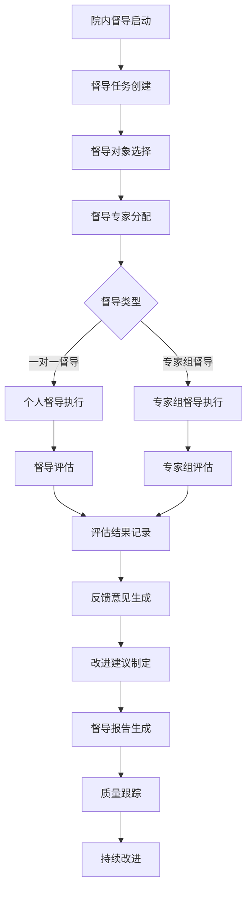
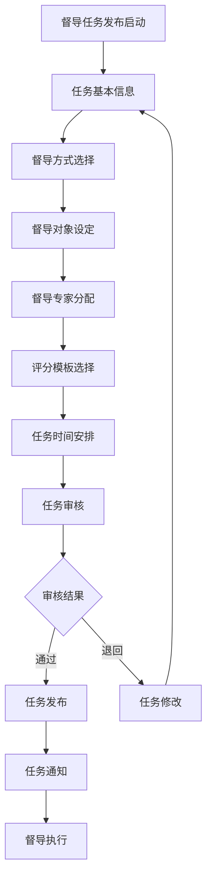
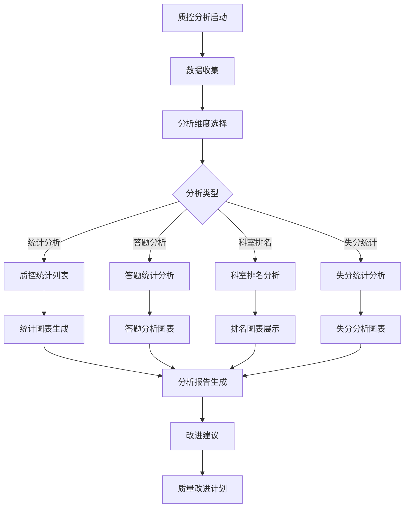
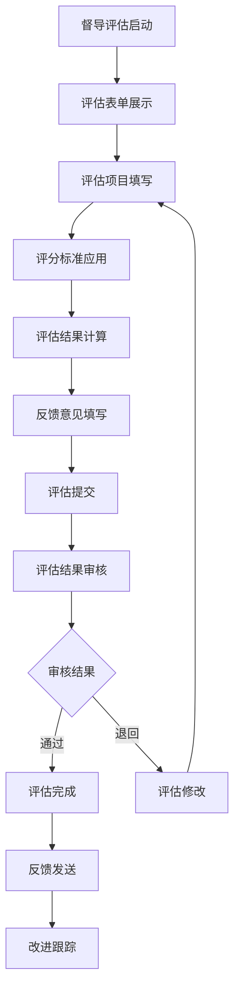

# 教学质量控制系统 - 深度业务分析报告

## 📋 系统概览

**模块路径**: `src/views/teachQualityControl/` + `src/views/qualityControlAnalyze/`
**开发者**: 邹瑜等团队开发
**开发时间**: 2024年6月-至今
**文件数量**: 25+个Vue文件
**复杂度**: ⭐⭐⭐⭐⭐ (极高复杂度)

### 系统定位
教学质量控制系统是医院教育管理的核心质量保障模块，负责管理教学督导、质量监控、改进建议等全方位的教学质量控制业务，确保医护人员的教学质量持续改进和标准化管理。

---

## 🏗️ 系统架构

### 核心子模块

| 子模块 | 路径 | 文件数 | 主要功能 | 复杂度 |
|--------|------|--------|----------|--------|
| 院内督导 | teachQualityControl/courtSupervisor/ | 8个 | 督导任务管理、督导执行 | ⭐⭐⭐⭐⭐ |
| 督导任务发布 | teachQualityControl/publishTask/ | 3个 | 督导任务创建、发布 | ⭐⭐⭐⭐ |
| 质控分析 | qualityControlAnalyze/ | 6个 | 质控数据统计、分析 | ⭐⭐⭐⭐⭐ |
| 督导评估 | teachQualityControl/components/ | 8个 | 督导评估、反馈管理 | ⭐⭐⭐⭐ |

### 技术架构特色
1. **多层级督导体系**: 支持一对一督导、专家组督导等多种形式
2. **智能任务分配**: 基于规则的督导任务自动分配
3. **实时质量监控**: 教学质量的实时监控和预警
4. **数据驱动改进**: 基于数据分析的质量改进建议

---

## 📊 业务流程分析

### 1. 院内督导模块 (courtSupervisor)

#### 1.1 核心业务流程



#### 1.2 督导任务管理

| 任务类型 | 督导对象 | 督导内容 | 评估标准 |
|---------|----------|----------|----------|
| 教学督导 | 带教老师 | 教学方法、教学效果 | 教学质量评估表 |
| 科室督导 | 科室团队 | 科室管理、教学环境 | 科室质量评估表 |
| 专项督导 | 特定项目 | 专项教学活动 | 专项评估标准 |

#### 1.3 关键API接口

```javascript
// 院内督导核心API
searchSupervisoryTask()         // 搜索督导任务
addSupervisoryTask()           // 添加督导任务
updateSupervisoryTask()        // 更新督导任务
deleteSupervisoryTask()        // 删除督导任务
getSupervisoryTask()           // 获取督导任务
dealResault()                  // 处理督导结果
exportSupervisoryData()        // 导出督导数据
```

### 2. 督导任务发布模块 (publishTask)

#### 2.1 业务流程



#### 2.2 任务发布功能

| 发布步骤 | 功能描述 | 技术实现 | 验证规则 |
|---------|----------|----------|----------|
| 基本信息 | 任务标题、描述、类型 | 表单验证 | 必填验证 |
| 督导方式 | 一对一、专家组督导 | 单选组件 | 方式选择 |
| 对象设定 | 督导科室、人员选择 | 多选组件 | 对象验证 |
| 专家分配 | 督导专家分配 | 专家选择器 | 专家资质验证 |
| 模板选择 | 评分模板配置 | 模板选择器 | 模板适用性 |

#### 2.3 关键API接口

```javascript
// 督导任务发布核心API
getProfessor()                  // 获取督导专家
findAllOrganizations()          // 获取所有组织
getAllOrgOptionDtos()           // 获取组织选项
getMethodSearch()               // 获取督导方法
getScoringTemplate()            // 获取评分模板
```

### 3. 质控分析模块 (qualityControlAnalyze)

#### 3.1 业务流程



#### 3.2 质控分析功能

| 分析类型 | 分析内容 | 计算方式 | 展示方式 |
|---------|----------|----------|----------|
| 统计分析 | 督导任务统计 | 数量统计、比率计算 | 统计表格 |
| 答题分析 | 评估答题情况 | 正确率、分布分析 | 分析图表 |
| 科室排名 | 科室质量排名 | 综合评分排序 | 排名表格 |
| 失分统计 | 失分项目统计 | 失分率、失分分布 | 失分图表 |

#### 3.3 关键API接口

```javascript
// 质控分析核心API
getStatisticsListApi()          // 质控分析列表统计
getAssessTargetOrgApi()         // 评估对象查询
getItemStatisticsListApi()      // 答题分析统计列表
getOrgRankingListApi()          // 科室排名列表
getItemLoseScoreListApi()       // 失分统计列表
getItemOrgLoseScoreDetailApi()  // 失分统计科室详情
supervisionExportApi()          // 异步导出
```

### 4. 督导评估模块 (components)

#### 4.1 业务流程



#### 4.2 评估维度

| 评估维度 | 评估内容 | 评分标准 | 权重设置 |
|---------|----------|----------|----------|
| 教学准备 | 教案准备、资料齐全 | 5分制 | 20% |
| 教学过程 | 教学方法、互动效果 | 5分制 | 40% |
| 教学效果 | 学习效果、目标达成 | 5分制 | 30% |
| 教学态度 | 教学态度、师德表现 | 5分制 | 10% |

---

## 👥 用户角色与权限

### 用户角色定义

| 角色 | 权限范围 | 主要操作 |
|------|----------|----------|
| **质控管理员** | 全局质控管理 | 任务发布、督导管理、统计分析 |
| **督导专家** | 督导执行权限 | 督导评估、反馈意见 |
| **科室教学秘书** | 科室质控管理 | 科室督导配合、改进实施 |
| **被督导人员** | 接受督导权限 | 督导配合、改进执行 |
| **系统管理员** | 系统配置权限 | 用户管理、系统配置 |

### 权限控制矩阵

| 功能模块 | 质控管理员 | 督导专家 | 科室秘书 | 被督导人员 | 系统管理员 |
|---------|------------|----------|----------|------------|------------|
| 任务发布 | ✅ | ❌ | ❌ | ❌ | ✅ |
| 督导执行 | ✅ | ✅ | ❌ | ✅(配合) | ✅ |
| 质控分析 | ✅ | ✅(相关) | ✅(科室内) | ❌ | ✅ |
| 改进跟踪 | ✅ | ✅ | ✅ | ✅ | ✅ |
| 系统配置 | ❌ | ❌ | ❌ | ❌ | ✅ |

---

## 🔧 技术实现分析

### 前端技术栈
- **Vue 2.6.14**: 主框架
- **Element UI**: UI组件库
- **Lodash**: 工具库
- **Moment.js**: 时间处理

### 核心技术特点

#### 1. 督导任务管理
```javascript
// 督导任务搜索
searchSupervisoryTask(params).then(res => {
  this.taskList = res.data.recordList
  this.total = res.data.total
})

// 督导任务处理
dealResault(resultData).then(res => {
  if (res.code === 0) {
    this.$message.success('处理成功')
    this.refreshTaskList()
  }
})
```

#### 2. 质控数据分析
```javascript
// 质控统计分析
getStatisticsListApi(params).then(res => {
  this.statisticsData = res.data
  this.generateCharts()
})

// 科室排名分析
getOrgRankingListApi(params).then(res => {
  this.rankingData = res.data.map((item, index) => ({
    ranking: index + 1,
    orgName: item.orgName,
    score: item.score,
    level: this.getScoreLevel(item.score)
  }))
})
```

#### 3. 动态评估表单
```javascript
// 动态生成评估表单
const generateAssessmentForm = (template) => {
  return template.assessmentItems.map(item => ({
    itemId: item.id,
    itemName: item.name,
    itemWeight: item.weight,
    score: 0,
    comment: ''
  }))
}

// 评估结果计算
const calculateAssessmentResult = (assessmentData) => {
  const totalScore = assessmentData.reduce((sum, item) => {
    return sum + (item.score * item.itemWeight)
  }, 0)
  
  return {
    totalScore: totalScore,
    level: this.getScoreLevel(totalScore),
    suggestions: this.generateSuggestions(assessmentData)
  }
}
```

#### 4. 督导状态管理
```javascript
// 督导状态常量
const supervisorState = {
  PENDING: '待督导',
  IN_PROGRESS: '督导中',
  COMPLETED: '已完成',
  CANCELLED: '已取消'
}

const supervisionFeedbackMark = {
  EXCELLENT: '优秀',
  GOOD: '良好',
  AVERAGE: '一般',
  POOR: '较差'
}
```

---

## 📈 数据统计与分析

### 关键指标
1. **督导完成率**: 按时间、科室、专家统计督导完成情况
2. **质量改进率**: 督导后质量改进效果统计
3. **专家工作量**: 督导专家工作量和效率分析
4. **问题发现率**: 督导中发现问题的统计分析

### 统计功能
1. **实时监控**: 督导进度实时监控
2. **趋势分析**: 质量趋势变化分析
3. **对比分析**: 科室间质量对比分析
4. **预警机制**: 质量异常预警提醒

---

## 🎯 业务价值分析

### 核心价值
1. **质量保证**: 确保教学质量的持续改进
2. **标准化督导**: 统一的督导标准和流程
3. **数据驱动**: 基于数据的质量管理决策
4. **持续改进**: 督导反馈的持续改进机制

### 解决的痛点
1. **督导不规范**: 标准化督导流程和评估
2. **质量难监控**: 实时质量监控和预警
3. **改进不及时**: 及时的反馈和改进机制
4. **数据分散**: 统一的质控数据管理

---

## 🔮 优化建议

### 技术优化
1. **AI辅助**: AI辅助督导评估和分析
2. **移动督导**: 移动端督导功能
3. **智能预警**: 智能质量预警系统
4. **自动化报告**: 自动化督导报告生成

### 业务优化
1. **个性化督导**: 个性化督导方案
2. **跨院协作**: 跨医院督导经验交流
3. **国际标准**: 对接国际质量控制标准
4. **持续跟踪**: 督导改进效果持续跟踪

这个教学质量控制系统展现了医院教学质量管理的完整性和专业性！
