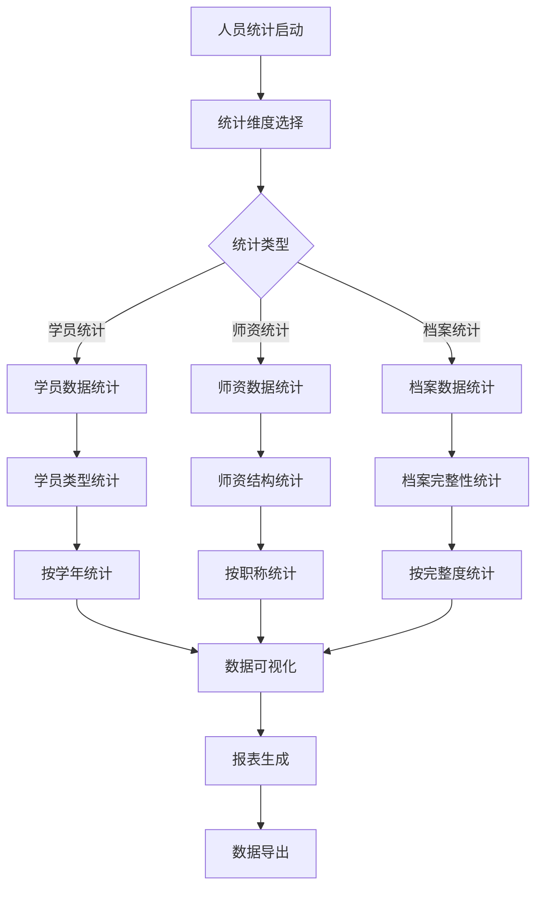
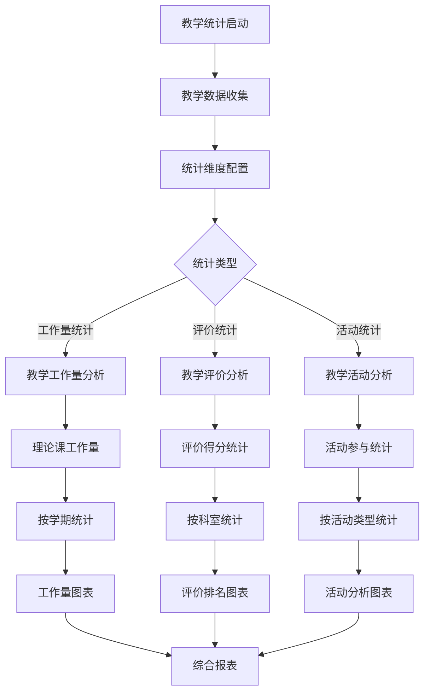
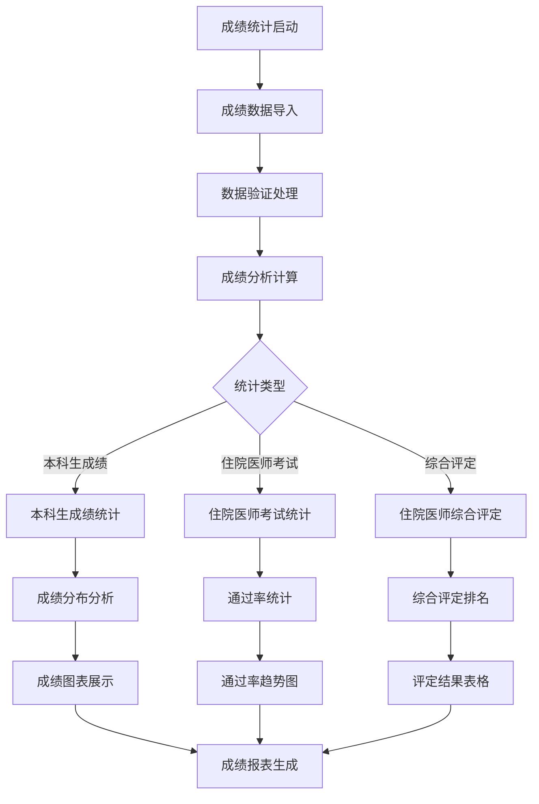
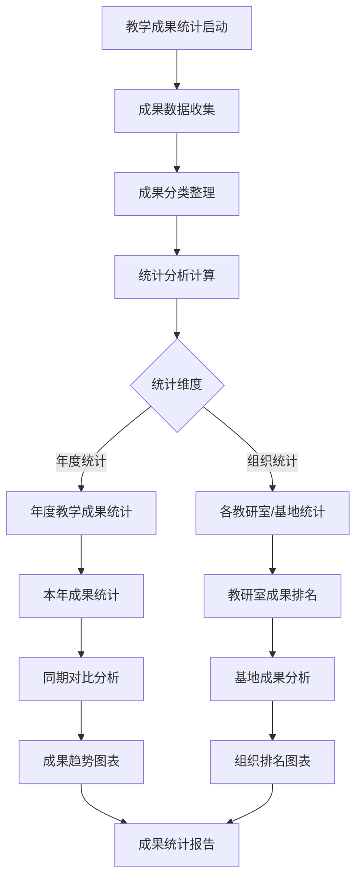

# 数据统计模块 - 深度业务分析报告

## 📋 系统概览

**模块路径**: `src/views/statisticalAnalysis/`
**开发者**: 邹瑜等团队开发
**开发时间**: 2024年6月-至今
**文件数量**: 150+个Vue文件
**复杂度**: ⭐⭐⭐⭐⭐ (极高复杂度)

### 系统定位
数据统计模块是医院教育管理系统的核心数据分析平台，负责管理综合统计、报表生成、数据导出等全方位的数据统计业务，为医院教育管理提供数据驱动的决策支持。

---

## 🏗️ 系统架构

### 核心子模块

| 子模块 | 路径 | 文件数 | 主要功能 | 复杂度 |
|--------|------|--------|----------|--------|
| 人员统计 | personnel/ | 25个 | 学员统计、师资统计、档案统计 | ⭐⭐⭐⭐⭐ |
| 教学统计 | teaching/ | 30个 | 教学工作量、教学评价统计 | ⭐⭐⭐⭐⭐ |
| 成绩统计 | results/ | 15个 | 考试成绩、综合评定统计 | ⭐⭐⭐⭐ |
| 教学成果统计 | teachingAchievements/ | 10个 | 教学成果、科研成果统计 | ⭐⭐⭐⭐ |
| 积分统计 | integralStatisticalAnalysis/ | 20个 | 积分统计、积分分析 | ⭐⭐⭐⭐ |
| 住培统计 | residenttraining/ | 25个 | 住培评教、轮转分析 | ⭐⭐⭐⭐⭐ |
| 专科统计 | specializedSpecial/ | 15个 | 专科培训统计分析 | ⭐⭐⭐⭐ |
| 航空救援统计 | airRescue/ | 10个 | 航空救援培训统计 | ⭐⭐⭐ |

### 技术架构特色
1. **多维度统计分析**: 支持人员、教学、成绩等多维度统计
2. **可视化数据展示**: 丰富的图表和可视化组件
3. **灵活的报表生成**: 动态报表生成和自定义配置
4. **高性能数据处理**: 大数据量的统计分析和处理

---

## 📊 业务流程分析

### 1. 人员统计模块 (personnel)

#### 1.1 核心业务流程



#### 1.2 人员统计功能

| 统计类型 | 统计内容 | 数据来源 | 展示方式 |
|---------|----------|----------|----------|
| 学员类型统计 | 按学员类型分类统计 | 学员管理系统 | 柱状图 |
| 新招录人数统计 | 历年新招录人数变化 | 招录系统 | 折线图 |
| 本科生专业统计 | 本科生专业分布 | 学籍系统 | 饼图 |
| 师资结构统计 | 师资职称、学历分布 | 人事系统 | 组合图表 |

#### 1.3 关键API接口

```javascript
// 人员统计核心API
findBleandStuTySts()               // 学员类型按学年统计
findBleandStuNewSts()              // 历年新招录人数统计
findBleandBkMajorSts()             // 本科生专业统计
findBlendStuBkSysSts()             // 本科生学制统计
```

### 2. 教学统计模块 (teaching)

#### 2.1 业务流程



#### 2.2 教学统计功能

| 统计维度 | 统计指标 | 计算方式 | 应用场景 |
|---------|----------|----------|----------|
| 教学工作量 | 理论课、实践课工作量 | 课时×系数 | 绩效考核 |
| 教学评价 | 评价得分、排名 | 加权平均 | 质量评估 |
| 教学活动 | 活动次数、参与度 | 统计计数 | 活动分析 |
| 督导评价 | 督导得分、改进建议 | 评分统计 | 质量监控 |

#### 2.3 关键API接口

```javascript
// 教学统计核心API
finsBleandWorkTySts()              // 各类型学员工作量统计
findBleandWorkXsSts()              // 学术讲座工作量统计
findBleandTeaEavRanStsList()       // 老师评价得分排名
getTeacherWorkCount()              // 教师工作量统计
```

### 3. 成绩统计模块 (results)

#### 3.1 业务流程



#### 3.2 成绩统计功能

| 成绩类型 | 统计内容 | 分析维度 | 输出结果 |
|---------|----------|----------|----------|
| 本科生成绩 | 各科目成绩分布 | 按学年、学期 | 成绩统计图表 |
| 住院医师考试 | 考试通过率变化 | 按年度、科室 | 通过率趋势 |
| 综合评定 | 多维度综合评分 | 按权重、排名 | 评定结果排名 |

#### 3.3 关键API接口

```javascript
// 成绩统计核心API
getGraduExamGrade()                // 本科生成绩统计
getResExamStsGrade()               // 住院医师考试通过率统计
findBlendResGradeSts()             // 住院医师综合评定统计
importGraduExamGrade()             // 本科生成绩导入
exportBlendResGradeSts()           // 综合评定统计导出
```

### 4. 教学成果统计模块 (teachingAchievements)

#### 4.1 业务流程



#### 4.2 教学成果统计功能

| 成果类型 | 统计指标 | 对比维度 | 分析结果 |
|---------|----------|----------|----------|
| 教学论文 | 发表数量、影响因子 | 年度对比 | 论文发表趋势 |
| 教学项目 | 项目数量、级别 | 组织对比 | 项目申报能力 |
| 教学奖励 | 获奖数量、等级 | 历史对比 | 获奖水平变化 |
| 教学改革 | 改革项目、成效 | 同期对比 | 改革成效评估 |

---

## 👥 用户角色与权限

### 用户角色定义

| 角色 | 权限范围 | 主要操作 |
|------|----------|----------|
| **统计管理员** | 全局统计管理 | 统计配置、报表生成、数据导出 |
| **数据分析师** | 数据分析权限 | 数据分析、图表制作、趋势预测 |
| **科室统计员** | 科室数据统计 | 科室数据查看、科室报表 |
| **教学管理员** | 教学数据统计 | 教学统计、评价分析 |
| **系统管理员** | 系统配置权限 | 统计系统配置、权限管理 |

### 权限控制矩阵

| 功能模块 | 统计管理员 | 数据分析师 | 科室统计员 | 教学管理员 | 系统管理员 |
|---------|------------|------------|------------|------------|------------|
| 人员统计 | ✅ | ✅ | ✅(科室内) | ✅ | ✅ |
| 教学统计 | ✅ | ✅ | ✅(科室内) | ✅ | ✅ |
| 成绩统计 | ✅ | ✅ | ✅(科室内) | ✅ | ✅ |
| 数据导入 | ✅ | ❌ | ❌ | ✅ | ✅ |
| 报表配置 | ✅ | ✅ | ❌ | ✅ | ✅ |
| 系统配置 | ❌ | ❌ | ❌ | ❌ | ✅ |

---

## 🔧 技术实现分析

### 前端技术栈
- **Vue 2.6.14**: 主框架
- **Element UI**: UI组件库
- **ECharts**: 数据可视化
- **Moment.js**: 时间处理

### 核心技术特点

#### 1. 数据可视化系统
```javascript
// ECharts图表配置
const chartConfig = {
  tooltip: {
    trigger: 'item',
    formatter: '{a} <br/>{b}: {c} ({d}%)'
  },
  legend: {
    orient: 'vertical',
    left: 10,
    data: this.legendData
  },
  series: [{
    name: '统计数据',
    type: 'pie',
    radius: ['50%', '70%'],
    avoidLabelOverlap: false,
    data: this.chartData
  }]
}

// 动态图表更新
updateChart(newData) {
  this.chartInstance.setOption({
    series: [{
      data: newData
    }]
  })
}
```

#### 2. 统计数据处理
```javascript
// 人员统计数据处理
findBleandStuTySts(params).then(res => {
  this.studentTypeData = res.data.map(item => ({
    name: item.studentType,
    value: item.count,
    percentage: (item.count / res.data.total * 100).toFixed(2)
  }))
  this.generateChart()
})

// 教学工作量统计
finsBleandWorkTySts(params).then(res => {
  this.workloadData = {
    categories: res.data.map(item => item.category),
    series: [{
      name: '工作量',
      data: res.data.map(item => item.workload)
    }]
  }
})
```

#### 3. 报表生成系统
```javascript
// 动态报表生成
generateReport(reportConfig) {
  const reportData = {
    title: reportConfig.title,
    period: reportConfig.period,
    data: this.processReportData(reportConfig.data),
    charts: this.generateCharts(reportConfig.charts),
    summary: this.calculateSummary(reportConfig.data)
  }
  
  return this.renderReport(reportData)
}

// 数据导出功能
exportData(exportType, data) {
  switch(exportType) {
    case 'excel':
      return this.exportToExcel(data)
    case 'pdf':
      return this.exportToPDF(data)
    case 'csv':
      return this.exportToCSV(data)
  }
}
```

#### 4. 统计算法实现
```javascript
// 综合评定算法
calculateComprehensiveScore(evaluationData) {
  const weights = {
    theory: 0.3,        // 理论成绩权重
    practice: 0.4,      // 实践成绩权重
    attitude: 0.2,      // 学习态度权重
    innovation: 0.1     // 创新能力权重
  }
  
  return Object.keys(weights).reduce((total, key) => {
    return total + evaluationData[key] * weights[key]
  }, 0)
}

// 趋势分析算法
analyzeTrend(timeSeriesData) {
  const trend = {
    direction: this.calculateTrendDirection(timeSeriesData),
    slope: this.calculateSlope(timeSeriesData),
    correlation: this.calculateCorrelation(timeSeriesData),
    prediction: this.predictNextPeriod(timeSeriesData)
  }
  
  return trend
}
```

---

## 📈 数据统计与分析

### 关键指标
1. **数据覆盖率**: 各模块数据的完整性和覆盖率
2. **统计准确性**: 统计结果的准确性和一致性
3. **查询性能**: 大数据量统计查询的性能
4. **用户使用率**: 各统计功能的使用频率

### 统计功能
1. **实时统计**: 实时数据统计和更新
2. **历史对比**: 历史数据对比分析
3. **趋势预测**: 基于历史数据的趋势预测
4. **异常检测**: 数据异常检测和预警

---

## 🎯 业务价值分析

### 核心价值
1. **决策支持**: 为管理决策提供数据支撑
2. **绩效评估**: 客观的绩效评估和考核
3. **趋势分析**: 发展趋势分析和预测
4. **质量监控**: 教学质量的持续监控

### 解决的痛点
1. **数据分散**: 统一的数据统计平台
2. **分析困难**: 自动化数据分析和可视化
3. **报表繁琐**: 自动化报表生成
4. **决策盲目**: 数据驱动的科学决策

---

## 🔮 优化建议

### 技术优化
1. **大数据处理**: 引入大数据处理技术
2. **实时计算**: 实时数据处理和分析
3. **AI分析**: AI辅助数据分析和预测
4. **云端部署**: 云端统计分析服务

### 业务优化
1. **自定义报表**: 用户自定义报表功能
2. **智能预警**: 智能数据预警机制
3. **移动统计**: 移动端统计查看
4. **数据挖掘**: 深度数据挖掘分析

这个数据统计模块展现了医院教育管理系统的数据分析能力和决策支持水平！
