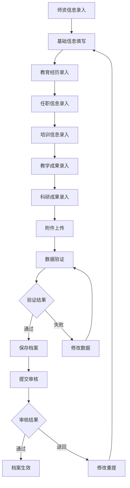
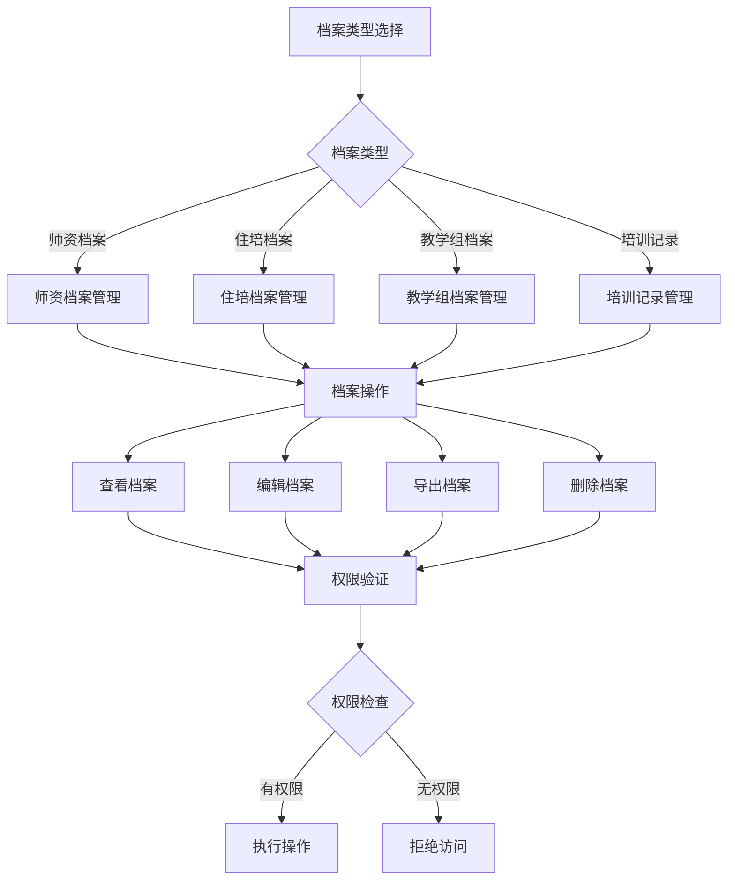
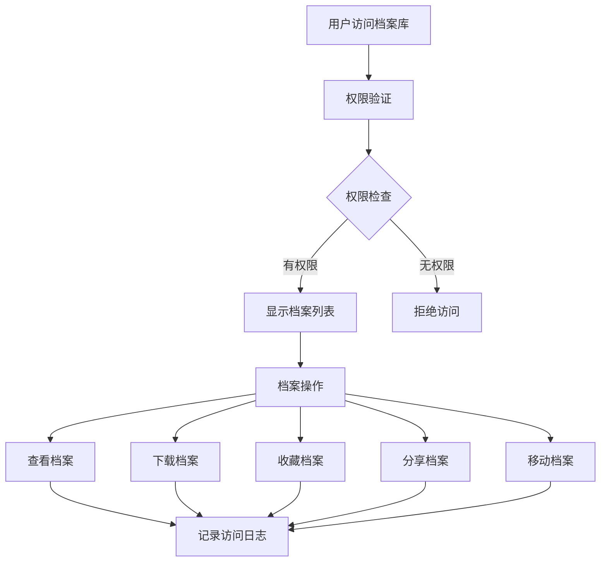

# 档案管理系统 - 深度业务分析报告

## 📋 系统概览

**模块路径**: `src/views/archivesManage/`
**开发者**: 许辉 🔥
**开发时间**: 2024年4月-7月
**文件数量**: 100+个Vue文件
**复杂度**: ⭐⭐⭐⭐⭐ (极高复杂度)

### 系统定位
档案管理系统是医院教育管理的核心数据中心，负责管理师资档案、住培档案、教学组档案等各类教育相关档案的全生命周期管理，包括创建、编辑、查看、审核、导入导出、权限控制等功能。

---

## 🏗️ 系统架构

### 核心子模块

| 子模块 | 路径 | 文件数 | 主要功能 | 复杂度 |
|--------|------|--------|----------|--------|
| 师资档案管理 | teacherArchives/ | 25个 | 师资档案全生命周期管理 | ⭐⭐⭐⭐⭐ |
| 综合档案管理 | archivesManage/ | 50个 | 住培、教学组、培训记录档案 | ⭐⭐⭐⭐⭐ |
| 档案库管理 | archivesRepository/ | 25个 | 档案存储、检索、权限管理 | ⭐⭐⭐⭐⭐ |

### 技术架构特色
1. **动态表单系统**: 基于配置驱动的表单渲染
2. **附件管理系统**: 完整的文件上传、预览、下载功能
3. **权限控制系统**: 细粒度的档案访问权限
4. **数据导入导出**: Excel批量导入导出功能

---

## 📊 业务流程分析

### 1. 师资档案管理模块 (teacherArchives)

#### 1.1 核心业务流程



#### 1.2 动态表单组件系统

| 组件名称 | 文件路径 | 功能描述 | 适用场景 |
|---------|----------|----------|----------|
| 文本输入 | v-input.vue | 基础文本输入 | 姓名、邮箱等 |
| 数字输入 | v-number.vue | 数字输入控制 | 年龄、工号等 |
| 千分位数字 | v-millennialDigit.vue | 千分位格式数字 | 薪资、金额等 |
| 文本域 | v-textarea.vue | 多行文本输入 | 简介、备注等 |
| 单选框 | v-radio.vue | 单选选择 | 性别、状态等 |
| 单选组 | v-radioGroup.vue | 单选组合 | 复杂单选 |
| 下拉选择 | v-select.vue | 下拉选择框 | 职称、专业等 |
| 组织级联 | v-orgCascader.vue | 组织架构级联 | 科室选择 |
| 城市级联 | v-cityCascader.vue | 城市级联选择 | 籍贯、地址等 |
| 日期选择 | v-datePicker.vue | 日期选择器 | 生日、入职日期 |
| 日期范围 | v-daterange.vue | 日期范围选择 | 工作经历时间 |
| 年份选择 | v-yearPicker.vue | 年份选择器 | 毕业年份 |
| 至今选择 | v-hithertoPicker.vue | 支持"至今"的日期 | 当前工作时间 |
| 文件上传 | v-uploads.vue | 文件上传管理 | 证书、照片等 |
| 教学职务 | v-jxzwDTOList.vue | 教学职务列表 | 教学职务管理 |
| 学期选择 | v-semester.vue | 学期选择器 | 学期相关 |

#### 1.3 关键API接口

```javascript
// 师资档案核心API
getFieldConfig()        // 获取字段配置
querySzInfoPageList()   // 师资列表查询
querySzDetail()         // 师资详情查询
saveSzDetail()          // 保存师资详情
confirmSzDetail()       // 确认师资详情
delSzDetail()           // 删除师资详情
importSzInfo()          // 导入师资信息
queryDictInfo()         // 字典查询
queryPostTitleInfo()    // 职称查询
changeSzStatus()        // 修改师资状态
```

#### 1.4 数据模型分析

```javascript
// 师资档案数据结构
const teacherArchive = {
  // 基础信息
  trueName: '',           // 姓名
  gender: '',             // 性别
  userState: '',          // 在职状态
  userPhone: '',          // 电话
  email: '',              // 邮箱
  age: '',                // 年龄
  nationPropertyName: '', // 民族
  
  // 教育经历
  educationExperience: [],
  
  // 任职信息
  positionInfo: [],
  
  // 培训信息
  trainingInfo: [],
  
  // 教学成果
  teachingAchievements: [],
  
  // 科研成果
  researchAchievements: [],
  
  // 附件信息
  attachments: []
}
```

### 2. 综合档案管理模块 (archivesManage)

#### 2.1 业务流程



#### 2.2 档案类型管理

| 档案类型 | 管理模块 | 主要功能 | 特殊要求 |
|---------|----------|----------|----------|
| 师资档案 | teacherFiles | 师资信息管理 | 多维度分类 |
| 住培档案 | residentPhysician | 住培人员档案 | 培训进度跟踪 |
| 教学组档案 | teachingGroup | 教学小组管理 | 组织架构关联 |
| 培训记录 | trainingRecords | 培训记录管理 | 时间序列管理 |

### 3. 档案库管理模块 (archivesRepository)

#### 3.1 业务流程



#### 3.2 核心功能

| 功能模块 | 描述 | 实现方式 |
|---------|------|----------|
| 档案存储 | 分类存储各类档案 | 目录树结构 |
| 档案检索 | 全文检索档案内容 | 搜索引擎 |
| 权限管理 | 细粒度权限控制 | RBAC模型 |
| 版本管理 | 档案版本控制 | 版本号管理 |
| 审计日志 | 操作记录追踪 | 日志系统 |

---

## 👥 用户角色与权限

### 用户角色定义

| 角色 | 权限范围 | 主要操作 |
|------|----------|----------|
| **档案管理员** | 全局档案管理 | 创建、编辑、删除、审核档案 |
| **科室管理员** | 科室档案管理 | 管理本科室档案 |
| **教师** | 个人档案管理 | 查看、编辑个人档案 |
| **学员** | 有限档案访问 | 查看授权档案 |
| **系统管理员** | 系统配置权限 | 用户管理、系统配置 |

### 权限控制矩阵

| 功能模块 | 档案管理员 | 科室管理员 | 教师 | 学员 | 系统管理员 |
|---------|------------|------------|------|------|------------|
| 创建档案 | ✅ | ✅ | ✅ | ❌ | ✅ |
| 编辑档案 | ✅ | ✅ | ✅(个人) | ❌ | ✅ |
| 删除档案 | ✅ | ✅(科室内) | ❌ | ❌ | ✅ |
| 审核档案 | ✅ | ✅(科室内) | ❌ | ❌ | ✅ |
| 查看档案 | ✅ | ✅(科室内) | ✅(授权) | ✅(授权) | ✅ |
| 导出档案 | ✅ | ✅(科室内) | ✅(个人) | ❌ | ✅ |
| 系统配置 | ❌ | ❌ | ❌ | ❌ | ✅ |

---

## 🔧 技术实现分析

### 核心技术特点

#### 1. 配置驱动的动态表单系统
```javascript
// 字段配置示例
const fieldConfig = {
  fieldName: 'trueName',
  fieldType: 'input',
  label: '姓名',
  required: true,
  validation: {
    maxLength: 50,
    pattern: /^[\u4e00-\u9fa5a-zA-Z]+$/
  }
}

// 动态渲染组件
<component 
  :is="getComponentType(field.fieldType)"
  :field="field"
  v-model="formData[field.fieldName]"
/>
```

#### 2. 附件管理系统
```javascript
// 文件上传组件
<v-uploads
  :field-item="fieldItem"
  :value="value"
  @input="handleInput"
  :disabled="disabled"
/>

// 支持的文件类型
const fileTypes = {
  image: ['jpg', 'jpeg', 'png', 'gif'],
  document: ['pdf', 'doc', 'docx', 'xls', 'xlsx'],
  certificate: ['pdf', 'jpg', 'jpeg', 'png']
}
```

#### 3. 权限控制系统
```javascript
// 权限检查
const hasPermission = (operation, resource) => {
  const userRole = this.$store.state.user.role
  const permissions = this.$store.state.permissions
  return permissions[userRole]?.[resource]?.[operation] || false
}

// 组件级权限控制
<el-button 
  v-if="hasPermission('edit', 'archive')"
  @click="handleEdit"
>
  编辑
</el-button>
```

#### 4. 数据导入导出
```javascript
// Excel导入
async handleImport(file) {
  const formData = new FormData()
  formData.append('file', file)
  const result = await importSzInfo(formData)
  if (result.code === 0) {
    this.$message.success('导入成功')
    this.refreshList()
  }
}

// Excel导出
async handleExport() {
  const params = this.getExportParams()
  const result = await normalReport(params)
  this.downloadFile(result.data)
}
```

---

## 📈 数据统计与分析

### 关键指标
1. **档案完整度**: 各类档案信息完整性统计
2. **更新频率**: 档案更新频率分析
3. **访问统计**: 档案访问次数和热度
4. **权限使用**: 权限使用情况统计

### 报表功能
1. **档案统计报表**: 按类型、科室、时间统计
2. **完整度报表**: 档案信息完整度分析
3. **访问日志报表**: 用户访问行为分析
4. **权限审计报表**: 权限使用情况审计

---

## 🎯 业务价值分析

### 核心价值
1. **数据集中化**: 统一管理各类教育档案
2. **流程标准化**: 标准化档案管理流程
3. **权限精细化**: 细粒度权限控制保证数据安全
4. **操作便捷化**: 动态表单提升用户体验

### 解决的痛点
1. **档案分散管理**: 集中化档案管理
2. **数据不一致**: 统一数据标准和格式
3. **权限管理混乱**: 精细化权限控制
4. **操作复杂**: 简化档案操作流程

---

## 🔮 优化建议

### 技术优化
1. **性能优化**: 大数据量分页加载和虚拟滚动
2. **缓存机制**: 增加数据缓存提升响应速度
3. **搜索优化**: 全文检索和智能搜索
4. **移动端适配**: 响应式设计支持移动设备

### 业务优化
1. **智能填充**: 基于历史数据的智能填充
2. **批量操作**: 支持批量导入导出和操作
3. **版本控制**: 档案版本管理和变更追踪
4. **数据分析**: 增加数据分析和可视化功能

这个档案管理系统展现了许辉在大型数据管理系统设计方面的卓越能力！
