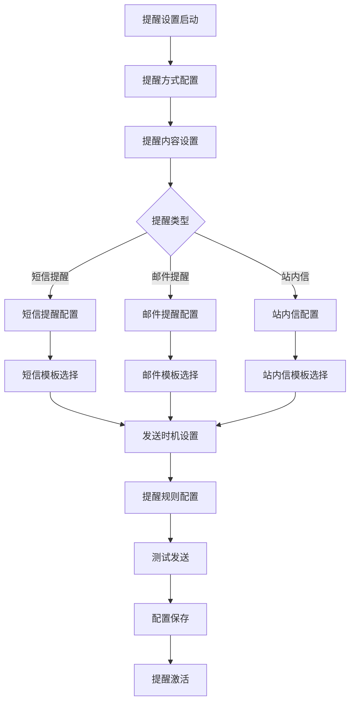
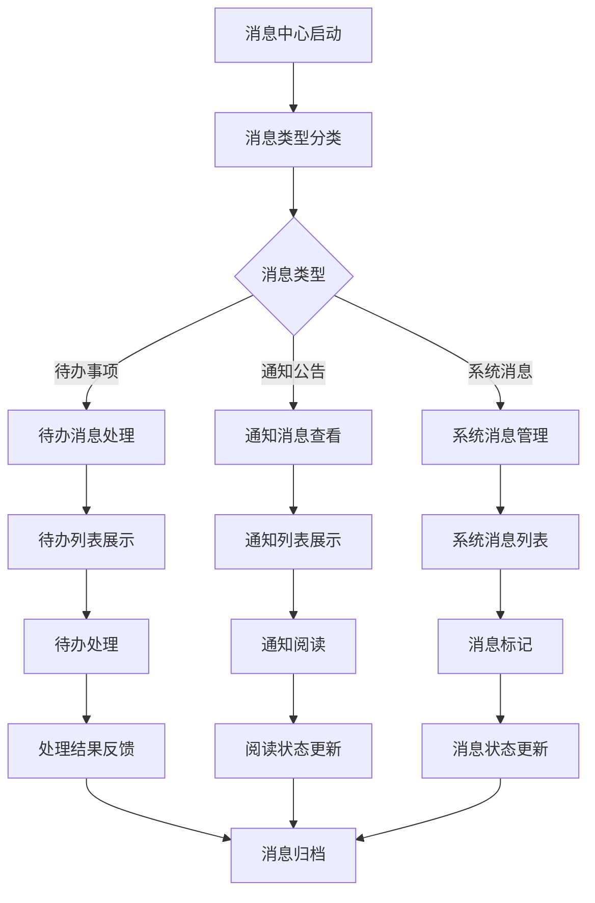
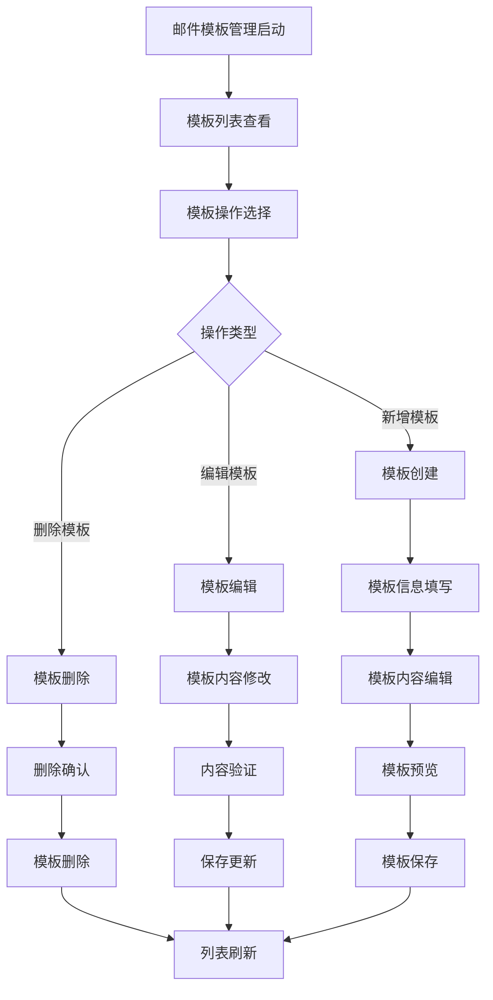
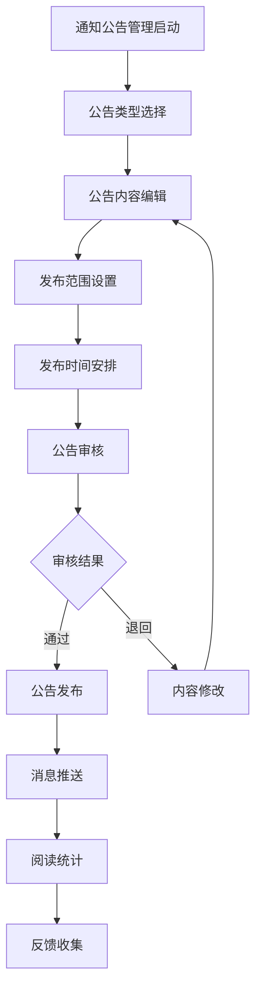

# 消息通知模块 - 深度业务分析报告

## 📋 系统概览

**模块路径**: 分布在多个模块中
**开发者**: 团队协作开发
**开发时间**: 2023年-2024年
**文件数量**: 80+个Vue文件
**复杂度**: ⭐⭐⭐⭐⭐ (极高复杂度)

### 系统定位
消息通知模块是医院教育管理系统的核心通信平台，负责管理消息推送、通知管理、提醒设置等全方位的消息通知业务，确保信息的及时传达和有效沟通。

---

## 🏗️ 系统架构

### 核心子模块

| 子模块 | 路径 | 文件数 | 主要功能 | 复杂度 |
|--------|------|--------|----------|--------|
| 提醒设置 | moduleSettings/remind/ | 15个 | 提醒方式、内容配置 | ⭐⭐⭐⭐⭐ |
| 邮件模板 | emailReminderTemplate/ | 8个 | 邮件模板管理 | ⭐⭐⭐⭐ |
| 短信模板 | smsReminderTemplate/ | 8个 | 短信模板管理 | ⭐⭐⭐⭐ |
| 通知公告 | noticeAndAnnouncement/ | 10个 | 通知公告发布管理 | ⭐⭐⭐⭐ |
| 消息中心 | consoleHomePage/ | 12个 | 消息查看、待办事项 | ⭐⭐⭐⭐⭐ |
| 直播通知 | LiveBroadcastManagement/ | 8个 | 直播消息、群组通知 | ⭐⭐⭐⭐ |
| 培训通知 | trainingPractice/ | 5个 | 培训报名通知 | ⭐⭐⭐ |

### 技术架构特色
1. **多渠道消息推送**: 支持短信、邮件、站内信等多种推送方式
2. **模板化消息管理**: 灵活的消息模板配置和管理
3. **实时消息通知**: 基于WebSocket的实时消息推送
4. **智能提醒机制**: 可配置的智能提醒和预警功能

---

## 📊 业务流程分析

### 1. 提醒设置模块 (remind/setReminders)

#### 1.1 核心业务流程



#### 1.2 提醒设置功能

| 提醒方式 | 适用场景 | 配置参数 | 发送时机 |
|---------|----------|----------|----------|
| 短信提醒 | 紧急通知、审批结果 | 手机号、模板ID | 实时发送 |
| 邮件提醒 | 详细通知、报告发送 | 邮箱地址、模板内容 | 定时发送 |
| 站内信 | 系统通知、待办提醒 | 用户ID、消息内容 | 实时推送 |
| 微信推送 | 移动端通知 | OpenID、模板消息 | 实时推送 |

#### 1.3 关键API接口

```javascript
// 提醒设置核心API
getRemindSettingInfo()             // 获取提醒设置信息
updateRemindSettingInfo()          // 更新提醒设置信息
searchRemindEmailTemplateInfo()    // 查询邮件提醒模板
createRemindEmailTemplateInfo()    // 创建邮件提醒模板
updateRemindEmailTemplateInfo()    // 更新邮件提醒模板
deleteRemindEmailTemplateInfo()    // 删除邮件提醒模板
```

### 2. 消息中心模块 (consoleHomePage)

#### 2.1 业务流程



#### 2.2 消息中心功能

| 消息类型 | 消息内容 | 处理方式 | 状态管理 |
|---------|----------|----------|----------|
| 待办事项 | 审批、确认、填写等 | 跳转处理页面 | 待处理/已处理 |
| 通知公告 | 系统通知、公告信息 | 查看详情 | 未读/已读 |
| 系统消息 | 系统提醒、状态变更 | 标记处理 | 未读/已读/已删除 |
| 个人消息 | 私信、评论回复 | 回复互动 | 未读/已读 |

#### 2.3 关键API接口

```javascript
// 消息中心核心API
findDacklogMatter()                // 查询今日日程
findDacklogMatterCount()           // 查询待办事项数量
getUnReadMessageCount()            // 查询未读消息数
getUnReadNoticeCount()             // 查询通知公告未读数量
updateUserMessageRead()            // 更新消息为已读状态
allUnreadMessage()                 // 查询所有未读消息
findUserMessageInfo()              // 查询个人待办消息与通知消息
```

### 3. 邮件模板管理模块 (emailReminderTemplate)

#### 3.1 业务流程



#### 3.2 邮件模板功能

| 模板类型 | 使用场景 | 模板内容 | 变量支持 |
|---------|----------|----------|----------|
| 审批拒绝 | 申请被拒绝时 | 拒绝原因、联系方式 | %s占位符 |
| 审批通过 | 申请通过时 | 通过信息、后续步骤 | %s占位符 |
| 审批退回 | 申请退回时 | 退回原因、修改要求 | %s占位符 |
| 报到提醒 | 报到前提醒 | 时间地点、联系人 | %s占位符 |

#### 3.3 关键API接口

```javascript
// 邮件模板管理核心API
searchRemindEmailTemplateInfo()    // 搜索邮件模板
createRemindEmailTemplateInfo()    // 创建邮件模板
updateRemindEmailTemplateInfo()    // 更新邮件模板
deleteRemindEmailTemplateInfo()    // 删除邮件模板
```

### 4. 通知公告模块 (noticeAndAnnouncement)

#### 4.1 业务流程



#### 4.2 通知公告功能

| 公告类型 | 发布范围 | 内容格式 | 推送方式 |
|---------|----------|----------|----------|
| 系统公告 | 全体用户 | 富文本、附件 | 站内信+邮件 |
| 部门通知 | 指定部门 | 富文本 | 站内信 |
| 紧急通知 | 相关人员 | 文本+链接 | 短信+站内信 |
| 活动通知 | 参与人员 | 富文本+图片 | 邮件+站内信 |

---

## 👥 用户角色与权限

### 用户角色定义

| 角色 | 权限范围 | 主要操作 |
|------|----------|----------|
| **消息管理员** | 全局消息管理 | 模板配置、消息发送、统计分析 |
| **部门管理员** | 部门消息管理 | 部门通知、消息查看 |
| **系统管理员** | 系统配置权限 | 系统消息配置、权限管理 |
| **普通用户** | 消息接收权限 | 消息查看、状态标记 |

### 权限控制矩阵

| 功能模块 | 消息管理员 | 部门管理员 | 系统管理员 | 普通用户 |
|---------|------------|------------|------------|----------|
| 模板管理 | ✅ | ❌ | ✅ | ❌ |
| 消息发送 | ✅ | ✅(部门内) | ✅ | ❌ |
| 消息查看 | ✅ | ✅ | ✅ | ✅ |
| 提醒设置 | ✅ | ❌ | ✅ | ✅(个人) |
| 统计分析 | ✅ | ✅(部门内) | ✅ | ❌ |

---

## 🔧 技术实现分析

### 前端技术栈
- **Vue 2.6.14**: 主框架
- **Element UI**: UI组件库
- **Quill Editor**: 富文本编辑器
- **WebSocket**: 实时通信

### 核心技术特点

#### 1. 消息模板系统
```javascript
// 邮件模板配置
const emailTemplate = {
  remindContent: 'AF',  // 审批拒绝
  addresser: '系统管理员',
  subject: '申请审批结果通知',
  content: '很抱歉！您未通过我院%s的报名审批，拒绝理由：%s'
}

// 模板变量替换
const processTemplate = (template, variables) => {
  let content = template.content
  variables.forEach((variable, index) => {
    content = content.replace('%s', variable)
  })
  return content
}
```

#### 2. 消息推送系统
```javascript
// 消息推送配置
const pushConfig = {
  sms: {
    enabled: true,
    template: 'SMS_001',
    timing: 'immediate'
  },
  email: {
    enabled: true,
    template: 'EMAIL_001',
    timing: 'scheduled'
  },
  inApp: {
    enabled: true,
    template: 'APP_001',
    timing: 'immediate'
  }
}

// 多渠道消息发送
const sendMultiChannelMessage = async (message, channels) => {
  const promises = channels.map(channel => {
    switch(channel.type) {
      case 'sms':
        return sendSMS(message, channel.config)
      case 'email':
        return sendEmail(message, channel.config)
      case 'inApp':
        return sendInAppMessage(message, channel.config)
    }
  })
  
  return Promise.all(promises)
}
```

#### 3. 实时消息系统
```javascript
// WebSocket消息处理
const messageHandler = {
  connect() {
    this.ws = new WebSocket(wsUrl)
    this.ws.onmessage = this.handleMessage
    this.ws.onopen = this.handleConnect
    this.ws.onclose = this.handleDisconnect
  },
  
  handleMessage(event) {
    const message = JSON.parse(event.data)
    switch(message.type) {
      case 'notification':
        this.showNotification(message)
        break
      case 'todo':
        this.updateTodoCount(message)
        break
      case 'system':
        this.handleSystemMessage(message)
        break
    }
  },
  
  sendMessage(message) {
    if (this.ws.readyState === WebSocket.OPEN) {
      this.ws.send(JSON.stringify(message))
    }
  }
}
```

#### 4. 消息状态管理
```javascript
// 消息状态管理
const messageState = {
  unread: 0,      // 未读
  read: 1,        // 已读
  processed: 2,   // 已处理
  archived: 3     // 已归档
}

// 消息状态更新
const updateMessageStatus = (messageId, status) => {
  return updateUserMessageRead({
    messageId: messageId,
    status: status,
    readTime: new Date().getTime()
  })
}

// 批量消息处理
const batchUpdateMessages = (messageIds, status) => {
  return Promise.all(
    messageIds.map(id => updateMessageStatus(id, status))
  )
}
```

---

## 📈 数据统计与分析

### 关键指标
1. **消息发送量**: 各渠道消息发送数量统计
2. **消息到达率**: 消息成功到达率分析
3. **消息阅读率**: 消息阅读和处理率统计
4. **用户活跃度**: 基于消息互动的用户活跃度

### 统计功能
1. **发送统计**: 消息发送量和成功率统计
2. **阅读分析**: 消息阅读情况分析
3. **效果评估**: 消息推送效果评估
4. **用户行为**: 用户消息行为分析

---

## 🎯 业务价值分析

### 核心价值
1. **信息传达**: 确保重要信息及时准确传达
2. **流程推进**: 通过消息推动业务流程进展
3. **用户体验**: 提升用户信息获取体验
4. **管理效率**: 提高管理沟通效率

### 解决的痛点
1. **信息滞后**: 实时消息推送机制
2. **通知遗漏**: 多渠道消息保障
3. **模板重复**: 统一的消息模板管理
4. **状态不明**: 清晰的消息状态管理

---

## 🔮 优化建议

### 技术优化
1. **智能推送**: AI智能推送时机优化
2. **消息聚合**: 智能消息聚合和去重
3. **个性化**: 个性化消息推送策略
4. **性能优化**: 大量消息推送性能优化

### 业务优化
1. **推送策略**: 智能推送策略优化
2. **用户偏好**: 用户消息偏好设置
3. **效果分析**: 消息推送效果深度分析
4. **国际化**: 多语言消息支持

这个消息通知模块展现了医院教育管理系统的通信能力和用户体验水平！
