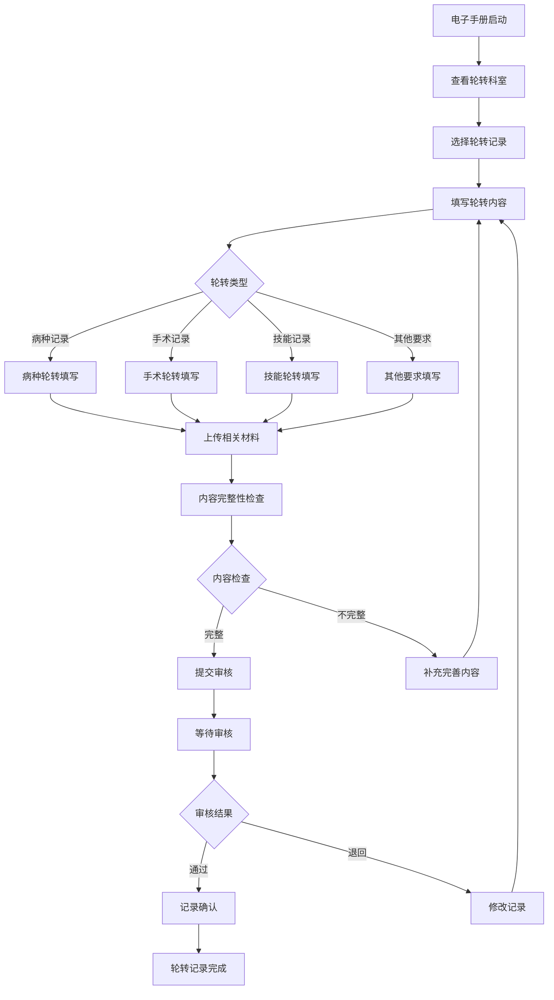
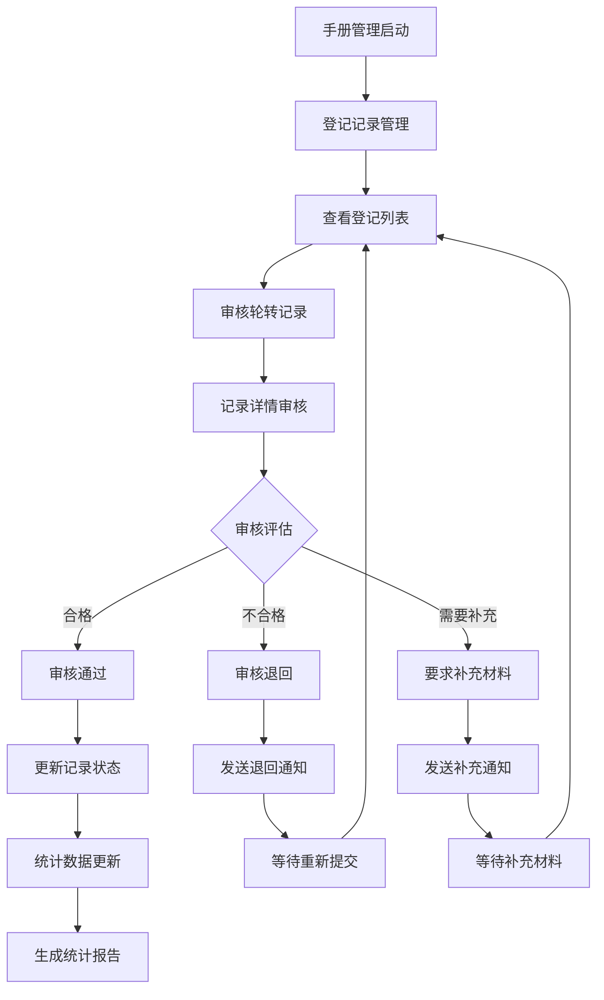
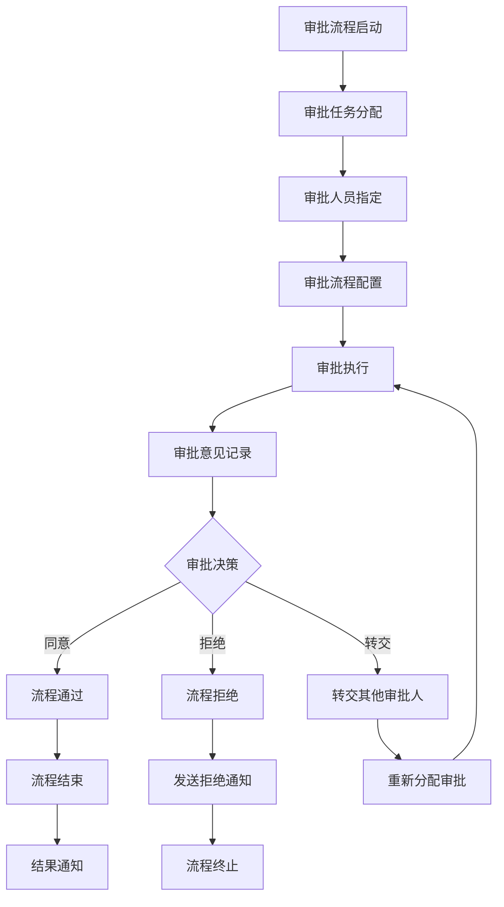

# 电子轮转手册管理系统 - 深度业务分析报告

## 📋 系统概览

**模块路径**: `src/views/electronicTaketurnManual/`
**开发者**: 团队协作开发
**开发时间**: 2023年-2024年
**文件数量**: 50+个Vue文件
**复杂度**: ⭐⭐⭐⭐⭐ (极高复杂度)

### 系统定位
电子轮转手册管理系统是医院教育管理的核心轮转管理模块，负责管理住培学员的轮转手册记录、模板管理、审批流程、统计分析等全流程业务，确保轮转过程的规范化和标准化管理。

---

## 🏗️ 系统架构

### 核心子模块

| 子模块 | 路径 | 文件数 | 主要功能 | 复杂度 |
|--------|------|--------|----------|--------|
| 轮转手册管理 | electronicTaketurnManualManagement/ | 20个 | 手册管理、审批流程、统计分析 | ⭐⭐⭐⭐⭐ |
| 我的电子手册 | myElectronicTaketurnManual/ | 15个 | 个人轮转手册、记录填写 | ⭐⭐⭐⭐⭐ |
| 审批流程管理 | approvalProcessManagement/ | 10个 | 轮转审批流程管理 | ⭐⭐⭐⭐ |
| 考勤数据报告 | attendanceDataReport.vue | 1个 | 轮转考勤数据报告 | ⭐⭐⭐ |
| 基地入科统计 | baseEntryStatistics.vue | 1个 | 基地入科统计分析 | ⭐⭐⭐ |
| 学生入科统计 | studentEntryStatistics.vue | 1个 | 学生入科统计分析 | ⭐⭐⭐ |
| 接口管理 | interfaceManagement.vue | 1个 | 系统接口管理 | ⭐⭐⭐ |

### 技术架构特色
1. **多维度轮转管理**: 支持病种、手术、技能等多种轮转类型
2. **智能模板系统**: 灵活的轮转内容模板配置和管理
3. **完整审批流程**: 从登记到审核的完整电子化流程
4. **实时统计分析**: 全方位的轮转数据统计和分析

---

## 📊 业务流程分析

### 1. 我的电子手册模块 (myElectronicTaketurnManual)

#### 1.1 核心业务流程



#### 1.2 轮转记录类型

| 记录类型 | 组件文件 | 主要内容 | 评价标准 |
|---------|----------|----------|----------|
| 病种记录 | addTakeTurn1.vue | 病种诊疗记录 | 病种覆盖度、诊疗质量 |
| 手术记录 | addTakeTurn2.vue | 手术操作记录 | 手术技能、操作规范 |
| 技能记录 | addTakeTurn3.vue | 临床技能记录 | 技能掌握程度 |
| 教学活动 | addTakeTurn4.vue | 教学活动参与 | 参与度、学习效果 |
| 学术活动 | addTakeTurn5.vue | 学术活动记录 | 学术能力、创新思维 |
| 科研活动 | addTakeTurn6.vue | 科研项目参与 | 科研能力、研究成果 |
| 质控活动 | addTakeTurn7.vue | 质量控制活动 | 质控意识、改进能力 |
| 其他要求 | addTakeTurn8.vue | 其他培训要求 | 综合能力评价 |

#### 1.3 关键API接口

```javascript
// 我的电子手册核心API
getBaseHeaderInfoApi()              // 获取手册头部信息
getManualOrgListApi()               // 获取手册轮转科室列表
getManualItemDetailListApi()        // 获取手册记录详情列表
getManualOtherListApi()             // 获取手册其他要求列表
getManualReachDetailApi()           // 获取用户达标详情
registerSaveApi()                   // 保存轮转记录
registerSubmitApi()                 // 提交轮转记录
submitRegisterApi()                 // 提交注册申请
importRegisterDoApi()               // 导入轮转记录
```

### 2. 轮转手册管理模块 (electronicTaketurnManualManagement)

#### 2.1 业务流程



#### 2.2 管理功能模块

| 功能模块 | 组件文件 | 主要功能 | 权限要求 |
|---------|----------|----------|----------|
| 登记记录管理 | registerRecordManagement.vue | 轮转记录审核管理 | 管理员 |
| 登记详情 | registerDetailed.vue | 轮转记录详情查看 | 管理员 |
| 科室统计 | deptStatistics.vue | 科室轮转统计分析 | 管理员 |
| 统计管理 | statisticsManagement.vue | 综合统计管理 | 管理员 |
| 手册填报查询 | manualManagerList.vue | 手册填报情况查询 | 管理员 |

### 3. 审批流程管理模块 (approvalProcessManagement)

#### 3.1 业务流程



### 4. 统计分析功能

#### 4.1 统计维度

| 统计类型 | 统计内容 | 分析指标 | 展示方式 |
|---------|----------|----------|----------|
| 科室统计 | 各科室轮转情况 | 轮转人数、完成率 | 表格、图表 |
| 基地统计 | 基地入科统计 | 入科人数、分布情况 | 统计图表 |
| 学生统计 | 学生轮转进度 | 轮转进度、达标情况 | 进度图表 |
| 考勤统计 | 轮转考勤数据 | 出勤率、请假情况 | 考勤报表 |

---

## 👥 用户角色与权限

### 用户角色定义

| 角色 | 权限范围 | 主要操作 |
|------|----------|----------|
| **轮转管理员** | 全局轮转管理 | 手册管理、审批管理、统计分析 |
| **科室教学秘书** | 科室轮转管理 | 科室轮转审核、进度监督 |
| **带教老师** | 学员指导权限 | 轮转指导、记录评价 |
| **住培学员** | 个人轮转权限 | 轮转记录填写、进度查询 |
| **系统管理员** | 系统配置权限 | 用户管理、系统配置 |

### 权限控制矩阵

| 功能模块 | 轮转管理员 | 科室秘书 | 带教老师 | 住培学员 | 系统管理员 |
|---------|------------|----------|----------|----------|------------|
| 手册管理 | ✅ | ✅(科室内) | ❌ | ❌ | ✅ |
| 记录审核 | ✅ | ✅(科室内) | ✅(指导学员) | ❌ | ✅ |
| 记录填写 | ✅ | ❌ | ❌ | ✅ | ✅ |
| 统计分析 | ✅ | ✅(科室内) | ✅(指导学员) | ✅(个人) | ✅ |
| 审批流程 | ✅ | ✅(科室内) | ✅(评价) | ❌ | ✅ |
| 系统配置 | ❌ | ❌ | ❌ | ❌ | ✅ |

---

## 🔧 技术实现分析

### 前端技术栈
- **Vue 2.6.14**: 主框架
- **Element UI**: UI组件库
- **Moment.js**: 时间处理
- **Lodash**: 工具库

### 核心技术特点

#### 1. 组件化轮转记录
```javascript
// 8个轮转记录组件
import addTakeTurn1 from '../components/addTakeTurn1.vue'  // 病种记录
import addTakeTurn2 from '../components/addTakeTurn2.vue'  // 手术记录
import addTakeTurn3 from '../components/addTakeTurn3.vue'  // 技能记录
import addTakeTurn4 from '../components/addTakeTurn4.vue'  // 教学活动
import addTakeTurn5 from '../components/addTakeTurn5.vue'  // 学术活动
import addTakeTurn6 from '../components/addTakeTurn6.vue'  // 科研活动
import addTakeTurn7 from '../components/addTakeTurn7.vue'  // 质控活动
import addTakeTurn8 from '../components/addTakeTurn8.vue'  // 其他要求
```

#### 2. 动态表单系统
```javascript
// 轮转记录动态表单
data() {
  return {
    formData: {
      rotateOrgId: '',
      standardOrgId: '',
      competencyId: '',
      recordType: '',
      recordContent: {},
      attachments: []
    }
  }
}
```

#### 3. 状态管理
```javascript
// 轮转状态管理
const rotateStatus = {
  UNSTART: '未开始',
  RUN: '轮转中', 
  END: '已出科'
}

const recordStatus = {
  DRAFT: '草稿',
  SUBMIT: '已提交',
  APPROVED: '已审核',
  REJECTED: '已退回'
}
```

#### 4. 批量操作处理
```javascript
// 批量导入轮转记录
importRegisterDoApi(formData).then(res => {
  if (res.code === '0') {
    this.$message.success('导入成功')
    this.getRecordList()
  }
})

// 批量审核
batchApproval(recordIds, status).then(res => {
  if (res.code === '0') {
    this.$message.success('批量审核成功')
    this.refreshList()
  }
})
```

---

## 📈 数据统计与分析

### 关键指标
1. **轮转完成率**: 按科室、专业、时间统计轮转完成情况
2. **记录质量**: 轮转记录的完整性和质量评估
3. **审核效率**: 审核时长、通过率统计
4. **达标情况**: 轮转要求达标情况分析

### 统计功能
1. **实时监控**: 轮转进度实时监控
2. **预警机制**: 轮转进度滞后预警
3. **质量分析**: 轮转记录质量趋势分析
4. **效果评估**: 轮转培训效果评估

---

## 🎯 业务价值分析

### 核心价值
1. **流程标准化**: 统一轮转记录标准和流程
2. **管理精细化**: 全流程精细化管理和跟踪
3. **质量保证**: 多层次质量控制和评价体系
4. **效率提升**: 电子化管理提升效率

### 解决的痛点
1. **记录不规范**: 标准化轮转记录模板
2. **审核流程复杂**: 简化电子化审核流程
3. **进度难跟踪**: 实时进度跟踪和监控
4. **统计分析困难**: 自动化数据统计和分析

---

## 🔮 优化建议

### 技术优化
1. **移动端适配**: 支持移动端记录填写和审核
2. **智能提醒**: 基于轮转计划的智能提醒
3. **数据分析**: 深度挖掘轮转数据价值
4. **AI辅助**: AI辅助记录质量评估

### 业务优化
1. **个性化轮转**: 个性化轮转计划制定
2. **质量持续改进**: 基于数据的质量改进
3. **跨院交流**: 支持跨医院轮转交流
4. **标准化评估**: 更加标准化的评估体系

这个电子轮转手册管理系统展现了医院轮转培训管理的数字化转型和规范化管理！
