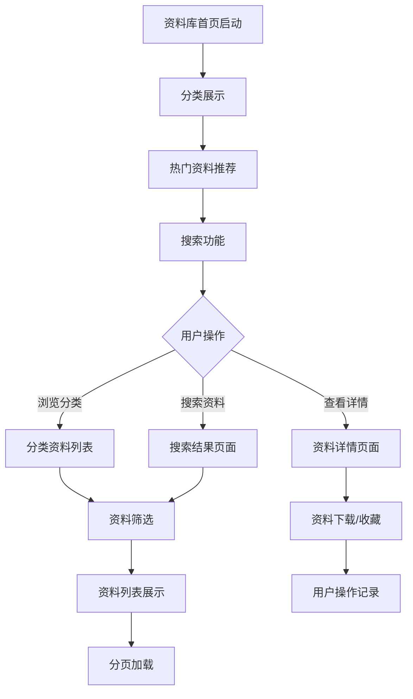
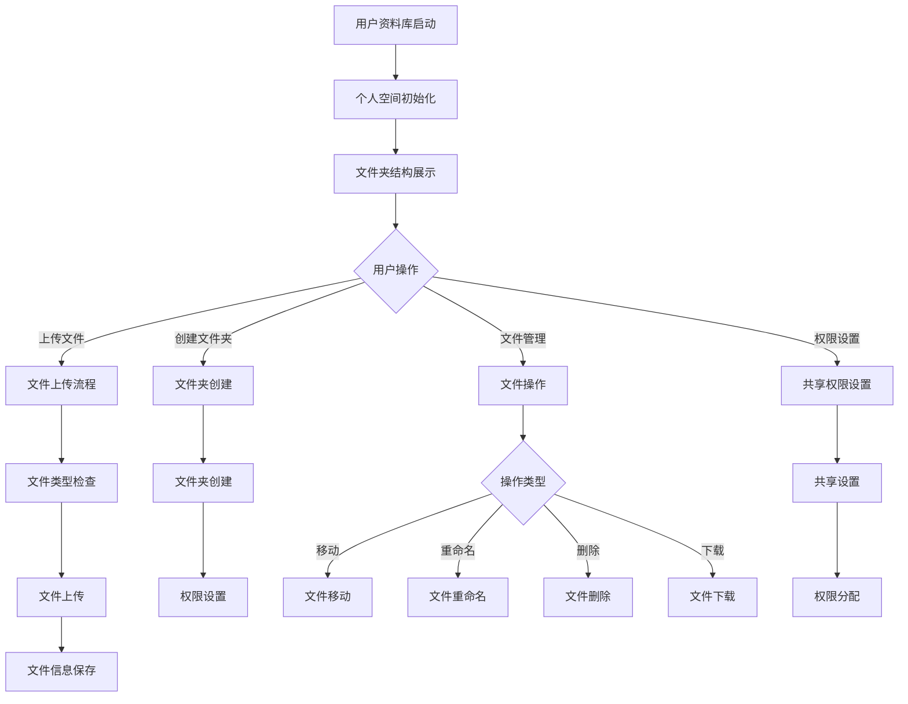
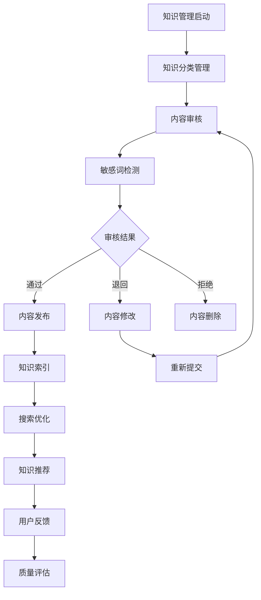
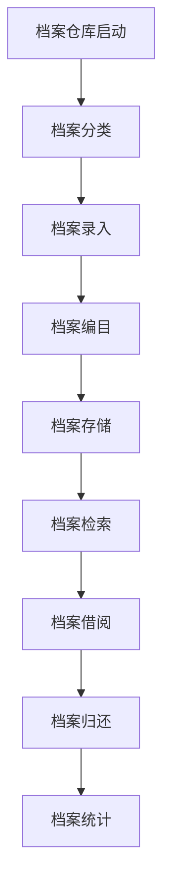

# 知识库管理系统 - 深度业务分析报告

## 📋 系统概览

**模块路径**: `src/views/library/` + `src/views/knowledge/` + `src/views/archivesRepository/`
**开发者**: 团队协作开发
**开发时间**: 2023年-2024年
**文件数量**: 80+个Vue文件
**复杂度**: ⭐⭐⭐⭐⭐ (极高复杂度)

### 系统定位
知识库管理系统是医院教育管理的核心知识平台，负责管理医学知识的分类、存储、检索、分享等全生命周期，提供完整的知识管理解决方案，确保医护人员能够高效获取和利用医学知识资源。

---

## 🏗️ 系统架构

### 核心子模块

| 子模块 | 路径 | 文件数 | 主要功能 | 复杂度 |
|--------|------|--------|----------|--------|
| 资料库首页 | library/home/ | 8个 | 首页展示、分类导航、搜索入口 | ⭐⭐⭐⭐ |
| 用户资料库 | library/userDatabase/ | 25个 | 个人资料管理、文件夹管理 | ⭐⭐⭐⭐⭐ |
| 知识管理 | knowledge/ | 20个 | 知识分类、内容管理、敏感词 | ⭐⭐⭐⭐⭐ |
| 档案仓库 | archivesRepository/ | 15个 | 档案存储、检索、管理 | ⭐⭐⭐⭐ |
| 公共信息 | library/userDatabase/publicInformation/ | 12个 | 公共资料、共享管理 | ⭐⭐⭐⭐ |

### 技术架构特色
1. **多层级分类体系**: 支持一级、二级、三级分类管理
2. **智能搜索引擎**: 全文检索、分类搜索、标签搜索
3. **权限管理体系**: 细粒度权限控制和共享机制
4. **版本控制系统**: 文档版本管理和历史追踪

---

## 📊 业务流程分析

### 1. 资料库首页模块 (library/home)

#### 1.1 核心业务流程



#### 1.2 首页功能模块

| 功能模块 | 组件文件 | 主要功能 | 数据来源 |
|---------|----------|----------|----------|
| 分类导航 | classification.vue | 知识分类展示 | 分类接口 |
| 搜索功能 | searchBar.vue | 全文搜索 | 搜索接口 |
| 热门推荐 | hotRecommend.vue | 热门资料推荐 | 推荐算法 |
| 最新资料 | latestMaterial.vue | 最新上传资料 | 时间排序 |

#### 1.3 关键API接口

```javascript
// 资料库首页核心API
plateTab()                      // 获取web分类
content()                       // 获取分类文章
twelveMaterialList()            // 首页资料中心
searchContentList()             // 搜索内容
materialList()                  // 资料列表
```

### 2. 用户资料库模块 (library/userDatabase)

#### 2.1 业务流程



#### 2.2 文件管理功能

| 功能模块 | 描述 | 技术实现 | 权限控制 |
|---------|------|----------|----------|
| 文件上传 | 支持多种文件格式上传 | 分片上传、断点续传 | 上传权限 |
| 文件夹管理 | 创建、删除、重命名文件夹 | 树形结构管理 | 管理权限 |
| 文件共享 | 设置文件共享权限 | 权限矩阵管理 | 共享权限 |
| 版本控制 | 文件版本管理 | 版本历史记录 | 版本权限 |

#### 2.3 关键API接口

```javascript
// 用户资料库核心API
folderList()                    // 文件夹列表
uploadFile()                    // 上传文件
downloadFile()                  // 下载文件
deleteMaterial()                // 删除资料
CreateFolder()                  // 创建文件夹
fileMove()                      // 文件移动
settingShare()                  // 设置共享
cancelShare()                   // 取消共享
```

### 3. 知识管理模块 (knowledge)

#### 3.1 业务流程



#### 3.2 知识管理功能

| 管理类型 | 功能描述 | 技术实现 | 质量控制 |
|---------|----------|----------|----------|
| 分类管理 | 知识分类体系管理 | 树形分类结构 | 分类规范 |
| 内容审核 | 知识内容质量审核 | 人工+自动审核 | 审核标准 |
| 敏感词过滤 | 敏感内容检测过滤 | 敏感词库匹配 | 词库维护 |
| 版权管理 | 知识版权保护 | 版权标识管理 | 版权验证 |

#### 3.3 关键API接口

```javascript
// 知识管理核心API
getContentList()                // 获取内容列表
deleteContentById()             // 根据ID删除内容
getSensitiveWordsList()         // 获取敏感词列表
createSensitiveWords()          // 创建敏感词
deleteSensitiveWords()          // 删除敏感词
searchSensitiveWords()          // 搜索敏感词
```

### 4. 档案仓库模块 (archivesRepository)

#### 4.1 业务流程



#### 4.2 档案管理功能

| 档案类型 | 管理内容 | 存储方式 | 检索方式 |
|---------|----------|----------|----------|
| 教学档案 | 教学计划、课程资料 | 分类存储 | 关键词检索 |
| 学员档案 | 学员信息、成绩记录 | 加密存储 | 条件检索 |
| 培训档案 | 培训记录、证书 | 版本存储 | 时间检索 |
| 制度档案 | 规章制度、标准 | 权限存储 | 分类检索 |

---

## 👥 用户角色与权限

### 用户角色定义

| 角色 | 权限范围 | 主要操作 |
|------|----------|----------|
| **知识管理员** | 全局知识管理 | 分类管理、内容审核、权限设置 |
| **内容编辑** | 内容编辑权限 | 内容创建、编辑、发布 |
| **普通用户** | 基础使用权限 | 浏览、搜索、下载、收藏 |
| **系统管理员** | 系统配置权限 | 用户管理、系统配置 |

### 权限控制矩阵

| 功能模块 | 知识管理员 | 内容编辑 | 普通用户 | 系统管理员 |
|---------|------------|----------|----------|------------|
| 分类管理 | ✅ | ❌ | ❌ | ✅ |
| 内容审核 | ✅ | ✅(自己) | ❌ | ✅ |
| 内容发布 | ✅ | ✅ | ❌ | ✅ |
| 内容浏览 | ✅ | ✅ | ✅ | ✅ |
| 文件上传 | ✅ | ✅ | ✅(限制) | ✅ |
| 权限设置 | ✅ | ❌ | ❌ | ✅ |

---

## 🔧 技术实现分析

### 前端技术栈
- **Vue 2.6.14**: 主框架
- **Element UI**: UI组件库
- **Axios**: HTTP请求
- **Lodash**: 工具库

### 核心技术特点

#### 1. 智能搜索引擎
```javascript
// 全文搜索
searchContentList(searchData).then(res => {
  this.searchResults = res.data
  this.highlightKeywords()
})

// 分类搜索
const searchAlgorithm = {
  fullTextSearch: true,        // 全文检索
  categoryFilter: true,        // 分类过滤
  tagSearch: true,            // 标签搜索
  fuzzyMatch: true,           // 模糊匹配
  relevanceRanking: true      // 相关性排序
}
```

#### 2. 文件管理系统
```javascript
// 分片上传
const uploadChunk = {
  chunkSize: 1024 * 1024,     // 1MB分片
  maxRetries: 3,              // 最大重试次数
  concurrent: 3,              // 并发上传数
  resumable: true             // 断点续传
}

// 文件操作
fileMove(moveData).then(res => {
  if (res.code === 0) {
    this.refreshFileList()
  }
})
```

#### 3. 权限管理系统
```javascript
// 权限控制
const permissionMatrix = {
  read: ['user', 'editor', 'admin'],
  write: ['editor', 'admin'],
  delete: ['admin'],
  share: ['editor', 'admin'],
  audit: ['admin']
}

// 共享设置
settingShare(shareData).then(res => {
  if (res.code === 0) {
    this.updateShareStatus()
  }
})
```

#### 4. 版本控制系统
```javascript
// 版本管理
const versionControl = {
  autoSave: true,             // 自动保存
  versionHistory: true,       // 版本历史
  diffComparison: true,       // 差异对比
  rollback: true              // 版本回滚
}
```

---

## 📈 数据统计与分析

### 关键指标
1. **知识利用率**: 知识资源的访问和使用统计
2. **搜索效果**: 搜索准确率和用户满意度
3. **内容质量**: 内容评分和用户反馈
4. **存储效率**: 存储空间利用率和访问速度

### 统计功能
1. **访问统计**: 知识访问频次和热度分析
2. **用户行为**: 用户搜索和浏览行为分析
3. **内容分析**: 内容质量和受欢迎程度分析
4. **系统性能**: 系统响应时间和稳定性监控

---

## 🎯 业务价值分析

### 核心价值
1. **知识共享**: 促进医学知识的共享和传播
2. **效率提升**: 提高知识检索和获取效率
3. **质量保证**: 确保知识内容的准确性和权威性
4. **持续学习**: 支持医护人员的持续学习

### 解决的痛点
1. **信息孤岛**: 统一的知识管理平台
2. **检索困难**: 智能化搜索和分类体系
3. **质量参差**: 内容审核和质量控制
4. **权限混乱**: 细粒度权限管理体系

---

## 🔮 优化建议

### 技术优化
1. **AI推荐**: AI驱动的个性化知识推荐
2. **语义搜索**: 基于语义理解的智能搜索
3. **知识图谱**: 构建医学知识图谱
4. **移动优化**: 完善的移动端知识管理

### 业务优化
1. **协作编辑**: 多人协作编辑功能
2. **专家审核**: 专家参与的内容审核
3. **国际化**: 多语言知识管理支持
4. **开放API**: 第三方系统集成接口

这个知识库管理系统展现了医院知识管理的完整性和专业性！
