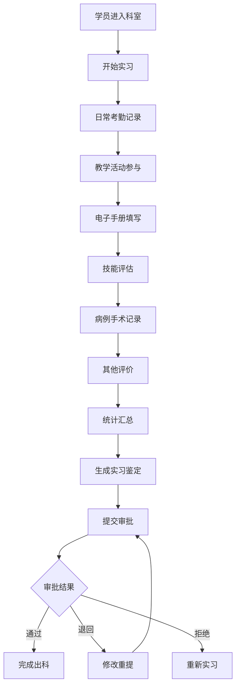
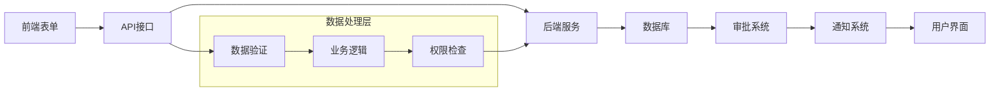
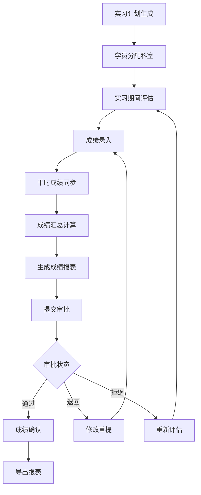
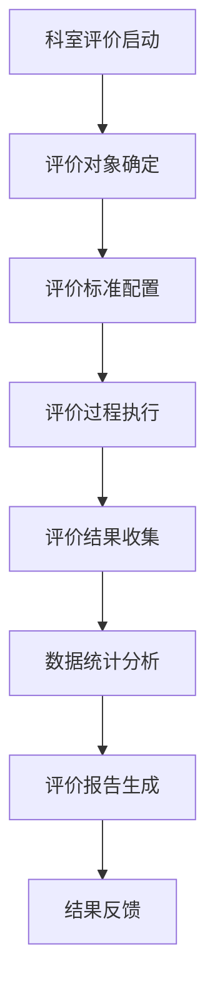

# 科室记录管理系统 - 深度业务分析报告

## 📋 系统概览

**模块路径**: `src/views/departmentRecord/`
**开发者**: 许辉 🔥
**开发时间**: 2024年10月
**文件数量**: 45+个Vue文件
**复杂度**: ⭐⭐⭐⭐⭐ (极高复杂度)

### 系统定位
科室记录管理系统是医院教育管理的核心业务模块，负责管理实习生在各科室的实习鉴定、成绩评定、审批流程等全生命周期业务。

---

## 🏗️ 系统架构

### 核心子模块

| 子模块 | 路径 | 文件数 | 主要功能 | 复杂度 |
|--------|------|--------|----------|--------|
| 实习鉴定管理 | practiceAppraisal/ | 16个 | 实习鉴定详情、审批、模板配置 | ⭐⭐⭐⭐⭐ |
| 出科成绩报表 | graduationScoreReport/ | 4个 | 成绩报表生成、审批进度、数据导出 | ⭐⭐⭐⭐ |
| 评价管理 | appraisal/ | 6个 | 科室评价管理 | ⭐⭐⭐⭐ |

### 技术架构特色
1. **高度组件化**: 10个专业评估组件，支持多维度评估
2. **复杂业务流程**: 完整的实习鉴定工作流
3. **审批系统集成**: 多级审批流程和进度展示
4. **数据可视化**: 成绩报表和统计分析

---

## 📊 业务流程分析

### 1. 实习鉴定管理模块 (practiceAppraisal)

#### 1.1 核心业务流程



#### 1.2 多维度评估组件

| 组件名称 | 文件路径 | 功能描述 | 数据来源 |
|---------|----------|----------|----------|
| 考勤管理 | attendance.vue | 实习期间考勤记录 | 考勤系统 |
| 教学活动 | teachActive.vue | 教学活动参与情况 | 教学活动系统 |
| 电子手册 | electronicManual.vue | 电子实习手册 | 手册系统 |
| 技能评估 | assessment.vue | 技能考核评估 | 评估系统 |
| 综合评价 | evaluation.vue | 综合能力评价 | 评价系统 |
| 病例手术 | diseaseOperation.vue | 病例手术记录 | 病例系统 |
| 其他评价 | others.vue | 其他补充评价 | 自定义 |
| 统计汇总 | statistical.vue | 数据统计分析 | 计算生成 |
| 总结文本 | summaryText.vue | 实习总结文本 | 手动填写 |
| 审批进度 | approvalProgress.vue | 审批流程进度 | 审批系统 |

#### 1.3 关键API接口

```javascript
// 核心API列表
graduateIdentificationPraSearch()  // 实习鉴定搜索
getTabs()                         // 获取标签页配置
getTabsByApprovalFormId()         // 根据审批ID获取标签页
generateGraduateFileByDate()      // 按日期生成毕业文件
generateGraduateFileByDateGetStatus() // 获取生成状态
```

#### 1.4 数据流分析



### 2. 出科成绩报表模块 (graduationScoreReport)

#### 2.1 业务流程



#### 2.2 核心功能点

| 功能模块 | 描述 | 实现方式 |
|---------|------|----------|
| 成绩录入 | 手动录入学员成绩 | 表格编辑 |
| 批量导入 | Excel批量导入成绩 | 文件上传解析 |
| 平时成绩同步 | 同步其他系统成绩 | API接口调用 |
| 成绩计算 | 自动计算总分排名 | 前端计算逻辑 |
| 报表生成 | 生成PDF/Excel报表 | 后端报表服务 |
| 审批流程 | 成绩审批工作流 | 审批系统集成 |

#### 2.3 关键API接口

```javascript
// 成绩报表相关API
reportSearch()           // 搜索实习计划列表
searchDetail()          // 查看学员详情列表
saveGrade()             // 录入成绩保存
syncNormalGrade()       // 同步平时成绩
downloadExcelTemplate() // 下载导入模板
importGrade()           // 导入成绩
exportGradeExcel()      // 导出Excel
exportGradePDF()        // 导出PDF
reportSubmit()          // 提交审批
```

### 3. 评价管理模块 (appraisal)

#### 3.1 业务流程



#### 3.2 核心组件

| 组件 | 功能 | 特点 |
|------|------|------|
| appraisalDetail.vue | 评价详情页 | 复用实习鉴定组件 |
| appraisalDetailApprove.vue | 评价审批页 | 审批流程集成 |
| identificationTemplateConfig.vue | 模板配置 | 动态表单配置 |

---

## 👥 用户角色与权限

### 用户角色定义

| 角色 | 权限范围 | 主要操作 |
|------|----------|----------|
| **学员** | 查看自己的记录 | 查看实习鉴定、成绩 |
| **科室秘书** | 科室内数据管理 | 录入成绩、提交审批 |
| **科室主任** | 科室审批权限 | 审批实习鉴定、成绩 |
| **教务管理员** | 全局数据管理 | 配置模板、导出数据 |
| **系统管理员** | 系统配置权限 | 用户管理、系统配置 |

### 权限控制矩阵

| 功能模块 | 学员 | 科室秘书 | 科室主任 | 教务管理员 | 系统管理员 |
|---------|------|----------|----------|------------|------------|
| 查看实习鉴定 | ✅ | ✅ | ✅ | ✅ | ✅ |
| 编辑实习鉴定 | ❌ | ✅ | ✅ | ✅ | ✅ |
| 审批实习鉴定 | ❌ | ❌ | ✅ | ✅ | ✅ |
| 录入成绩 | ❌ | ✅ | ✅ | ✅ | ✅ |
| 审批成绩 | ❌ | ❌ | ✅ | ✅ | ✅ |
| 导出数据 | ❌ | ✅ | ✅ | ✅ | ✅ |
| 模板配置 | ❌ | ❌ | ❌ | ✅ | ✅ |
| 系统配置 | ❌ | ❌ | ❌ | ❌ | ✅ |

---

## 🔧 技术实现分析

### 前端技术栈
- **Vue 2.6.14**: 主框架
- **Element UI**: UI组件库
- **Vuex**: 状态管理
- **Vue Router**: 路由管理
- **Axios**: HTTP请求

### 核心技术特点

#### 1. 组件化设计
```javascript
// 实习鉴定详情页组件引用
import teachActive from './components/teachActive.vue'
import attendance from './components/attendance.vue'
import electronicManual from './components/electronicManual.vue'
import assessment from './components/assessment.vue'
import evaluation from './components/evaluation.vue'
// ... 更多组件
```

#### 2. 动态标签页系统
```javascript
// 动态获取标签页配置
async getTabs() {
  const { data } = await getTabs(this.formId)
  this.tabs = data || []
}
```

#### 3. 审批系统集成
```javascript
// 审批操作
async handleOperate(data) {
  const { code } = await singleApproval(data)
  if (code === 0) {
    this.$message.success('操作成功')
    this.handleDrawerClose()
  }
}
```

#### 4. 数据导入导出
```javascript
// 导出功能
async handleExport() {
  const pathUrl = `/docs/graduateIdentification/pra/export`
  this.$downloadPostMethodV2(pathUrl, req)
}
```

---

## 📈 数据统计与分析

### 关键指标
1. **实习鉴定完成率**: 按科室、专业、时间维度统计
2. **成绩分布情况**: 成绩等级分布、排名统计
3. **审批效率**: 审批时长、通过率统计
4. **评价质量**: 评价完整度、及时性统计

### 报表功能
1. **实习鉴定报表**: PDF/Excel格式导出
2. **成绩汇总报表**: 多维度成绩统计
3. **审批进度报表**: 审批流程跟踪
4. **质量分析报表**: 评价质量分析

---

## 🎯 业务价值分析

### 核心价值
1. **流程标准化**: 统一实习鉴定流程和标准
2. **数据集中化**: 集中管理所有科室记录数据
3. **审批自动化**: 自动化审批流程，提高效率
4. **分析智能化**: 数据统计分析，支持决策

### 解决的痛点
1. **手工记录繁琐**: 电子化管理替代纸质记录
2. **审批流程混乱**: 标准化审批流程
3. **数据分散难统计**: 集中化数据管理
4. **质量难以控制**: 多维度评估保证质量

---

## 🔮 优化建议

### 技术优化
1. **性能优化**: 大数据量列表虚拟滚动
2. **用户体验**: 增加加载状态和错误提示
3. **移动端适配**: 响应式设计支持移动设备
4. **离线功能**: 支持离线数据录入

### 业务优化
1. **智能推荐**: 基于历史数据的评价建议
2. **预警机制**: 异常数据自动预警
3. **批量操作**: 支持批量审批和操作
4. **数据可视化**: 增加图表展示功能

这个科室记录管理系统展现了许辉在复杂业务系统设计和实现方面的深厚技术功底！
