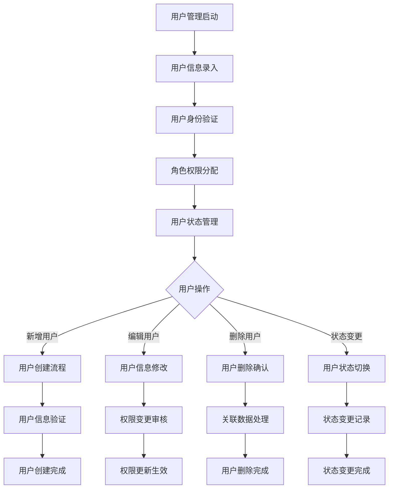
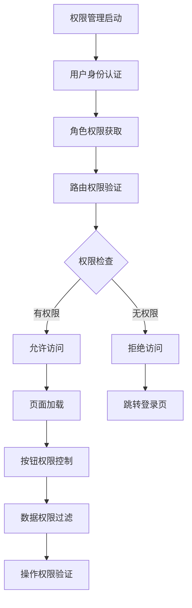
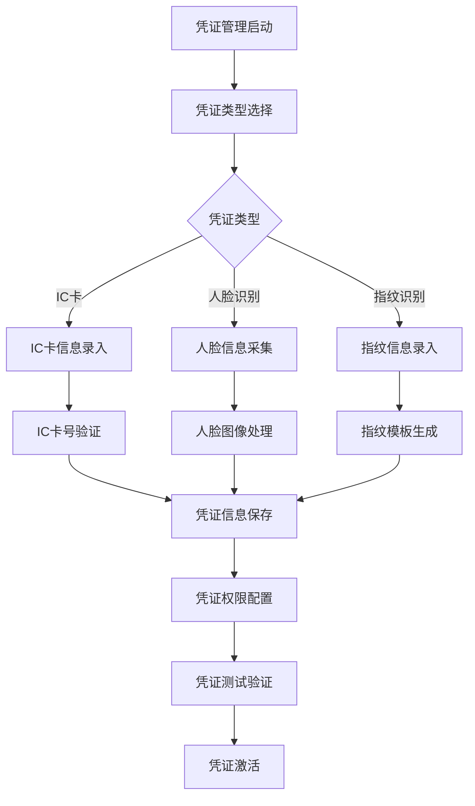
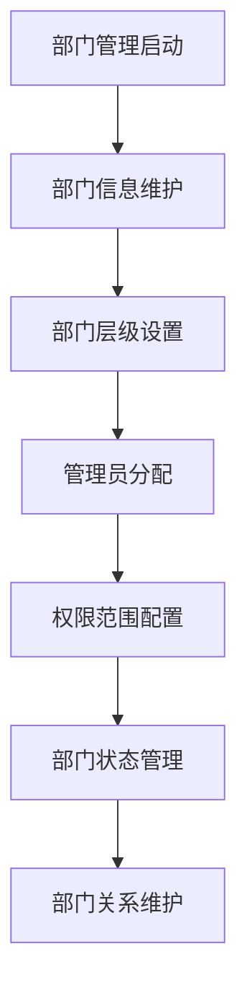

# 系统管理模块 - 深度业务分析报告

## 📋 系统概览

**模块路径**: 分布在多个模块中
**开发者**: 团队协作开发
**开发时间**: 2023年-2024年
**文件数量**: 100+个Vue文件
**复杂度**: ⭐⭐⭐⭐⭐ (极高复杂度)

### 系统定位
系统管理模块是医院教育管理系统的核心支撑服务，负责管理用户权限、系统配置、数据维护等全方位的系统管理业务，确保整个系统的稳定运行和安全管理。

---

## 🏗️ 系统架构

### 核心子模块

| 子模块 | 路径 | 文件数 | 主要功能 | 复杂度 |
|--------|------|--------|----------|--------|
| 用户管理 | userList/ | 15个 | 用户信息管理、状态控制 | ⭐⭐⭐⭐⭐ |
| 权限管理 | permission.js | 1个 | 路由权限、按钮权限控制 | ⭐⭐⭐⭐⭐ |
| 系统配置 | utils/config.js | 1个 | 系统参数配置、环境设置 | ⭐⭐⭐⭐ |
| 用户凭证管理 | simulationCenterS/userCredentialManagement/ | 8个 | IC卡管理、人脸识别 | ⭐⭐⭐⭐ |
| 部门管理 | furtherDepartmentManagement/ | 5个 | 部门信息、管理员配置 | ⭐⭐⭐ |
| 设备管理 | simulationCenterS/equipmentManagement/ | 20个 | 设备信息、维护记录 | ⭐⭐⭐⭐ |

### 技术架构特色
1. **细粒度权限控制**: 支持路由级、按钮级、数据级权限控制
2. **多租户架构**: 支持多机构、多部门的独立管理
3. **统一认证体系**: 集成多种认证方式和单点登录
4. **配置化管理**: 灵活的系统参数配置和动态调整

---

## 📊 业务流程分析

### 1. 用户管理模块 (userList)

#### 1.1 核心业务流程



#### 1.2 用户管理功能

| 功能模块 | 描述 | 技术实现 | 权限要求 |
|---------|------|----------|----------|
| 用户查询 | 用户信息查询、筛选 | 分页查询、条件筛选 | 管理员 |
| 用户新增 | 新增用户账号 | 表单验证、数据校验 | 超级管理员 |
| 用户编辑 | 修改用户信息 | 差异更新、权限验证 | 管理员 |
| 用户删除 | 删除用户账号 | 软删除、关联检查 | 超级管理员 |
| 状态管理 | 用户状态控制 | 状态机管理 | 管理员 |
| 批量操作 | 批量导入导出 | 文件处理、异步任务 | 管理员 |

#### 1.3 关键API接口

```javascript
// 用户管理核心API
queryUserList()                    // 查询用户列表
removeStudent()                    // 移除用户
changeStudentStatus()              // 变更用户状态
studentsImport()                   // 批量导入用户
studentAllDownload()               // 导出用户数据
studentModelDownload()             // 下载导入模板
```

### 2. 权限管理模块 (permission)

#### 2.1 业务流程



#### 2.2 权限控制体系

| 权限类型 | 控制范围 | 实现方式 | 验证时机 |
|---------|----------|----------|----------|
| 路由权限 | 页面访问控制 | 路由守卫 | 路由跳转前 |
| 按钮权限 | 操作按钮显示 | 指令控制 | 组件渲染时 |
| 数据权限 | 数据访问范围 | 接口过滤 | 数据请求时 |
| 功能权限 | 功能模块使用 | 角色配置 | 功能调用时 |

#### 2.3 关键API接口

```javascript
// 权限管理核心API
getRoleRoutingInfoP2()             // 获取用户菜单权限
getInfo()                          // 获取用户信息
logout()                           // 用户登出
queryDicts()                       // 获取字典数据
```

### 3. 用户凭证管理模块 (userCredentialManagement)

#### 3.1 业务流程



#### 3.2 凭证管理功能

| 凭证类型 | 管理内容 | 技术实现 | 安全等级 |
|---------|----------|----------|----------|
| IC卡凭证 | IC卡号、权限配置 | 卡号读取、权限映射 | 中等 |
| 人脸凭证 | 人脸图像、特征提取 | 人脸识别算法 | 高等 |
| 指纹凭证 | 指纹模板、匹配算法 | 指纹识别技术 | 高等 |
| 密码凭证 | 密码策略、加密存储 | 加密算法、策略控制 | 中等 |

#### 3.3 关键API接口

```javascript
// 用户凭证管理核心API
getList()                          // 获取凭证列表
addOrUpdate()                      // 新增或更新凭证
deleteTask()                       // 删除凭证
getICCardNo()                      // 获取IC卡号
getFacePicAttach()                 // 获取人脸图片
importModelData()                  // 导入凭证数据
```

### 4. 部门管理模块 (furtherDepartmentManagement)

#### 4.1 业务流程



#### 4.2 部门管理功能

| 管理功能 | 功能描述 | 实现方式 | 数据结构 |
|---------|----------|----------|----------|
| 部门创建 | 新建部门信息 | 树形结构管理 | 层级关系 |
| 部门编辑 | 修改部门信息 | 表单编辑 | 属性更新 |
| 管理员配置 | 部门管理员设置 | 用户关联 | 权限映射 |
| 权限配置 | 部门权限范围 | 权限矩阵 | 权限继承 |

---

## 👥 用户角色与权限

### 用户角色定义

| 角色 | 权限范围 | 主要操作 |
|------|----------|----------|
| **超级管理员** | 全局系统管理 | 用户管理、权限配置、系统设置 |
| **系统管理员** | 系统运维管理 | 用户维护、数据备份、监控管理 |
| **部门管理员** | 部门范围管理 | 部门用户管理、部门配置 |
| **普通用户** | 基础使用权限 | 个人信息维护、密码修改 |

### 权限控制矩阵

| 功能模块 | 超级管理员 | 系统管理员 | 部门管理员 | 普通用户 |
|---------|------------|------------|------------|----------|
| 用户管理 | ✅ | ✅ | ✅(部门内) | ❌ |
| 权限配置 | ✅ | ✅(部分) | ❌ | ❌ |
| 系统配置 | ✅ | ✅ | ❌ | ❌ |
| 部门管理 | ✅ | ✅ | ✅(本部门) | ❌ |
| 凭证管理 | ✅ | ✅ | ✅(部门内) | ✅(个人) |

---

## 🔧 技术实现分析

### 前端技术栈
- **Vue 2.6.14**: 主框架
- **Element UI**: UI组件库
- **Vuex**: 状态管理
- **Vue Router**: 路由管理

### 核心技术特点

#### 1. 权限控制系统
```javascript
// 路由权限守卫
router.beforeEach(async (to, from, next) => {
  NProgress.start()
  store.dispatch('btnPermissionsArr/setBtnPermissions', to.meta.elements)
  const newbusCode = to.meta.busCode ? to.meta.busCode : 'ALL'
  store.dispatch('user/setbusCode', newbusCode)
  
  // 权限验证逻辑
  const hasToken = getToken()
  if (hasToken) {
    if (to.path === '/login') {
      next({ path: '/' })
    } else {
      const hasRoles = store.getters.roles && store.getters.roles.length > 0
      if (hasRoles) {
        next()
      } else {
        try {
          const { roles } = await store.dispatch('user/getInfo')
          const accessRoutes = await store.dispatch('permission/generateRoutes', roles)
          router.addRoutes(accessRoutes)
          next({ ...to, replace: true })
        } catch (error) {
          await store.dispatch('user/resetToken')
          next(`/login?redirect=${to.path}`)
        }
      }
    }
  } else {
    if (whiteList.indexOf(to.path) !== -1) {
      next()
    } else {
      next(`/login?redirect=${to.path}`)
    }
  }
})
```

#### 2. 用户管理系统
```javascript
// 用户列表查询
queryUserList(params).then(res => {
  this.tableModel = res.data.records
  this.total = res.data.total
})

// 用户状态变更
changeStudentStatus(status, userIds).then(res => {
  if (res.code === 0) {
    this.$message.success('状态变更成功')
    this.loadDataList()
  }
})

// 批量用户导入
studentsImport(file, type).then(res => {
  if (res.code === 0) {
    this.$message.success('导入成功')
    this.loadDataList()
  }
})
```

#### 3. 凭证管理系统
```javascript
// IC卡信息获取
getICCardNo(params).then(res => {
  this.cardInfo = res.data
  this.validateCardInfo()
})

// 人脸图像处理
getFacePicAttach(params).then(res => {
  this.faceImage = res.data
  this.processFaceImage()
})

// 凭证信息保存
addOrUpdate(credentialData).then(res => {
  if (res.code === 0) {
    this.$message.success('凭证保存成功')
    this.refreshList()
  }
})
```

#### 4. 系统配置管理
```javascript
// 系统配置参数
const systemConfig = {
  Domain: 'https://roomkit-api.zego.im',
  SecretID: 1664094,
  SecretSign: 'b2d7c4d1d7fbdd7b160662ec8b22f56df2bb4511e36e2ee46905e6eb2e0a6e71',
  AppName: 'manjitech',
  User_ID: [20705440188]
}

// 动态配置加载
async getVueConfig() {
  try {
    const config = await this.loadSystemConfig()
    this.applyConfig(config)
  } catch (error) {
    console.error('配置加载失败:', error)
  }
}
```

---

## 📈 数据统计与分析

### 关键指标
1. **用户活跃度**: 用户登录频次、使用时长统计
2. **权限使用率**: 各权限模块的使用情况分析
3. **系统性能**: 系统响应时间、并发用户数
4. **安全指标**: 登录失败次数、异常操作记录

### 统计功能
1. **用户行为分析**: 用户操作行为统计分析
2. **系统监控**: 系统运行状态实时监控
3. **安全审计**: 安全事件记录和审计
4. **性能分析**: 系统性能指标分析

---

## 🎯 业务价值分析

### 核心价值
1. **安全保障**: 确保系统和数据的安全性
2. **权限控制**: 精细化的权限管理和控制
3. **运维支撑**: 完善的系统运维和管理功能
4. **用户体验**: 统一的用户管理和认证体验

### 解决的痛点
1. **权限混乱**: 统一的权限管理体系
2. **用户管理分散**: 集中的用户管理平台
3. **安全风险**: 多重安全防护机制
4. **运维困难**: 自动化运维管理工具

---

## 🔮 优化建议

### 技术优化
1. **微服务架构**: 系统管理服务化拆分
2. **容器化部署**: Docker容器化部署
3. **自动化运维**: DevOps自动化流程
4. **监控告警**: 完善的监控告警体系

### 业务优化
1. **自助服务**: 用户自助服务功能
2. **智能运维**: AI辅助运维管理
3. **多租户支持**: 完善的多租户架构
4. **国际化**: 多语言和国际化支持

这个系统管理模块展现了医院教育管理系统的基础支撑能力和管理水平！
