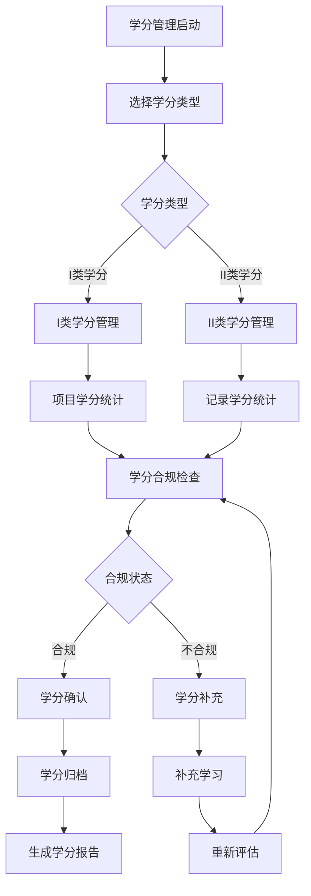
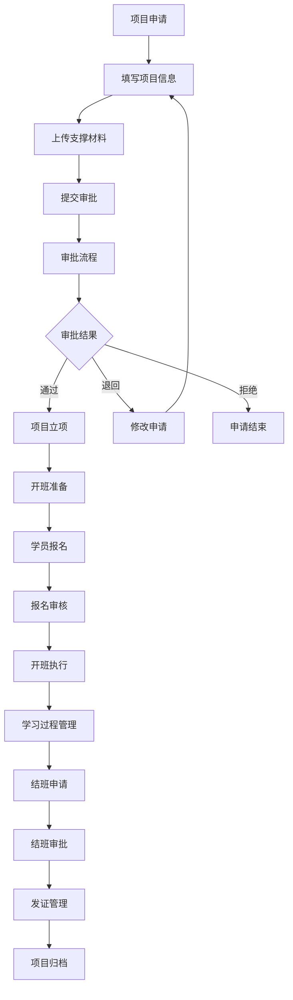
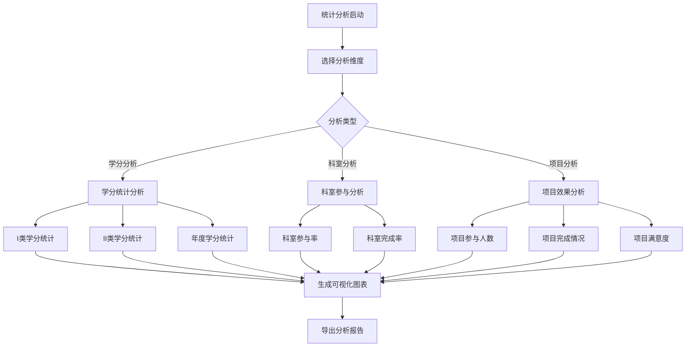

# 继续教育管理系统 - 深度业务分析报告

## 📋 系统概览

**模块路径**: `src/views/ContinuingEducation/`
**开发者**: 团队协作开发
**开发时间**: 2023年-2024年
**文件数量**: 30+个Vue文件
**复杂度**: ⭐⭐⭐⭐⭐ (极高复杂度)

### 系统定位
继续教育管理系统是医院教育管理的重要组成部分，负责管理医护人员的继续教育学分、教育项目发布、学习进度跟踪、统计分析等全生命周期业务，确保医护人员持续学习和专业发展。

---

## 🏗️ 系统架构

### 核心子模块

| 子模块 | 路径 | 文件数 | 主要功能 | 复杂度 |
|--------|------|--------|----------|--------|
| 学分管理 | creditManagement/ | 8个 | 学分统计、规则配置、合规检查 | ⭐⭐⭐⭐⭐ |
| 新教育项目 | newEducation/ | 12个 | 教育项目发布、管理、审批 | ⭐⭐⭐⭐⭐ |
| 统计分析 | AnalysisStatistical/ | 6个 | 参与率、完成率分析 | ⭐⭐⭐⭐ |
| 学习日历 | learnCalendar.vue | 1个 | 课程安排日历展示 | ⭐⭐⭐ |
| 档案分析 | Archiveanalysis.vue | 1个 | 档案数据分析 | ⭐⭐⭐ |
| 批量导入 | customizedBatchImport.vue | 1个 | 批量数据导入 | ⭐⭐⭐ |
| 统计分析 | statisticalanalysis.vue | 1个 | 综合统计分析 | ⭐⭐⭐⭐ |

### 技术架构特色
1. **学分体系管理**: 支持I类、II类学分的分类管理
2. **项目全生命周期**: 从申请、审批、开班到结班的完整流程
3. **数据可视化**: ECharts图表展示学分统计和趋势分析
4. **多级审批流程**: 完整的项目审批工作流

---

## 📊 业务流程分析

### 1. 学分管理模块 (creditManagement)

#### 1.1 核心业务流程



#### 1.2 学分类型管理

| 学分类型 | 描述 | 获取方式 | 年度要求 |
|---------|------|----------|----------|
| I类学分 | 国家级继续教育项目 | 参加国家级培训 | 25学分/年 |
| II类学分 | 省市级继续教育项目 | 参加省市级培训 | 不少于总学分50% |

#### 1.3 关键API接口

```javascript
// 学分管理核心API
statsProInfo()              // 项目信息统计
findUserCreditPage()        // 用户学分分页查询
statsOrgTwoCreditInfo()     // 科室II类学分统计
statsStandInfo()            // 学分标准信息统计
projectfindPage()           // 项目分页列表
statsPro()                  // I类项目汇总
importTwoRecordsCreditManage() // 导入II类学分记录
```

### 2. 新教育项目模块 (newEducation)

#### 2.1 业务流程



#### 2.2 项目类型管理

| 项目类型 | 级别 | 学分类型 | 审批流程 |
|---------|------|----------|----------|
| 国家级项目 | 国家级 | I类学分 | 三级审批 |
| 省级项目 | 省级 | I类学分 | 二级审批 |
| 市级项目 | 市级 | II类学分 | 一级审批 |
| 院内项目 | 院级 | II类学分 | 科室审批 |

#### 2.3 关键API接口

```javascript
// 新教育项目核心API
findPage()                  // 学习班项目列表
getProjectProgressList()    // 获取项目进度列表
selectProgressList()        // 查询学习班进度
applyStartClassUpdate()     // 一类开班修改
projectSubmit()             // 结班申请
assignApplyUser()           // 指派申请人
saveCertificateRecord()     // 保存发证记录
taskSendRemindQuery()       // 定时发送提醒查询
```

### 3. 统计分析模块 (AnalysisStatistical)

#### 3.1 业务流程



#### 3.2 统计维度

| 统计维度 | 指标类型 | 计算方式 | 展示形式 |
|---------|----------|----------|----------|
| 学分统计 | 获得学分、完成率 | 按人员、科室、时间统计 | 柱状图、饼图 |
| 参与统计 | 参与人数、参与率 | 按项目、科室统计 | 折线图、雷达图 |
| 效果统计 | 满意度、通过率 | 问卷调查、考试成绩 | 仪表盘、热力图 |

---

## 👥 用户角色与权限

### 用户角色定义

| 角色 | 权限范围 | 主要操作 |
|------|----------|----------|
| **教育管理员** | 全局教育管理 | 项目审批、学分管理、统计分析 |
| **科室教育秘书** | 科室教育管理 | 科室项目申请、学员管理 |
| **项目负责人** | 项目管理权限 | 项目执行、学员管理、材料上传 |
| **学员** | 学习参与权限 | 项目报名、学习记录、学分查询 |
| **系统管理员** | 系统配置权限 | 用户管理、系统配置 |

### 权限控制矩阵

| 功能模块 | 教育管理员 | 科室秘书 | 项目负责人 | 学员 | 系统管理员 |
|---------|------------|----------|------------|------|------------|
| 项目申请 | ✅ | ✅ | ✅ | ❌ | ✅ |
| 项目审批 | ✅ | ✅(科室内) | ❌ | ❌ | ✅ |
| 学员管理 | ✅ | ✅(科室内) | ✅(项目内) | ❌ | ✅ |
| 学分管理 | ✅ | ✅(科室内) | ❌ | ✅(个人) | ✅ |
| 统计分析 | ✅ | ✅(科室内) | ✅(项目内) | ✅(个人) | ✅ |
| 系统配置 | ❌ | ❌ | ❌ | ❌ | ✅ |

---

## 🔧 技术实现分析

### 前端技术栈
- **Vue 2.6.14**: 主框架
- **Element UI**: UI组件库
- **ECharts**: 数据可视化
- **Vuex**: 状态管理
- **Vue Router**: 路由管理

### 核心技术特点

#### 1. 学分计算引擎
```javascript
// 学分统计计算
statsProInfo(data).then(res => {
  if (res.data) {
    this.sumTotal = res.data.reduce((total, item) => {
      return total + (item.newNum || 0) + (item.recordNum || 0)
    }, 0)
  }
})
```

#### 2. 项目进度管理
```javascript
// 项目进度跟踪
getProjectProgressList().then(res => {
  this.projectProgress = res.data.map(item => ({
    label: item.progressName,
    value: item.progressCode
  }))
})
```

#### 3. 数据可视化集成
```javascript
// ECharts图表配置
import echarts from '@/views/ContinuingEducation/myChart'
components: {
  echarts
}
```

#### 4. 文件上传下载
```javascript
// 批量导入功能
importTwoRecordsCreditManage(formData).then(res => {
  if (res.code === 0) {
    this.$message.success('导入成功')
    this.refreshList()
  }
})
```

---

## 📈 数据统计与分析

### 关键指标
1. **学分完成率**: 按人员、科室、专业统计年度学分完成情况
2. **项目参与率**: 统计各类教育项目的参与人数和参与率
3. **培训效果**: 通过考试成绩、满意度调查评估培训效果
4. **合规性分析**: 检查学分获取是否符合继续教育要求

### 可视化功能
1. **柱状图**: 学分获得情况对比
2. **饼图**: 学分类型分布
3. **折线图**: 学分获得趋势
4. **雷达图**: 多维度能力评估

---

## 🎯 业务价值分析

### 核心价值
1. **学分规范化**: 统一学分管理标准和流程
2. **项目系统化**: 完整的教育项目管理体系
3. **数据可视化**: 直观展示教育培训效果
4. **合规自动化**: 自动检查学分合规性

### 解决的痛点
1. **学分管理混乱**: 统一学分记录和管理
2. **项目流程不规范**: 标准化项目申请和审批流程
3. **数据统计困难**: 自动化数据统计和分析
4. **合规检查繁琐**: 自动化合规性检查

---

## 🔮 优化建议

### 技术优化
1. **性能优化**: 大数据量统计的分页和缓存优化
2. **移动端适配**: 支持移动端学习和管理
3. **实时通知**: WebSocket实时推送学习提醒
4. **智能推荐**: 基于用户画像的课程推荐

### 业务优化
1. **学习路径规划**: 个性化学习路径推荐
2. **质量评估**: 多维度培训质量评估体系
3. **激励机制**: 学分积分兑换激励体系
4. **跨平台整合**: 与外部教育平台数据整合

这个继续教育管理系统展现了医院教育管理中学分管理和项目管理的完整性和专业性！
