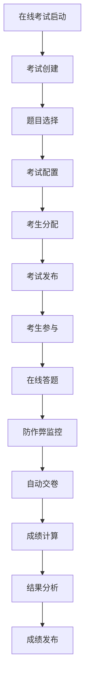
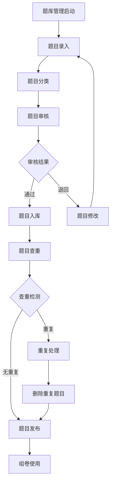
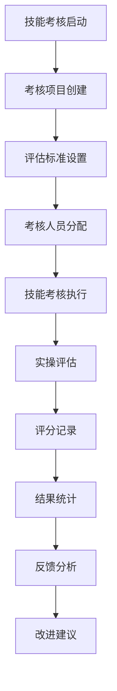
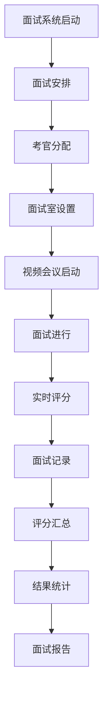
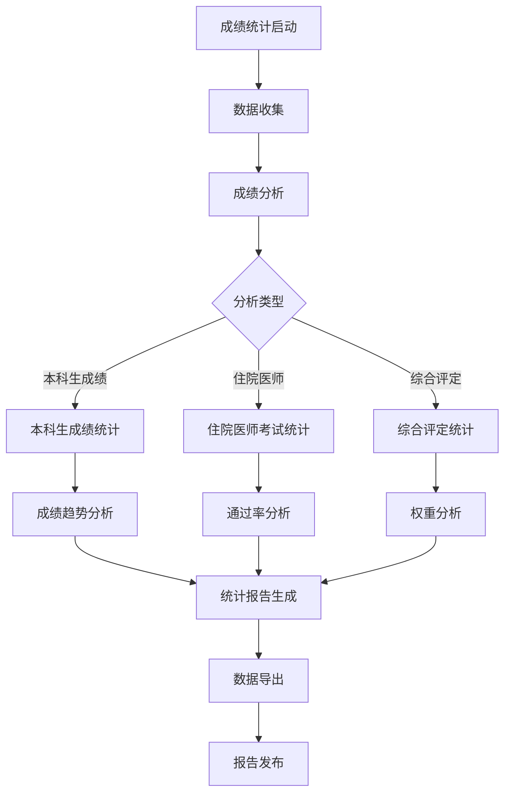

# 考试系统 - 深度业务分析报告

## 📋 系统概览

**模块路径**: 分布在多个模块中
**开发者**: 团队协作开发
**开发时间**: 2023年-2024年
**文件数量**: 50+个Vue文件
**复杂度**: ⭐⭐⭐⭐⭐ (极高复杂度)

### 系统定位
考试系统是医院教育管理的重要评估工具，负责管理在线考试、题库管理、成绩统计、技能考核等全方位的考试评估业务，确保医护人员的专业能力评估和持续改进。

---

## 🏗️ 系统架构

### 核心子模块

| 子模块 | 路径 | 文件数 | 主要功能 | 复杂度 |
|--------|------|--------|----------|--------|
| 在线考试 | exam/ | 15个 | 答案分析、成绩分析、结果查询 | ⭐⭐⭐⭐⭐ |
| 题库管理 | questionManagement/ | 12个 | 题目查重、上传记录、题型管理 | ⭐⭐⭐⭐⭐ |
| 技能考核 | skillExam/ | 10个 | 技能考核项目、评估管理 | ⭐⭐⭐⭐ |
| 面试系统 | interview/ | 20个 | 在线面试、评分管理、视频会议 | ⭐⭐⭐⭐⭐ |
| 成绩统计 | statisticalAnalysis/results/ | 8个 | 成绩统计分析、数据导入导出 | ⭐⭐⭐⭐ |

### 技术架构特色
1. **多类型考试支持**: 在线考试、技能考核、面试评估
2. **智能题库管理**: 题目查重、分类管理、智能组卷
3. **实时评分系统**: 在线评分、实时统计、结果分析
4. **防作弊机制**: 多重防作弊技术保障考试公平

---

## 📊 业务流程分析

### 1. 在线考试模块 (exam)

#### 1.1 核心业务流程



#### 1.2 考试管理功能

| 功能模块 | 组件文件 | 主要功能 | 技术实现 |
|---------|----------|----------|----------|
| 答案分析 | answerAnalysis/ | 考试答案统计分析 | 数据可视化 |
| 成绩分析 | gradeAnalysis/ | 成绩分布、趋势分析 | 统计算法 |
| 结果查询 | resultsQuery/ | 考试结果查询管理 | 多条件查询 |
| 工作量分析 | workloadAnalysis/ | 考试工作量统计 | 工作量计算 |

#### 1.3 关键API接口

```javascript
// 在线考试核心API
queryOnlineExamStudents()       // 成绩查询列表
studentAchievementDropDown()    // 下拉数据集合
submitUserExamPaper()           // 交卷
startExam()                     // 开始考试
```

### 2. 题库管理模块 (questionManagement)

#### 2.1 业务流程



#### 2.2 题库管理功能

| 功能模块 | 描述 | 技术实现 | 数据管理 |
|---------|------|----------|----------|
| 题目查重 | 检测重复题目 | 文本相似度算法 | 查重记录 |
| 上传记录 | 题目上传历史 | 文件上传管理 | 上传日志 |
| 题型管理 | 题目类型分类 | 分类树结构 | 题型配置 |
| 适用类型 | 题目适用范围 | 标签管理 | 适用配置 |

#### 2.3 关键API接口

```javascript
// 题库管理核心API
onlineExam_test_question_exerciseCheck()        // 一级目录查重
onlineExam_test_question_getRepeatQuestDetails() // 重复题目展开
onlineExam_test_question_deleteTestQuestion()   // 删除重复题目
onlineExam_testQuestion_library_queryUploadRecords() // 查询上传记录
onlineExam_question_type_queryQuestionTypeList() // 查看题型
```

### 3. 技能考核模块 (skillExam)

#### 3.1 业务流程



#### 3.2 技能考核功能

| 考核类型 | 评估内容 | 评分标准 | 数据记录 |
|---------|----------|----------|----------|
| 临床技能 | 临床操作技能 | 操作规范、熟练度 | 操作记录 |
| 专业知识 | 专业理论知识 | 知识掌握程度 | 答题记录 |
| 沟通技能 | 医患沟通能力 | 沟通效果评价 | 沟通评估 |
| 团队协作 | 团队合作能力 | 协作效果评价 | 协作记录 |

#### 3.3 关键API接口

```javascript
// 技能考核核心API
queryAssessPagelist()                           // 考核信息分页查询
searchObtainAssessmentParameters()              // 考核小项
searchWithSkillDaily()                          // 技能考核项目分页列表
findAllOrgs()                                   // 获取科室列表
```

### 4. 面试系统模块 (interview)

#### 4.1 业务流程



#### 4.2 面试系统功能

| 功能模块 | 技术实现 | 主要特性 | 数据管理 |
|---------|----------|----------|----------|
| 视频会议 | TRTC SDK | 实时音视频通信 | 会议记录 |
| 在线评分 | 实时评分组件 | 多维度评分 | 评分数据 |
| 聊天功能 | WebSocket | 实时消息通信 | 聊天记录 |
| 设备检测 | WebRTC | 音视频设备检测 | 设备状态 |

#### 4.3 关键API接口

```javascript
// 面试系统核心API
getTrtcUserSig()                    // 获取TRTC用户签名
querySessionDetail()                // 查询会话详情
getQuestionData()                   // 获取题目数据
getScoreData()                      // 获取评分数据
submitStudentResult()               // 提交学生结果
queryScoreResultForAllStu()         // 查询所有学生评分结果
```

### 5. 成绩统计模块 (statisticalAnalysis/results)

#### 5.1 业务流程



#### 5.2 统计分析功能

| 统计类型 | 分析内容 | 统计指标 | 展示方式 |
|---------|----------|----------|----------|
| 成绩分布 | 成绩区间分布 | 平均分、及格率 | 柱状图、饼图 |
| 趋势分析 | 成绩变化趋势 | 增长率、波动率 | 折线图 |
| 对比分析 | 不同群体对比 | 差异分析 | 对比图表 |
| 权重分析 | 评定权重影响 | 权重贡献度 | 权重图 |

---

## 👥 用户角色与权限

### 用户角色定义

| 角色 | 权限范围 | 主要操作 |
|------|----------|----------|
| **考试管理员** | 全局考试管理 | 考试创建、题库管理、成绩统计 |
| **教师/考官** | 考试执行权限 | 出题、监考、评分、面试 |
| **学员/考生** | 考试参与权限 | 参加考试、查看成绩 |
| **系统管理员** | 系统配置权限 | 用户管理、系统配置 |

### 权限控制矩阵

| 功能模块 | 考试管理员 | 教师/考官 | 学员/考生 | 系统管理员 |
|---------|------------|-----------|----------|------------|
| 考试创建 | ✅ | ✅(授权) | ❌ | ✅ |
| 题库管理 | ✅ | ✅(授权) | ❌ | ✅ |
| 参加考试 | ✅ | ✅ | ✅ | ✅ |
| 成绩查看 | ✅ | ✅(相关) | ✅(个人) | ✅ |
| 统计分析 | ✅ | ✅(相关) | ❌ | ✅ |
| 系统配置 | ❌ | ❌ | ❌ | ✅ |

---

## 🔧 技术实现分析

### 前端技术栈
- **Vue 2.6.14**: 主框架
- **Element UI**: UI组件库
- **TRTC SDK**: 实时音视频通信
- **WebSocket**: 实时消息通信
- **ECharts**: 数据可视化

### 核心技术特点

#### 1. 防作弊技术
```javascript
// 防作弊监控
const antiCheatMonitor = {
  screenCapture: false,      // 禁止截屏
  tabSwitch: 0,             // 切换标签页次数
  fullScreen: true,         // 强制全屏
  timeLimit: true,          // 时间限制
  randomQuestions: true     // 随机题目
}
```

#### 2. 实时评分系统
```javascript
// 实时评分
submitStudentResult(scoreData).then(res => {
  if (res.code === 0) {
    this.updateScoreDisplay()
    this.broadcastScore()
  }
})

// 评分统计
queryScoreResultForAllStu().then(res => {
  this.scoreStatistics = res.data
  this.generateScoreReport()
})
```

#### 3. 智能组卷算法
```javascript
// 智能组卷
const paperGenerationAlgorithm = {
  difficultyDistribution: [0.3, 0.5, 0.2], // 难度分布
  knowledgePointCoverage: 0.8,              // 知识点覆盖率
  questionTypeBalance: true,                // 题型平衡
  timeEstimation: true                      // 时间估算
}
```

#### 4. 视频面试技术
```javascript
// TRTC视频面试
import TRTC from 'trtc-js-sdk'

// 初始化TRTC
const trtc = TRTC.createClient({
  mode: 'rtc',
  sdkAppId: this.sdkAppId
})

// 加入房间
trtc.join({
  roomId: this.roomId,
  userSig: this.userSig
})
```

---

## 📈 数据统计与分析

### 关键指标
1. **考试通过率**: 按专业、科室、时间统计通过情况
2. **题目质量**: 题目难度、区分度、信度分析
3. **考试效果**: 考试效果评估和改进建议
4. **作弊检测**: 作弊行为检测和处理统计

### 统计功能
1. **实时监控**: 考试过程实时监控
2. **成绩分析**: 多维度成绩分析
3. **质量评估**: 考试质量评估分析
4. **趋势预测**: 基于历史数据的趋势预测

---

## 🎯 业务价值分析

### 核心价值
1. **能力评估**: 全面评估医护人员专业能力
2. **质量保证**: 确保医疗服务质量标准
3. **持续改进**: 基于数据的持续改进机制
4. **公平公正**: 标准化、客观化的评估体系

### 解决的痛点
1. **评估不统一**: 标准化评估体系
2. **作弊难防**: 多重防作弊技术
3. **统计困难**: 自动化成绩统计分析
4. **效率低下**: 在线化考试提升效率

---

## 🔮 优化建议

### 技术优化
1. **AI监考**: AI辅助监考和作弊检测
2. **自适应考试**: 基于能力的自适应考试
3. **移动考试**: 完善的移动端考试体验
4. **区块链**: 区块链技术保证成绩真实性

### 业务优化
1. **个性化评估**: 个性化能力评估方案
2. **多元化考试**: 多种考试形式结合
3. **国际标准**: 对接国际医学考试标准
4. **持续评估**: 持续性能力评估体系

这个考试系统展现了医院教育评估的全面性和专业性！
