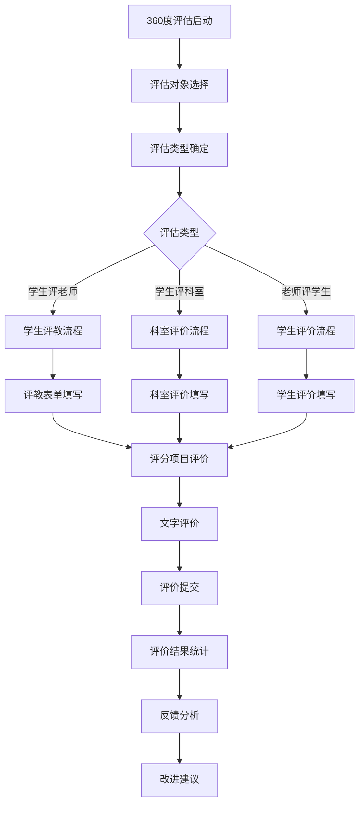
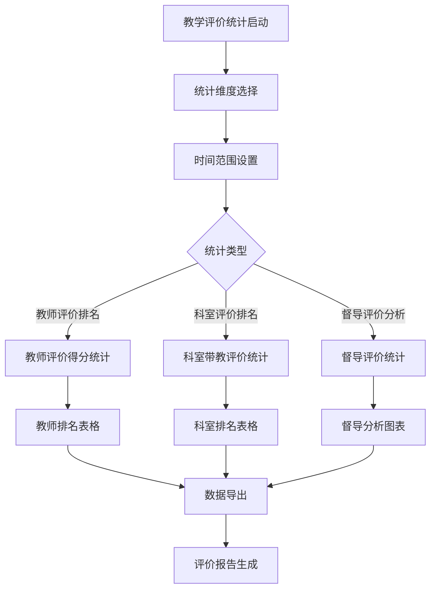
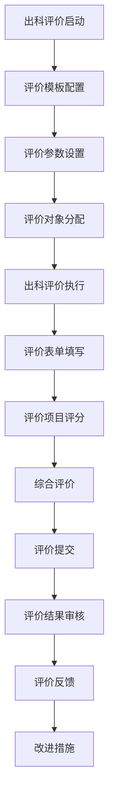
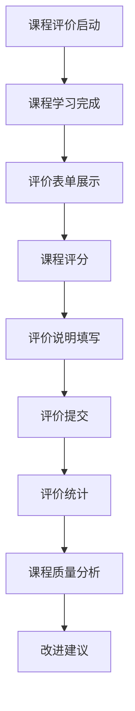

# 评教系统 - 深度业务分析报告

## 📋 系统概览

**模块路径**: 分布在多个模块中
**开发者**: 团队协作开发
**开发时间**: 2023年-2024年
**文件数量**: 40+个Vue文件
**复杂度**: ⭐⭐⭐⭐⭐ (极高复杂度)

### 系统定位
评教系统是医院教育管理的重要评价工具，负责管理教学评价、满意度调查、反馈分析等全方位的教学质量评估业务，确保医护人员的教学质量持续改进和标准化管理。

---

## 🏗️ 系统架构

### 核心子模块

| 子模块 | 路径 | 文件数 | 主要功能 | 复杂度 |
|--------|------|--------|----------|--------|
| 360度评估 | 360/phase/teachingEvaluation/ | 15个 | 360度教学评估、多维度评价 | ⭐⭐⭐⭐⭐ |
| 教学评价统计 | statisticalAnalysis/teaching/ | 8个 | 教学评价统计、排名分析 | ⭐⭐⭐⭐ |
| 出科评价 | departureEvaluation/ | 10个 | 出科评价模板、参数设置 | ⭐⭐⭐⭐ |
| 课程评价 | courseCenter/courseStudy/ | 3个 | 课程学习评价、满意度调查 | ⭐⭐⭐ |
| 技能评估 | appraisalManagement/ | 5个 | 技能评估、项目管理 | ⭐⭐⭐⭐ |

### 技术架构特色
1. **多维度评价体系**: 支持360度、出科、课程等多种评价类型
2. **智能统计分析**: 评价数据的多维度统计和趋势分析
3. **灵活模板配置**: 可配置的评价模板和参数设置
4. **实时反馈机制**: 评价结果的实时反馈和改进建议

---

## 📊 业务流程分析

### 1. 360度评估模块 (360/phase/teachingEvaluation)

#### 1.1 核心业务流程



#### 1.2 评估类型管理

| 评估类型 | 评估对象 | 评估内容 | 评分标准 |
|---------|----------|----------|----------|
| 学生评老师(A) | 带教老师 | 教学能力、专业水平、指导效果 | 5分制 |
| 学生评科室(B) | 轮转科室 | 科室环境、管理水平、学习氛围 | 5分制 |
| 老师评学生(D) | 实习学生 | 学习态度、专业能力、工作表现 | 5分制 |

#### 1.3 关键API接口

```javascript
// 360度评估核心API
getTeaEvaByStuList()            // 查询评老师列表
getOrgEvaReportList()           // 查询评科室列表
getStuEvaReportList()           // 查询对学员的评教列表
getStuEvaDetail()               // 查询评学员评价头部详情
getStuEvaItemResult()           // 查询评学员评价评分详情
studentSupervise()              // 一键督办
```

### 2. 教学评价统计模块 (statisticalAnalysis/teaching)

#### 2.1 业务流程



#### 2.2 统计分析功能

| 统计类型 | 统计内容 | 计算方式 | 展示方式 |
|---------|----------|----------|----------|
| 教师评价排名 | 教师评价得分排名 | 平均分排序 | 排名表格 |
| 科室评价排名 | 科室带教评价排名 | 综合评分排序 | 排名表格 |
| 督导评价分析 | 督导评价统计分析 | 多维度分析 | 图表展示 |
| 趋势分析 | 评价趋势变化 | 时间序列分析 | 趋势图 |

#### 2.3 关键API接口

```javascript
// 教学评价统计核心API
findBleandTeaEavRanStsList()    // 老师评价得分排名
findBleandOrgEavlRanStsList()   // 科室日常带教评价得分排名
exportTeaEvalRankSts()          // 导出老师评分排名统计
findBleandTeaEavRanStsDDList()  // 督导评价老师排名
exportTeaEvalRankDDSts()        // 导出督导评价统计
```

### 3. 出科评价模块 (departureEvaluation)

#### 3.1 业务流程



#### 3.2 评价模板管理

| 模板类型 | 适用对象 | 评价维度 | 配置参数 |
|---------|----------|----------|----------|
| 学生评老师模板 | 实习学生 | 教学能力、指导水平 | 权重、题目 |
| 学生评科室模板 | 实习学生 | 科室管理、学习环境 | 权重、题目 |
| 老师评学生模板 | 带教老师 | 学习态度、专业能力 | 权重、题目 |

#### 3.3 关键API接口

```javascript
// 出科评价核心API
searchDepartureEvaluationOptimizationTemplateSettingPage()  // 查询评价模板设置
updateDepartureEvaluationOptimizationTemplateSetting()      // 更新评价模板设置
queryEvaluationTemplate()                                   // 查询评价模板
searchRoleByIdentityCode()                                  // 根据身份码搜索角色
```

### 4. 课程评价模块 (courseCenter/courseStudy)

#### 4.1 业务流程



#### 4.2 课程评价功能

| 评价维度 | 评价内容 | 评分方式 | 权重设置 |
|---------|----------|----------|----------|
| 课程内容 | 内容质量、实用性 | 星级评分 | 40% |
| 教学方式 | 教学方法、互动性 | 星级评分 | 30% |
| 学习效果 | 知识掌握、技能提升 | 星级评分 | 30% |

#### 4.3 关键API接口

```javascript
// 课程评价核心API
saveEval()                      // 保存课程评价分数
getCourseEvaluation()           // 获取课程评价
updateCourseEvaluation()        // 更新课程评价
```

---

## 👥 用户角色与权限

### 用户角色定义

| 角色 | 权限范围 | 主要操作 |
|------|----------|----------|
| **评教管理员** | 全局评教管理 | 模板配置、统计分析、结果审核 |
| **科室教学秘书** | 科室评教管理 | 科室评教管理、数据查看 |
| **带教老师** | 评价权限 | 学生评价、反馈查看 |
| **学员/学生** | 评教权限 | 老师评价、科室评价、课程评价 |
| **督导专家** | 督导评价权限 | 督导评价、质量监控 |

### 权限控制矩阵

| 功能模块 | 评教管理员 | 科室秘书 | 带教老师 | 学员/学生 | 督导专家 |
|---------|------------|----------|----------|----------|----------|
| 模板配置 | ✅ | ❌ | ❌ | ❌ | ✅ |
| 评价执行 | ✅ | ✅ | ✅ | ✅ | ✅ |
| 结果查看 | ✅ | ✅(科室内) | ✅(相关) | ✅(个人) | ✅ |
| 统计分析 | ✅ | ✅(科室内) | ✅(相关) | ❌ | ✅ |
| 督导评价 | ✅ | ❌ | ❌ | ❌ | ✅ |

---

## 🔧 技术实现分析

### 前端技术栈
- **Vue 2.6.14**: 主框架
- **Element UI**: UI组件库
- **ECharts**: 数据可视化
- **Moment.js**: 时间处理

### 核心技术特点

#### 1. 多维度评价算法
```javascript
// 360度评价算法
const evaluationAlgorithm = {
  teachingAbility: 0.4,      // 教学能力权重
  professionalLevel: 0.3,    // 专业水平权重
  guidanceEffect: 0.2,       // 指导效果权重
  personalQuality: 0.1       // 个人素质权重
}

// 综合评分计算
const calculateTotalScore = (scores) => {
  return Object.keys(evaluationAlgorithm).reduce((total, key) => {
    return total + scores[key] * evaluationAlgorithm[key]
  }, 0)
}
```

#### 2. 评价数据统计
```javascript
// 评价统计分析
findBleandTeaEavRanStsList(params).then(res => {
  this.teacherRankingData = res.data.map(item => ({
    teacherName: item.teacherName,
    avgScore: item.avgScore,
    evaluationCount: item.evaluationCount,
    ranking: item.ranking
  }))
})
```

#### 3. 动态评价表单
```javascript
// 动态生成评价表单
const generateEvaluationForm = (template) => {
  return template.evaluationItems.map(item => ({
    itemId: item.id,
    itemName: item.name,
    itemType: item.type,
    score: 0,
    comment: ''
  }))
}
```

#### 4. 实时反馈系统
```javascript
// 评价反馈处理
const processFeedback = (evaluationData) => {
  const feedback = {
    strengths: [],
    improvements: [],
    suggestions: []
  }
  
  // 分析评价数据生成反馈
  evaluationData.forEach(item => {
    if (item.score >= 4) {
      feedback.strengths.push(item.itemName)
    } else if (item.score <= 2) {
      feedback.improvements.push(item.itemName)
    }
  })
  
  return feedback
}
```

---

## 📈 数据统计与分析

### 关键指标
1. **评价完成率**: 按评价类型、科室、时间统计完成情况
2. **评价满意度**: 评价结果的满意度分析
3. **教学质量**: 基于评价的教学质量趋势分析
4. **改进效果**: 评价反馈的改进效果跟踪

### 统计功能
1. **实时监控**: 评价进度实时监控
2. **排名分析**: 多维度排名分析
3. **趋势预测**: 基于历史数据的趋势预测
4. **质量报告**: 教学质量评估报告

---

## 🎯 业务价值分析

### 核心价值
1. **质量保证**: 确保教学质量的持续改进
2. **标准化评价**: 统一的评价标准和流程
3. **数据驱动**: 基于数据的教学质量决策
4. **持续改进**: 评价反馈的持续改进机制

### 解决的痛点
1. **评价不规范**: 标准化评价体系和流程
2. **反馈不及时**: 实时评价反馈机制
3. **数据分散**: 统一的评价数据管理
4. **改进困难**: 基于数据的改进建议

---

## 🔮 优化建议

### 技术优化
1. **AI分析**: AI辅助评价数据分析
2. **移动评价**: 移动端评价功能
3. **智能推荐**: 智能改进建议推荐
4. **实时预警**: 评价异常实时预警

### 业务优化
1. **个性化评价**: 个性化评价模板
2. **跨院对比**: 跨医院评价对比分析
3. **国际标准**: 对接国际教学评价标准
4. **持续跟踪**: 评价改进效果持续跟踪

这个评教系统展现了医院教学质量评价的完整性和专业性！
