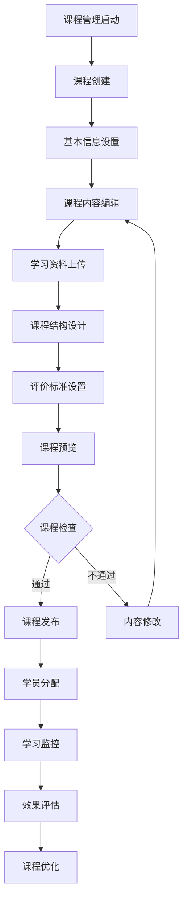
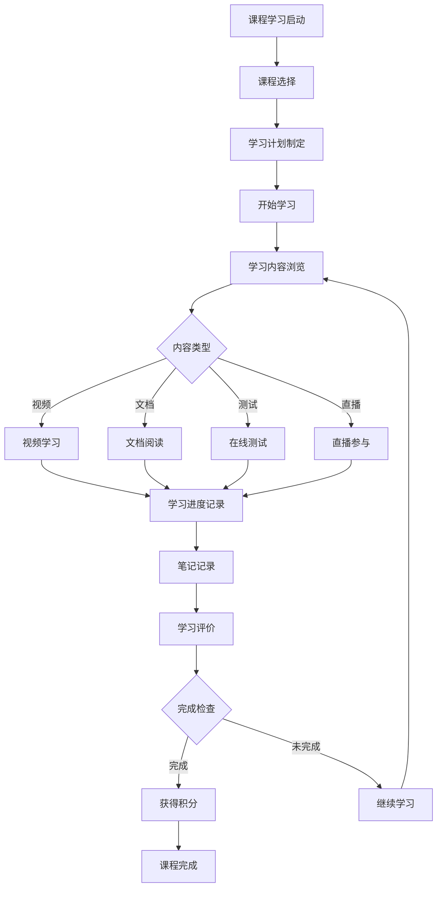
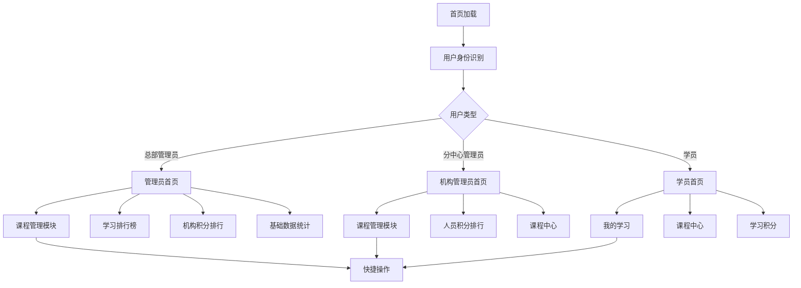
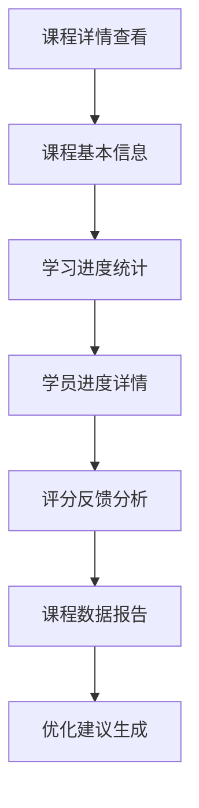

# 课程中心管理系统 - 深度业务分析报告

## 📋 系统概览

**模块路径**: `src/views/courseCenter/`
**开发者**: 许辉等团队开发
**开发时间**: 2023年-2024年
**文件数量**: 60+个Vue文件
**复杂度**: ⭐⭐⭐⭐⭐ (极高复杂度)

### 系统定位
课程中心管理系统是医院教育管理的核心学习平台，负责管理在线课程的创建、发布、学习、评价等全生命周期，提供完整的数字化学习解决方案，确保医护人员的持续教育和专业发展。

---

## 🏗️ 系统架构

### 核心子模块

| 子模块 | 路径 | 文件数 | 主要功能 | 复杂度 |
|--------|------|--------|----------|--------|
| 医院首页 | hospitalHome/ | 8个 | 首页展示、快捷操作、数据统计 | ⭐⭐⭐⭐ |
| 课程管理 | courseManagement/ | 25个 | 课程创建、编辑、发布、分类管理 | ⭐⭐⭐⭐⭐ |
| 课程学习 | courseStudy/ | 12个 | 在线学习、进度跟踪、笔记管理 | ⭐⭐⭐⭐⭐ |
| 课程详情 | viewDetailsPage/ | 8个 | 课程详情、学习进度、评分反馈 | ⭐⭐⭐⭐ |
| 学习统计 | statistics/ | 7个 | 学习数据统计、排行榜、积分管理 | ⭐⭐⭐⭐ |

### 技术架构特色
1. **多角色学习体系**: 支持管理员、教师、学员等多角色
2. **智能学习推荐**: 基于学习行为的个性化推荐
3. **完整评价体系**: 多维度课程和学习效果评价
4. **积分激励机制**: 完善的学习积分和排行榜系统

---

## 📊 业务流程分析

### 1. 课程管理模块 (courseManagement)

#### 1.1 核心业务流程



#### 1.2 课程创建流程

| 创建步骤 | 组件文件 | 主要内容 | 必填要求 |
|---------|----------|----------|----------|
| 步骤一 | saveStep1 | 基本信息、课程分类、学习目标 | 必填 |
| 步骤二 | saveStep2 | 课程内容、学习资料、章节结构 | 必填 |
| 步骤三 | saveStep3 | 评价设置、完成条件、发布设置 | 必填 |

#### 1.3 关键API接口

```javascript
// 课程管理核心API
getPagePlanList()               // 查询课程列表
saveStep1()                     // 建设课程步骤一，保存基本信息
saveStep2()                     // 建设课程步骤二，保存内容信息
saveStep3()                     // 建设课程步骤三，保存完成信息
saveColumn()                    // 建设课程内容，保存模块
publishPlan()                   // 发布课程
deletePlan()                    // 删除课程
copyPlan()                      // 复制课程
movePlan()                      // 移动课程
```

### 2. 课程学习模块 (courseStudy)

#### 2.1 业务流程



#### 2.2 学习功能模块

| 功能模块 | 描述 | 技术实现 | 数据跟踪 |
|---------|------|----------|----------|
| 视频学习 | 在线视频播放和进度跟踪 | Video.js | 播放时长、完成度 |
| 文档学习 | 文档在线阅读和标注 | PDF.js | 阅读时长、页数 |
| 在线测试 | 章节测试和考核 | 自定义组件 | 答题记录、成绩 |
| 笔记管理 | 学习笔记记录和管理 | 富文本编辑器 | 笔记内容、时间 |

#### 2.3 关键API接口

```javascript
// 课程学习核心API
findMyPage()                    // 分页查询我的课程学习列表
getDetail()                     // 获取课程学习明细信息
getPlanColumnCata()             // 获取课程学习章节目录
findUserMaterialByColumn()      // 查询模块下用户分类学习资料列表
reportLearning()                // 用户学习资料进度上报
saveEval()                      // 保存课程评价分数
submitUserExamPaper()           // 交卷
```

### 3. 医院首页模块 (hospitalHome)

#### 3.1 业务流程



#### 3.2 首页组件功能

| 组件名称 | 功能描述 | 适用角色 | 数据来源 |
|---------|----------|----------|----------|
| ScheduleTodo | 日程待办事项 | 管理员 | 待办接口 |
| CourseManagement | 课程管理概览 | 管理员 | 课程统计 |
| CourseStudy | 课程学习排行 | 总部管理员 | 学习统计 |
| ScoreTopTen | 积分排行榜 | 管理员 | 积分统计 |
| CourseCenter | 课程中心展示 | 机构管理员 | 课程列表 |
| MyStudy | 我的学习 | 学员 | 个人学习 |

### 4. 课程详情模块 (viewDetailsPage)

#### 4.1 业务流程



---

## 👥 用户角色与权限

### 用户角色定义

| 角色 | 权限范围 | 主要操作 |
|------|----------|----------|
| **总部管理员** | 全局课程管理 | 课程创建、发布、统计分析、用户管理 |
| **分中心管理员** | 机构课程管理 | 机构内课程管理、学员管理、统计查看 |
| **教师/讲师** | 课程内容管理 | 课程内容编辑、学员指导、评价管理 |
| **学员** | 学习权限 | 课程学习、笔记记录、评价反馈 |
| **系统管理员** | 系统配置权限 | 系统配置、权限管理、数据维护 |

### 权限控制矩阵

| 功能模块 | 总部管理员 | 分中心管理员 | 教师/讲师 | 学员 | 系统管理员 |
|---------|------------|--------------|-----------|------|------------|
| 课程创建 | ✅ | ✅(机构内) | ✅(授权) | ❌ | ✅ |
| 课程发布 | ✅ | ✅(机构内) | ✅(授权) | ❌ | ✅ |
| 课程学习 | ✅ | ✅ | ✅ | ✅ | ✅ |
| 学习统计 | ✅ | ✅(机构内) | ✅(授课) | ✅(个人) | ✅ |
| 用户管理 | ✅ | ✅(机构内) | ❌ | ❌ | ✅ |
| 系统配置 | ❌ | ❌ | ❌ | ❌ | ✅ |

---

## 🔧 技术实现分析

### 前端技术栈
- **Vue 2.6.14**: 主框架
- **Element UI**: UI组件库
- **Video.js**: 视频播放
- **PDF.js**: 文档阅读
- **ECharts**: 数据可视化

### 核心技术特点

#### 1. 多媒体学习支持
```javascript
// 视频学习组件
import Video from './video.vue'

// 文档学习组件
import FileInfo from './fileInfo.vue'

// 学习进度跟踪
reportLearning(progressData).then(res => {
  if (res.code === 0) {
    this.updateProgress()
  }
})
```

#### 2. 智能学习推荐
```javascript
// 基于学习行为的推荐
const recommendAlgorithm = {
  learningHistory: 0.4,    // 学习历史权重
  courseCategory: 0.3,     // 课程分类权重
  userPreference: 0.2,     // 用户偏好权重
  popularityScore: 0.1     // 热度分数权重
}
```

#### 3. 积分激励系统
```javascript
// 积分计算规则
const creditRules = {
  videoComplete: 10,       // 视频完成积分
  documentRead: 5,         // 文档阅读积分
  testPass: 20,           // 测试通过积分
  noteCreate: 2,          // 创建笔记积分
  courseEval: 5           // 课程评价积分
}

// 获取我的积分
getMyCredit().then(res => {
  this.myCredit = res.data
  this.updateCreditDisplay()
})
```

#### 4. 学习数据分析
```javascript
// 学习进度统计
const learningAnalytics = {
  completionRate: '完成率统计',
  learningTime: '学习时长统计',
  engagementScore: '参与度评分',
  knowledgeRetention: '知识保持率'
}
```

---

## 📈 数据统计与分析

### 关键指标
1. **课程完成率**: 按课程、学员、时间统计完成情况
2. **学习活跃度**: 学员学习频率和时长统计
3. **知识掌握度**: 通过测试和评价评估知识掌握
4. **课程满意度**: 学员对课程的评价和反馈

### 统计功能
1. **实时监控**: 学习进度实时监控
2. **排行榜系统**: 多维度学习排行榜
3. **学习报告**: 个人和机构学习报告
4. **趋势分析**: 学习趋势和效果分析

---

## 🎯 业务价值分析

### 核心价值
1. **知识传播**: 高效的医学知识传播平台
2. **持续教育**: 支持医护人员持续专业发展
3. **学习跟踪**: 全程学习过程跟踪和评估
4. **质量保证**: 多维度学习质量保证体系

### 解决的痛点
1. **培训成本高**: 降低传统面授培训成本
2. **时间冲突**: 灵活的在线学习时间安排
3. **效果难评估**: 数据化学习效果评估
4. **资源分散**: 统一的学习资源管理平台

---

## 🔮 优化建议

### 技术优化
1. **AI个性化**: AI驱动的个性化学习路径
2. **移动学习**: 完善的移动端学习体验
3. **VR/AR集成**: 虚拟现实医学培训
4. **智能评估**: AI辅助学习效果评估

### 业务优化
1. **微学习**: 碎片化微学习模式
2. **社交学习**: 学习社区和协作功能
3. **游戏化**: 游戏化学习激励机制
4. **国际化**: 多语言和国际标准支持

这个课程中心管理系统展现了医院数字化学习平台的完整性和先进性！
