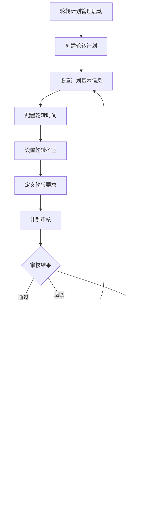

# 轮转管理系统 - 深度业务分析报告

## 📋 系统概览

**模块路径**: `src/views/rotationManagement/`
**开发者**: 彭会珍等团队开发
**开发时间**: 2024年6月-至今
**文件数量**: 25+个Vue文件
**复杂度**: ⭐⭐⭐⭐⭐ (极高复杂度)

### 系统定位
轮转管理系统是医院教育管理的核心轮转调度模块，负责管理实习生和住培学员的轮转计划制定、轮转安排算法、进度跟踪等全流程业务，确保轮转过程的科学化和规范化管理。

---

## 🏗️ 系统架构

### 核心子模块

| 子模块 | 路径 | 文件数 | 主要功能 | 复杂度 |
|--------|------|--------|----------|--------|
| 轮转计划列表 | rotationPlanList.vue | 1个 | 轮转计划管理、计划发布 | ⭐⭐⭐⭐⭐ |
| 轮转安排 | rotationArrangement.vue | 1个 | 轮转安排算法、学员分配 | ⭐⭐⭐⭐⭐ |
| 轮转计划详情 | rotationPlanDetails.vue | 1个 | 计划详情查看、进度跟踪 | ⭐⭐⭐⭐ |
| 轮科查询 | rotaceaeQuery.vue | 1个 | 轮转情况查询、统计分析 | ⭐⭐⭐⭐ |
| 轮转安排编辑 | module/rotationArrangementEdit.vue | 1个 | 轮转安排编辑、冲突处理 | ⭐⭐⭐⭐⭐ |
| 计划详情下一步 | module/planDetailsNext.vue | 1个 | 计划流程管理 | ⭐⭐⭐⭐ |
| 学员查询 | module/rotaceaeQueryStudent.vue | 1个 | 按学员查询轮转 | ⭐⭐⭐ |
| 科室查询 | module/rotaceaeQueryDepart.vue | 1个 | 按科室查询轮转 | ⭐⭐⭐ |

### 技术架构特色
1. **智能轮转算法**: 基于规则的轮转安排自动分配系统
2. **冲突检测机制**: 实时检测和处理轮转时间冲突
3. **多维度查询**: 支持按学员、科室等多维度查询
4. **可视化展示**: 图形化展示轮转安排和进度

---

## 📊 业务流程分析

### 1. 轮转计划管理模块 (rotationPlanList)

#### 1.1 核心业务流程



#### 1.2 计划管理功能

| 功能模块 | 描述 | 操作权限 | 状态管理 |
|---------|------|----------|----------|
| 计划创建 | 创建新的轮转计划 | 管理员 | 草稿状态 |
| 计划编辑 | 修改计划内容 | 管理员 | 编辑状态 |
| 计划发布 | 发布轮转计划 | 管理员 | 发布状态 |
| 计划删除 | 删除轮转计划 | 管理员 | 删除状态 |

#### 1.3 关键API接口

```javascript
// 轮转计划管理核心API
getRotationPlanList()           // 获取轮转计划列表
addRotationPlanApi()            // 新增轮转计划
editRotationPlanApi()           // 编辑轮转计划
delPlan()                       // 删除轮转计划
publishPlan()                   // 发布轮转计划
```

### 2. 轮转安排模块 (rotationArrangement)

#### 2.1 业务流程


#### 2.2 轮转安排算法

| 算法要素 | 权重 | 约束条件 | 优化目标 |
|---------|------|----------|----------|
| 科室容量 | 30% | 最大接收人数 | 均衡分配 |
| 轮转顺序 | 25% | 专业要求顺序 | 循序渐进 |
| 时间安排 | 25% | 轮转周期要求 | 时间连续 |
| 个人偏好 | 20% | 学员申请偏好 | 满意度最大 |

#### 2.3 关键API接口

```javascript
// 轮转安排核心API
getRotationPlanDetails()        // 获取轮转计划详情
scheduleDetailList()            // 获取安排详情列表
upsertScheduleDetail()          // 更新安排详情
planImportTemplate()            // 计划导入模板
rotateDetailsDel()              // 删除轮转详情
```

### 3. 轮转查询模块 (rotaceaeQuery)

#### 3.1 业务流程


#### 3.2 查询维度

| 查询维度 | 查询内容 | 展示方式 | 数据来源 |
|---------|----------|----------|----------|
| 按学员查看 | 学员轮转进度、科室分布 | 表格、时间轴 | 轮转记录 |
| 按科室查看 | 科室接收学员、时间分布 | 表格、统计图 | 科室数据 |

### 4. 轮转安排编辑模块 (rotationArrangementEdit)

#### 4.1 业务流程


---

## 👥 用户角色与权限

### 用户角色定义

| 角色 | 权限范围 | 主要操作 |
|------|----------|----------|
| **轮转管理员** | 全局轮转管理 | 计划制定、安排管理、统计分析 |
| **科室教学秘书** | 科室轮转管理 | 科室轮转安排、学员管理 |
| **教务管理员** | 教务轮转管理 | 计划审核、进度监督 |
| **学员** | 个人轮转权限 | 轮转查询、进度查看 |
| **系统管理员** | 系统配置权限 | 用户管理、系统配置 |

### 权限控制矩阵

| 功能模块 | 轮转管理员 | 科室秘书 | 教务管理员 | 学员 | 系统管理员 |
|---------|------------|----------|------------|------|------------|
| 计划管理 | ✅ | ❌ | ✅(审核) | ❌ | ✅ |
| 轮转安排 | ✅ | ✅(科室内) | ❌ | ❌ | ✅ |
| 进度查询 | ✅ | ✅(科室内) | ✅ | ✅(个人) | ✅ |
| 统计分析 | ✅ | ✅(科室内) | ✅ | ✅(个人) | ✅ |
| 系统配置 | ❌ | ❌ | ❌ | ❌ | ✅ |

---

## 🔧 技术实现分析

### 前端技术栈
- **Vue 2.6.14**: 主框架
- **Element UI**: UI组件库
- **Moment.js**: 时间处理
- **Vuex**: 状态管理

### 核心技术特点

#### 1. 动态表格生成
```javascript
// 动态生成轮转表格列
if(res.data.list&&res.data.list.length>0){
  let dayList = res.data.list[0].dayList
  dayList.forEach((item,index) => {
    let obj = {
      label:item.day,
      prop:item.day,
      width:100
    }
    this.colunmList.push(obj)
  });
  this.tableData.forEach((item,index)=>{
    item.dayList.forEach((i)=>{
      item[i.day] = i.organizationName
    })
  })
}
```

#### 2. 轮转安排算法
```javascript
// 轮转安排详情处理
scheduleDetailList(data).then(res => {
  if (res.code === '0') {
    this.infoList = res.data || []
    this.processScheduleData()
  }
})

// 更新轮转安排
upsertScheduleDetail(data).then(res => {
  if (res.code === '0') {
    this.$message.success('保存成功')
    this.getScheduleList()
  }
})
```

#### 3. 状态管理
```javascript
// 轮转状态管理
statusOptions: [
  {label:'通过',value:'A'},
  {label:'待审批',value:'D'},
  {label:'退回',value:'T'},
]
```

#### 4. 文件导入导出
```javascript
// 轮转安排导入
importAction: baseUrl + '/teaching/blend/internship/plan/importScheduleDetail'

// 模板下载
planImportTemplate(params).then(res => {
  this.downloadFile(res.data)
})
```

---

## 📈 数据统计与分析

### 关键指标
1. **轮转完成率**: 按计划、科室、学员统计轮转完成情况
2. **安排效率**: 轮转安排的合理性和效率分析
3. **冲突率**: 轮转安排冲突发生率和解决效率
4. **满意度**: 学员和科室对轮转安排的满意度

### 统计功能
1. **实时监控**: 轮转进度实时监控
2. **预警机制**: 轮转异常预警提醒
3. **效果分析**: 轮转效果评估分析
4. **优化建议**: 基于数据的优化建议

---

## 🎯 业务价值分析

### 核心价值
1. **科学化安排**: 基于算法的科学轮转安排
2. **效率提升**: 自动化轮转管理提升效率
3. **冲突减少**: 智能冲突检测减少安排冲突
4. **透明化管理**: 全程透明的轮转管理

### 解决的痛点
1. **安排复杂**: 简化复杂的轮转安排工作
2. **冲突频发**: 减少轮转时间和资源冲突
3. **进度难跟踪**: 实时跟踪轮转进度
4. **统计困难**: 自动化轮转数据统计

---

## 🔮 优化建议

### 技术优化
1. **AI智能算法**: 引入AI优化轮转安排算法
2. **移动端支持**: 支持移动端轮转管理
3. **实时同步**: 实时同步轮转状态变化
4. **预测分析**: 基于历史数据的预测分析

### 业务优化
1. **个性化安排**: 更加个性化的轮转安排
2. **跨院协作**: 支持跨医院轮转协作
3. **质量评估**: 完善的轮转质量评估体系
4. **智能推荐**: 智能推荐最优轮转方案

这个轮转管理系统展现了医院轮转管理的智能化和科学化水平！
