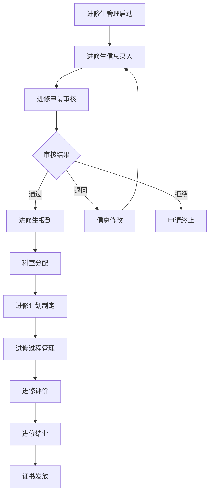
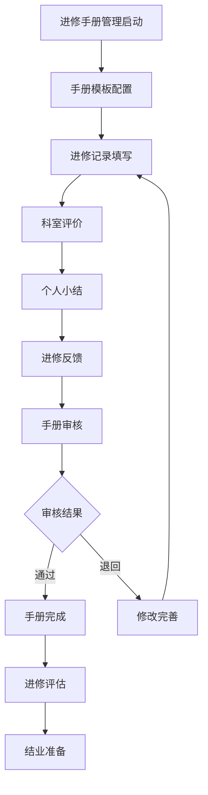
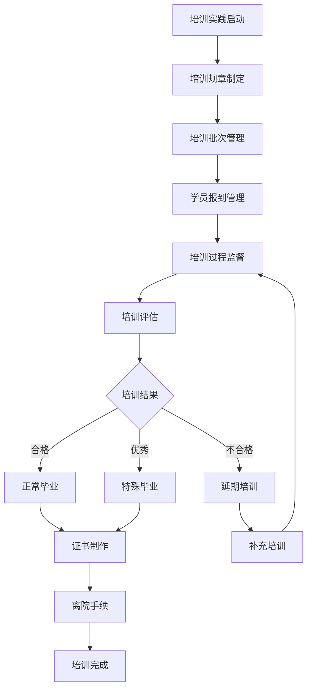
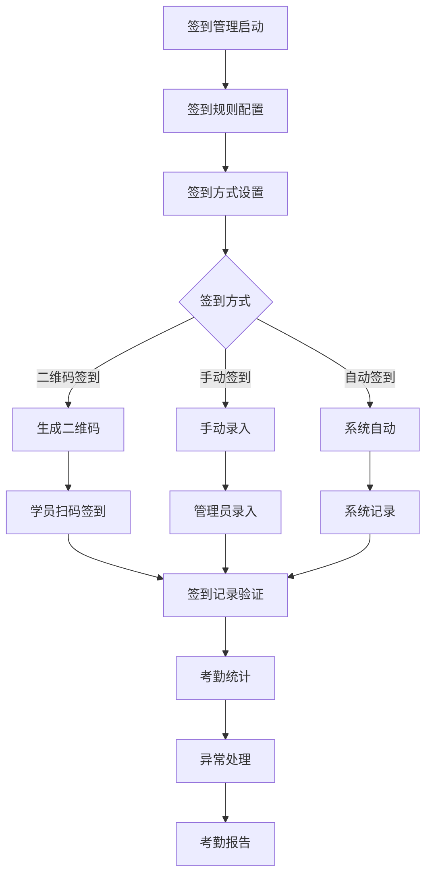

# 进修管理系统 - 深度业务分析报告

## 📋 系统概览

**模块路径**: 分布在多个模块中
**开发者**: 团队协作开发
**开发时间**: 2023年-2024年
**文件数量**: 40+个Vue文件
**复杂度**: ⭐⭐⭐⭐⭐ (极高复杂度)

### 系统定位
进修管理系统是医院教育管理的重要组成部分，负责管理进修生的全生命周期管理，包括进修信息管理、签到管理、进修评价、手册管理等完整的进修业务流程，确保进修过程的规范化和标准化管理。

---

## 🏗️ 系统架构

### 核心子模块

| 子模块 | 路径 | 文件数 | 主要功能 | 复杂度 |
|--------|------|--------|----------|--------|
| 进修生管理 | advancedStudiesManagement/jxStudent/ | 8个 | 进修生信息管理、报到管理 | ⭐⭐⭐⭐⭐ |
| 进修手册 | continuingEducationManage/handbook/ | 6个 | 进修手册管理、评价记录 | ⭐⭐⭐⭐ |
| 培训实践进修 | trainingPractice/jxglM/ | 12个 | 进修培训管理、毕业管理 | ⭐⭐⭐⭐⭐ |
| 签到管理 | attendanceManagement/ | 8个 | 进修签到、考勤统计 | ⭐⭐⭐⭐ |
| 科室管理 | departmentManagement/ | 6个 | 科室介绍、科室分配 | ⭐⭐⭐ |

### 技术架构特色
1. **全生命周期管理**: 从申请、报到、培训到毕业的完整流程
2. **多角色协同**: 支持进修生、科室、管理员等多角色操作
3. **智能签到系统**: 支持二维码签到、考勤统计
4. **评价反馈体系**: 完整的进修评价和反馈机制

---

## 📊 业务流程分析

### 1. 进修生管理模块 (jxStudent)

#### 1.1 核心业务流程



#### 1.2 进修生信息管理

| 信息类型 | 管理内容 | 数据来源 | 验证要求 |
|---------|----------|----------|----------|
| 基本信息 | 姓名、性别、身份证、联系方式 | 申请表单 | 必填验证 |
| 学历信息 | 学历、学位、毕业院校 | 学历证书 | 证书验证 |
| 工作信息 | 工作单位、职务、工作年限 | 工作证明 | 单位确认 |
| 进修信息 | 进修专业、进修时间、进修目标 | 进修申请 | 专业匹配 |

#### 1.3 关键API接口

```javascript
// 进修生管理核心API
getOptionList()                 // 获取进修生页面所有下拉列表选项
queryExaminerPage()             // 获取进修生列表
resetCheckStatus()              // 重置报到状态
checkInKeys()                   // 批量报到学员
```

### 2. 进修手册模块 (handbook)

#### 2.1 业务流程



#### 2.2 手册管理功能

| 功能模块 | 描述 | 操作权限 | 数据类型 |
|---------|------|----------|----------|
| 进修数据 | 进修过程数据记录 | 进修生填写 | 结构化数据 |
| 考核结果 | 阶段性考核结果 | 科室评价 | 评分数据 |
| 个人小结 | 进修期间个人总结 | 进修生填写 | 文本数据 |
| 进修反馈 | 对进修过程的反馈 | 进修生填写 | 反馈数据 |

#### 2.3 关键API接口

```javascript
// 进修手册核心API
ce_nurse_further_organization_mannalFurtherList()  // 进修数据分页查询
ce_nurse_further_selectFeedList()                  // 进修生反馈列表分页查询
ce_nurse_further_selectFurtherTempReocd()          // 考核结构查询
ce_nurse_further_studentFurtherList()              // 学员端进修手册列表查询
```

### 3. 培训实践进修模块 (jxglM)

#### 3.1 业务流程



#### 3.2 培训管理功能

| 管理类型 | 功能描述 | 管理对象 | 操作流程 |
|---------|----------|----------|----------|
| 规章管理 | 培训规章制度管理 | 培训规则 | 制定→审核→发布 |
| 批次管理 | 培训批次创建管理 | 培训批次 | 创建→配置→启动 |
| 报到管理 | 学员报到签到管理 | 进修学员 | 签到→确认→分配 |
| 毕业管理 | 学员毕业流程管理 | 毕业学员 | 评估→审核→证书 |

#### 3.3 关键API接口

```javascript
// 培训实践核心API
getTrainingRegulation()         // 获取培训规章
saveTrainingRegulation()        // 保存培训规章
queryTrainingBatchList()        // 查询培训批次列表
saveCheckIn()                   // 保存签到
queryTrainingStudentList()      // 查询培训学员列表
saveNormalGraduation()          // 保存正常毕业
saveSpecialGraduation()         // 保存特殊毕业
createCertificate()             // 创建证书
```

### 4. 签到管理模块 (attendanceManagement)

#### 4.1 业务流程



#### 4.2 签到统计功能

| 统计维度 | 统计内容 | 统计周期 | 展示方式 |
|---------|----------|----------|----------|
| 个人考勤 | 个人签到记录、出勤率 | 日/周/月 | 个人报表 |
| 科室考勤 | 科室整体出勤情况 | 周/月/季 | 科室报表 |
| 异常统计 | 迟到、早退、缺勤统计 | 月/季/年 | 异常报表 |
| 趋势分析 | 考勤趋势变化分析 | 月/季/年 | 趋势图表 |

---

## 👥 用户角色与权限

### 用户角色定义

| 角色 | 权限范围 | 主要操作 |
|------|----------|----------|
| **进修管理员** | 全局进修管理 | 进修生管理、培训管理、统计分析 |
| **科室教学秘书** | 科室进修管理 | 科室进修生管理、评价记录 |
| **带教老师** | 学员指导权限 | 进修指导、评价打分 |
| **进修生** | 个人进修权限 | 信息填写、签到、手册记录 |
| **系统管理员** | 系统配置权限 | 用户管理、系统配置 |

### 权限控制矩阵

| 功能模块 | 进修管理员 | 科室秘书 | 带教老师 | 进修生 | 系统管理员 |
|---------|------------|----------|----------|--------|------------|
| 进修生管理 | ✅ | ✅(科室内) | ❌ | ✅(个人) | ✅ |
| 进修手册 | ✅ | ✅(科室内) | ✅(评价) | ✅(填写) | ✅ |
| 培训管理 | ✅ | ✅(科室内) | ✅(指导) | ✅(参与) | ✅ |
| 签到管理 | ✅ | ✅(科室内) | ✅(查看) | ✅(签到) | ✅ |
| 统计分析 | ✅ | ✅(科室内) | ✅(指导学员) | ✅(个人) | ✅ |
| 系统配置 | ❌ | ❌ | ❌ | ❌ | ✅ |

---

## 🔧 技术实现分析

### 前端技术栈
- **Vue 2.6.14**: 主框架
- **Element UI**: UI组件库
- **Moment.js**: 时间处理
- **Lodash**: 工具库

### 核心技术特点

#### 1. 进修生信息管理
```javascript
// 进修生列表查询
queryExaminerPage(data).then(res => {
  if (res.code === 0) {
    this.tableData = res.data.records
    this.total = res.data.total
  }
})

// 批量报到
checkInKeys(selectedKeys).then(res => {
  if (res.code === 0) {
    this.$message.success('批量报到成功')
    this.getList()
  }
})
```

#### 2. 进修手册管理
```javascript
// 进修手册数据查询
ce_nurse_further_organization_mannalFurtherList(data).then(res => {
  this.handbookData = res.data.records
  this.processHandbookData()
})

// 进修反馈保存
ce_nurse_further_selectFeedList(data).then(res => {
  this.feedbackList = res.data
  this.generateFeedbackReport()
})
```

#### 3. 签到管理系统
```javascript
// 二维码签到
generateQRCode() {
  const qrData = {
    userId: this.userId,
    timestamp: Date.now(),
    location: this.currentLocation
  }
  this.qrCodeData = JSON.stringify(qrData)
}

// 签到记录
saveCheckIn(checkInData).then(res => {
  if (res.code === 0) {
    this.$message.success('签到成功')
    this.updateAttendanceStatus()
  }
})
```

#### 4. 培训管理
```javascript
// 培训批次管理
queryTrainingBatchList(params).then(res => {
  this.batchList = res.data
  this.processBatchData()
})

// 毕业管理
saveNormalGraduation(graduationData).then(res => {
  if (res.code === 0) {
    this.$message.success('毕业处理成功')
    this.createCertificate()
  }
})
```

---

## 📈 数据统计与分析

### 关键指标
1. **进修完成率**: 按专业、科室、时间统计进修完成情况
2. **签到出勤率**: 进修生签到出勤率统计
3. **评价满意度**: 进修过程满意度调查统计
4. **培训效果**: 进修培训效果评估分析

### 统计功能
1. **实时监控**: 进修进度实时监控
2. **预警机制**: 异常情况预警提醒
3. **效果分析**: 进修效果评估分析
4. **趋势预测**: 基于历史数据的趋势预测

---

## 🎯 业务价值分析

### 核心价值
1. **流程标准化**: 统一进修管理标准和流程
2. **管理精细化**: 全生命周期精细化管理
3. **效率提升**: 自动化签到和管理流程
4. **质量保证**: 多维度质量控制和评价

### 解决的痛点
1. **管理分散**: 统一进修管理平台
2. **签到繁琐**: 智能化签到管理
3. **评价不规范**: 标准化评价体系
4. **统计困难**: 自动化数据统计分析

---

## 🔮 优化建议

### 技术优化
1. **移动端适配**: 支持移动端进修管理
2. **智能推荐**: 基于数据的个性化推荐
3. **实时通知**: WebSocket实时推送重要信息
4. **AI辅助**: AI辅助进修规划和评价

### 业务优化
1. **个性化培训**: 个性化进修培训方案
2. **跨院交流**: 支持跨医院进修交流
3. **质量持续改进**: 基于数据的质量改进
4. **国际化标准**: 对接国际进修标准

这个进修管理系统展现了医院进修教育管理的完整性和专业性！
