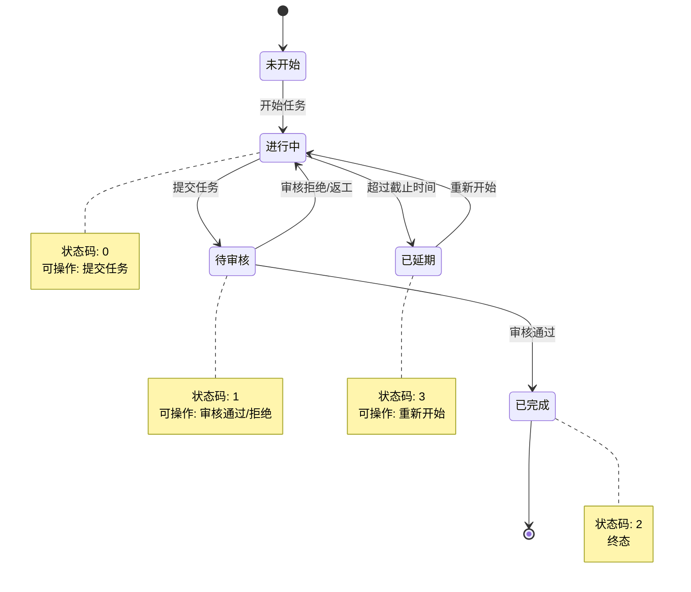
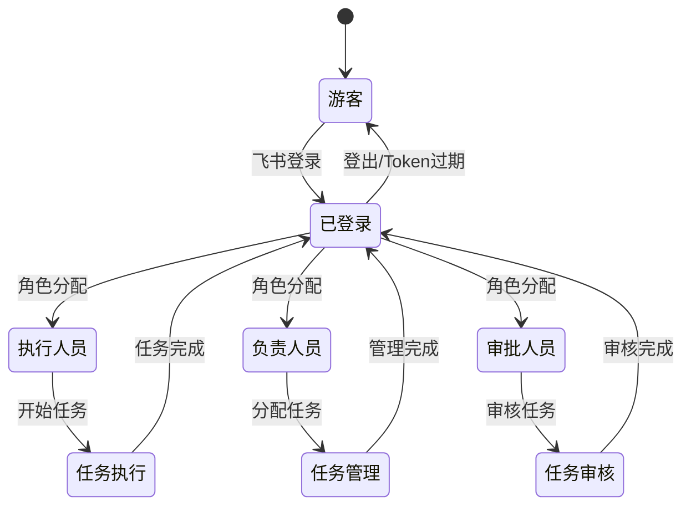
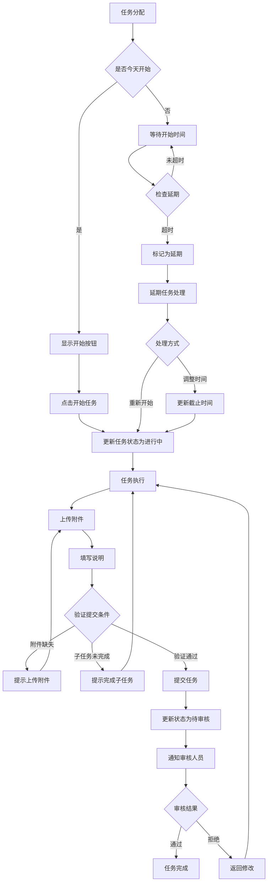
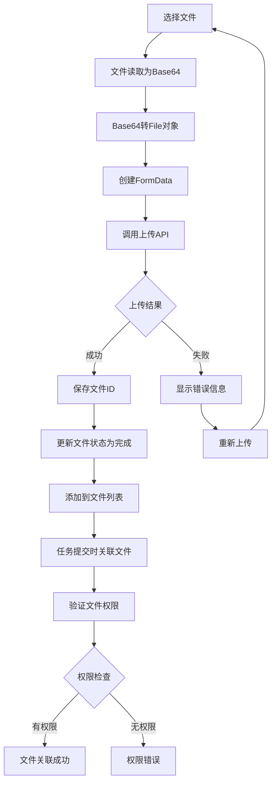
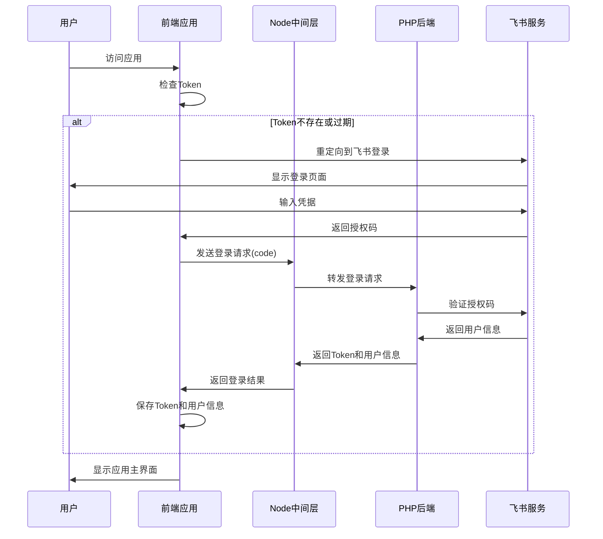
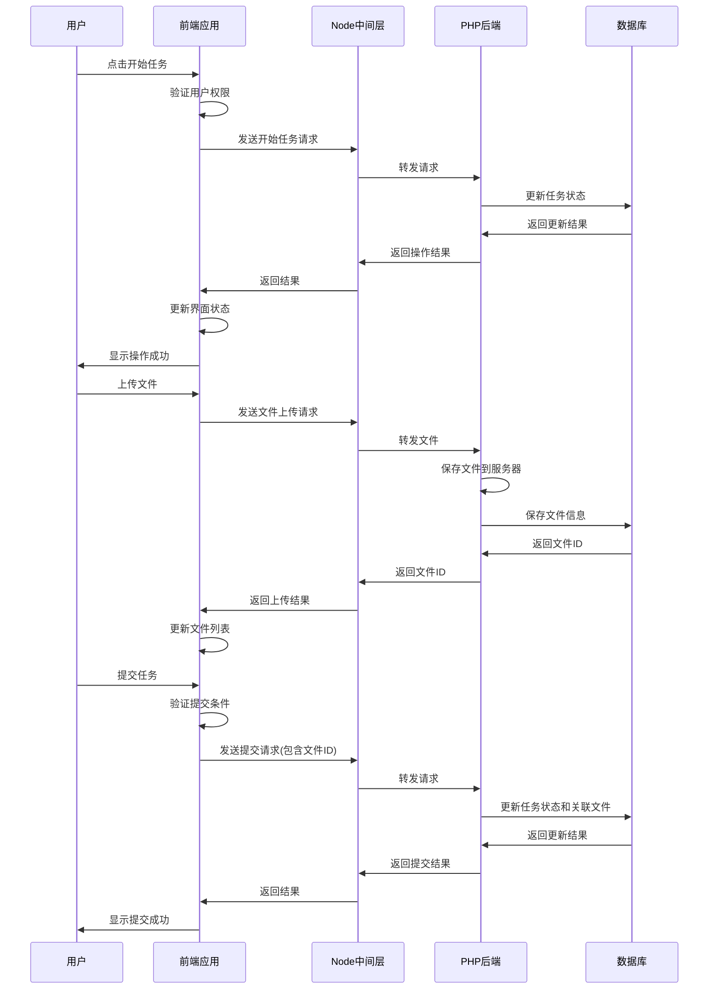
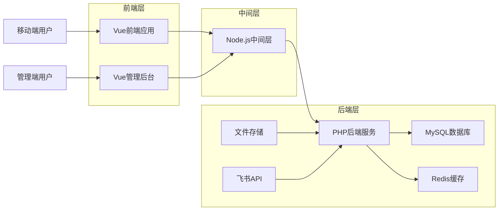
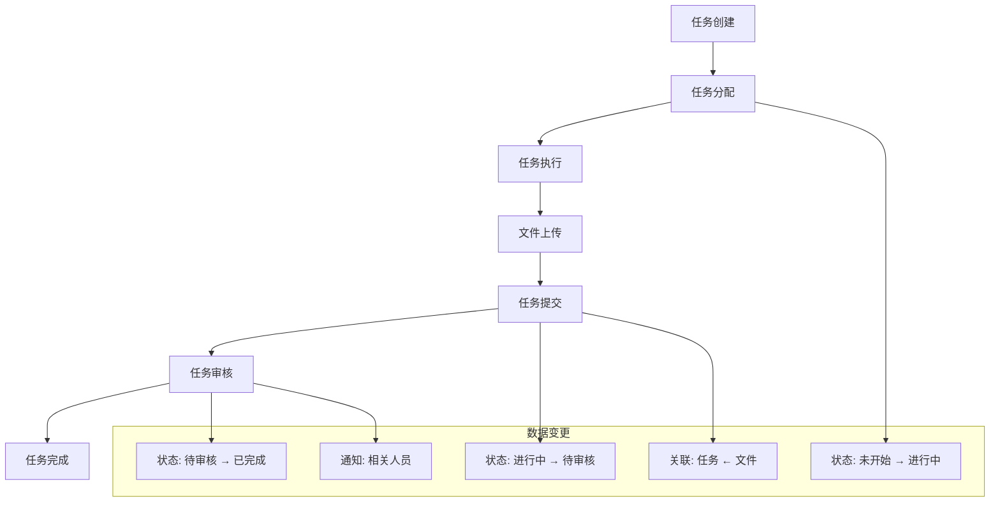

# Special 项目业务流程图和状态图

## 1. 任务状态流转图

### 1.1 任务状态流转状态图

### 1.2 用户角色权限状态图

## 2. 业务流程图

### 2.1 完整项目生命周期流程

```mermaid
flowchart TD
    A[客户录入] --> B[项目创建]
    B --> C[项目成员分配]
    C --> D[项目计划制定]
    D --> E[方案阶段]
    E --> F[设计阶段]
    F --> G[施工阶段]
    G --> H[保障阶段]
    H --> I[项目完成]
    
    E --> E1[方案任务创建]
    E1 --> E2[方案任务执行]
    E2 --> E3[方案任务提交]
    E3 --> E4[方案任务审核]
    E4 --> E5{审核结果}
    E5 -->|通过| F
    E5 -->|拒绝| E2
    
    F --> F1[设计任务创建]
    F1 --> F2[设计任务执行]
    F2 --> F3[设计任务提交]
    F3 --> F4[设计任务审核]
    F4 --> F5{审核结果}
    F5 -->|通过| G
    F5 -->|拒绝| F2
    
    G --> G1[施工任务创建]
    G1 --> G2[施工任务执行]
    G2 --> G3[施工任务提交]
    G3 --> G4[施工任务审核]
    G4 --> G5{审核结果}
    G5 -->|通过| H
    G5 -->|拒绝| G2
    
    H --> H1[保障任务创建]
    H1 --> H2[保障任务执行]
    H2 --> H3[保障任务提交]
    H3 --> H4[保障任务审核]
    H4 --> H5{审核结果}
    H5 -->|通过| I
    H5 -->|拒绝| H2
```

### 2.2 任务执行详细流程

### 2.3 文件上传处理流程

## 3. 用户交互时序图

### 3.1 用户登录时序图

### 3.2 任务操作时序图

## 4. 数据流向图

### 4.1 系统数据流向

### 4.2 任务数据流转

这些流程图和状态图清晰地展示了Special项目的核心业务逻辑，包括任务状态流转、用户交互流程、数据流向等关键业务机制。
